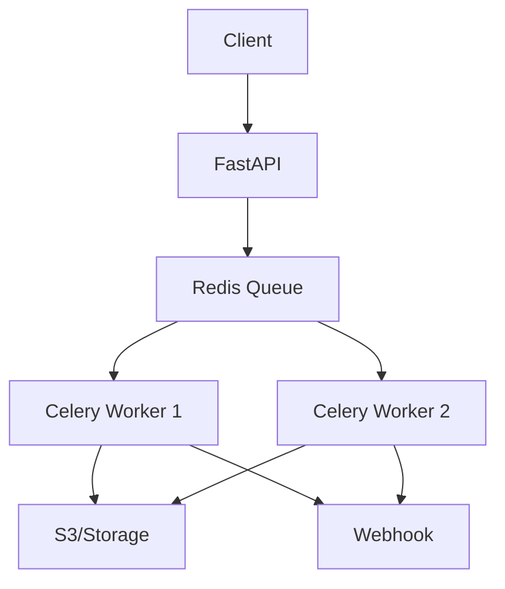

# Phase 4-1: 総仕上げ ～ 非同期処理システム構築 ～

## 学習目標

この単元を終えると、以下ができるようになります：

- 本番レベルの非同期処理システムを構築できる
- 適切なアーキテクチャを選択できる
- 運用上の注意点を理解できる

## 総合演習: 画像処理サービス

### 要件

```
- 画像アップロード API
- 非同期で画像処理（リサイズ、フィルター適用）
- 処理状況の確認 API
- 完了通知（Webhook）
```

### アーキテクチャ



### プロジェクト構成

```
image-processor/
├── docker-compose.yml
├── app/
│   ├── __init__.py
│   ├── main.py
│   ├── api/
│   │   ├── __init__.py
│   │   └── routes.py
│   ├── tasks/
│   │   ├── __init__.py
│   │   ├── celery_app.py
│   │   └── image_tasks.py
│   └── models/
│       └── schemas.py
├── worker/
│   └── Dockerfile
└── requirements.txt
```

### 実装

```yaml
# docker-compose.yml
services:
  redis:
    image: redis:7
    ports:
      - "6379:6379"
  
  api:
    build: .
    ports:
      - "8000:8000"
    depends_on:
      - redis
    environment:
      - CELERY_BROKER_URL=redis://redis:6379/0
  
  worker:
    build:
      context: .
      dockerfile: worker/Dockerfile
    depends_on:
      - redis
    environment:
      - CELERY_BROKER_URL=redis://redis:6379/0
    command: celery -A app.tasks.celery_app worker --loglevel=info
```

```python
# app/tasks/celery_app.py
from celery import Celery
import os

celery_app = Celery(
    'image_processor',
    broker=os.environ.get('CELERY_BROKER_URL', 'redis://localhost:6379/0'),
    backend=os.environ.get('CELERY_RESULT_BACKEND', 'redis://localhost:6379/0'),
)

celery_app.conf.update(
    task_serializer='json',
    accept_content=['json'],
    result_serializer='json',
    timezone='Asia/Tokyo',
    task_track_started=True,
    task_time_limit=300,
    task_soft_time_limit=240,
    worker_prefetch_multiplier=1,
)

celery_app.autodiscover_tasks(['app.tasks'])
```

```python
# app/tasks/image_tasks.py
from app.tasks.celery_app import celery_app
from celery import chain
import time
import httpx

@celery_app.task(bind=True, max_retries=3)
def download_image(self, url: str, job_id: str):
    try:
        # 画像ダウンロード（シミュレート）
        time.sleep(1)
        image_path = f"/tmp/{job_id}_original.jpg"
        return {"job_id": job_id, "path": image_path, "status": "downloaded"}
    except Exception as exc:
        raise self.retry(exc=exc, countdown=5)

@celery_app.task(bind=True)
def resize_image(self, result: dict, width: int, height: int):
    job_id = result["job_id"]
    input_path = result["path"]
    
    # リサイズ処理（シミュレート）
    time.sleep(2)
    
    output_path = f"/tmp/{job_id}_resized.jpg"
    return {"job_id": job_id, "path": output_path, "status": "resized"}

@celery_app.task(bind=True)
def apply_filter(self, result: dict, filter_name: str):
    job_id = result["job_id"]
    input_path = result["path"]
    
    # フィルター適用（シミュレート）
    time.sleep(1)
    
    output_path = f"/tmp/{job_id}_filtered.jpg"
    return {"job_id": job_id, "path": output_path, "status": "filtered"}

@celery_app.task(bind=True, max_retries=3)
def upload_to_storage(self, result: dict, destination: str):
    job_id = result["job_id"]
    input_path = result["path"]
    
    try:
        # S3アップロード（シミュレート）
        time.sleep(1)
        
        final_url = f"{destination}/{job_id}/processed.jpg"
        return {
            "job_id": job_id,
            "url": final_url,
            "status": "completed"
        }
    except Exception as exc:
        raise self.retry(exc=exc, countdown=10)

@celery_app.task
def send_webhook(result: dict, webhook_url: str):
    if not webhook_url:
        return result
    
    try:
        with httpx.Client() as client:
            client.post(webhook_url, json=result, timeout=10)
    except Exception as e:
        print(f"Webhook failed: {e}")
    
    return result

def create_processing_workflow(
    image_url: str,
    job_id: str,
    width: int = 800,
    height: int = 600,
    filter_name: str = "none",
    destination: str = "s3://my-bucket",
    webhook_url: str = None
):
    """画像処理ワークフローを作成"""
    workflow = chain(
        download_image.s(image_url, job_id),
        resize_image.s(width, height),
        apply_filter.s(filter_name) if filter_name != "none" else None,
        upload_to_storage.s(destination),
        send_webhook.s(webhook_url) if webhook_url else None,
    )
    
    # None を除去
    tasks = [t for t in workflow.tasks if t is not None]
    return chain(*tasks)
```

```python
# app/models/schemas.py
from pydantic import BaseModel, HttpUrl
from typing import Optional
from enum import Enum

class FilterType(str, Enum):
    none = "none"
    grayscale = "grayscale"
    blur = "blur"
    sharpen = "sharpen"

class ProcessImageRequest(BaseModel):
    image_url: HttpUrl
    width: int = 800
    height: int = 600
    filter: FilterType = FilterType.none
    webhook_url: Optional[HttpUrl] = None

class ProcessImageResponse(BaseModel):
    job_id: str
    status: str

class JobStatusResponse(BaseModel):
    job_id: str
    status: str
    result: Optional[dict] = None
```

```python
# app/api/routes.py
from fastapi import APIRouter, HTTPException
from celery.result import AsyncResult
import uuid

from app.models.schemas import (
    ProcessImageRequest, ProcessImageResponse, JobStatusResponse
)
from app.tasks.image_tasks import create_processing_workflow
from app.tasks.celery_app import celery_app

router = APIRouter()

@router.post("/process", response_model=ProcessImageResponse)
async def process_image(request: ProcessImageRequest):
    """画像処理ジョブを開始"""
    job_id = str(uuid.uuid4())
    
    workflow = create_processing_workflow(
        image_url=str(request.image_url),
        job_id=job_id,
        width=request.width,
        height=request.height,
        filter_name=request.filter.value,
        webhook_url=str(request.webhook_url) if request.webhook_url else None,
    )
    
    result = workflow.apply_async()
    
    return ProcessImageResponse(
        job_id=job_id,
        status="processing"
    )

@router.get("/jobs/{job_id}", response_model=JobStatusResponse)
async def get_job_status(job_id: str):
    """ジョブの状態を取得"""
    # 実際はジョブIDとタスクIDのマッピングが必要
    # ここでは簡略化
    
    return JobStatusResponse(
        job_id=job_id,
        status="processing"
    )
```

```python
# app/main.py
from fastapi import FastAPI
from app.api.routes import router

app = FastAPI(title="Image Processor API")

app.include_router(router, prefix="/api/v1")

@app.get("/health")
async def health():
    return {"status": "healthy"}
```

## 運用チェックリスト

```markdown
## インフラ
- [ ] Broker の冗長化
- [ ] Worker のオートスケール
- [ ] ストレージの設定

## モニタリング
- [ ] Flower の設定
- [ ] メトリクス収集
- [ ] アラート設定

## エラー処理
- [ ] リトライ戦略
- [ ] DLQ の設定
- [ ] アラート通知

## セキュリティ
- [ ] Broker の認証
- [ ] タスクのタイムアウト
- [ ] 入力のバリデーション
```

## カリキュラム完了！

おめでとうございます！メッセージキュー・非同期処理のカリキュラムを完了しました。

### 学んだこと

1. **非同期処理基礎** - 同期vs非同期、ユースケース
2. **メッセージキュー** - パターン、キューシステム選択
3. **RabbitMQ** - Exchange、ルーティング
4. **Celery** - タスク、ワークフロー、Beat

### 次のステップ

- **Kafka** - 大規模ストリーム処理
- **AWS Step Functions** - サーバーレスワークフロー
- **Temporal** - ワークフローエンジン
