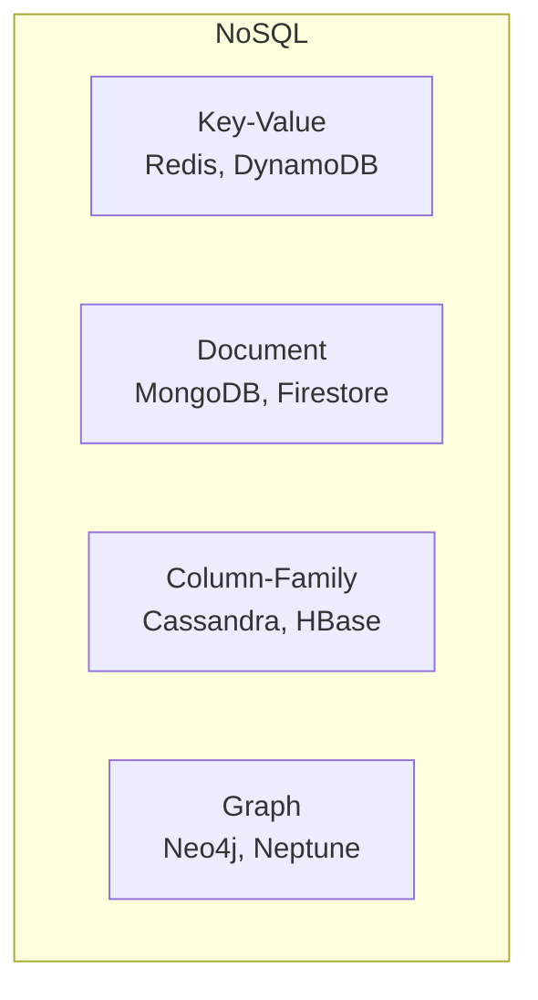

# Phase 1-1: NoSQL 概論

## 学習目標

この単元を終えると、以下ができるようになります：

- NoSQL の種類と特徴を説明できる
- RDB との使い分けを判断できる
- CAP 定理の観点から選択できる

## NoSQL とは



### NoSQL の種類

| 種類 | 特徴 | ユースケース |
|------|------|-------------|
| **Key-Value** | シンプル、高速 | セッション、キャッシュ |
| **Document** | 柔軟なスキーマ | CMS、ユーザー情報 |
| **Column-Family** | 時系列、大規模 | ログ、IoT |
| **Graph** | 関係性 | SNS、推薦 |

## RDB vs NoSQL

| 観点 | RDB | NoSQL |
|------|-----|-------|
| スキーマ | 固定 | 柔軟 |
| スケール | 垂直 | 水平 |
| ACID | 完全サポート | 制限あり |
| クエリ | SQL | API依存 |
| 正規化 | 推奨 | 非正規化 |

## ハンズオン

### 演習1: DynamoDB vs RDB

```python
# dynamodb_vs_rdb.py
"""
RDBとDynamoDBのアプローチ比較
"""

# ===== RDB アプローチ =====
# テーブル: users, orders, order_items, products

# SQL:
# SELECT o.order_id, o.order_date, 
#        oi.quantity, p.name
# FROM orders o
# JOIN order_items oi ON o.order_id = oi.order_id
# JOIN products p ON oi.product_id = p.product_id
# WHERE o.user_id = 123

# ===== DynamoDB アプローチ =====
# 単一テーブルに非正規化

import boto3
from boto3.dynamodb.conditions import Key

dynamodb = boto3.resource('dynamodb')
table = dynamodb.Table('SingleTable')

def get_user_orders(user_id: str):
    """
    ユーザーの注文を1回のクエリで取得
    
    テーブル設計:
    PK: USER#123
    SK: ORDER#2024-01-15#ORD-001
    
    データ例:
    {
        'PK': 'USER#123',
        'SK': 'ORDER#2024-01-15#ORD-001',
        'orderId': 'ORD-001',
        'orderDate': '2024-01-15',
        'items': [
            {'productName': 'Book', 'quantity': 2}
        ],
        'totalAmount': 3000
    }
    """
    response = table.query(
        KeyConditionExpression=Key('PK').eq(f'USER#{user_id}') & 
                               Key('SK').begins_with('ORDER#')
    )
    return response['Items']
```

### 演習2: CAP 定理

```python
# cap_theorem.py
"""
CAP定理の理解

C: Consistency（一貫性）
A: Availability（可用性）
P: Partition tolerance（分断耐性）

分散システムでは P は必須 → C と A のトレードオフ
"""

# CP システム（一貫性優先）
# - DynamoDB (Strong Consistency)
# - MongoDB (Primary)
# - HBase

# AP システム（可用性優先）
# - DynamoDB (Eventually Consistent)
# - Cassandra
# - CouchDB

import boto3

dynamodb = boto3.resource('dynamodb')
table = dynamodb.Table('orders')

def read_with_consistency(order_id: str, strong: bool = False):
    """
    一貫性レベルを選択
    
    Strong Consistency: 最新データ保証、2倍のRCU
    Eventually Consistent: 最新でない可能性、1倍のRCU
    """
    response = table.get_item(
        Key={'orderId': order_id},
        ConsistentRead=strong  # True: 強い一貫性
    )
    return response.get('Item')

# ユースケース別の選択
CONSISTENCY_CHOICE = {
    '在庫確認': True,      # 正確な数が必要
    '商品一覧': False,     # 少し古くてもOK
    '残高確認': True,      # 正確な金額が必要
    'ランキング': False,   # 多少の誤差OK
}
```

### 演習3: NoSQL の選択基準

```python
# nosql_selection.py
"""
NoSQL データベースの選択基準
"""

def recommend_database(requirements: dict) -> str:
    """
    要件からデータベースを推薦
    """
    
    # AWS サービスでの選択
    if requirements.get('serverless') and requirements.get('key_value'):
        return 'DynamoDB'
    
    if requirements.get('graph_relationships'):
        return 'Amazon Neptune'
    
    if requirements.get('time_series'):
        return 'Amazon Timestream'
    
    if requirements.get('document_store') and requirements.get('mongodb_compatible'):
        return 'Amazon DocumentDB'
    
    if requirements.get('in_memory') and requirements.get('cache'):
        return 'Amazon ElastiCache (Redis)'
    
    if requirements.get('search'):
        return 'Amazon OpenSearch'
    
    return 'DynamoDB'  # デフォルト

# 選択例
examples = [
    {
        'use_case': 'Eコマースカート',
        'requirements': {'serverless': True, 'key_value': True},
        'recommendation': 'DynamoDB'
    },
    {
        'use_case': 'ソーシャルグラフ',
        'requirements': {'graph_relationships': True},
        'recommendation': 'Neptune'
    },
    {
        'use_case': 'IoTセンサーデータ',
        'requirements': {'time_series': True},
        'recommendation': 'Timestream'
    },
    {
        'use_case': '全文検索',
        'requirements': {'search': True},
        'recommendation': 'OpenSearch'
    }
]
```

## RDB を選ぶべき場合

| 条件 | 理由 |
|------|------|
| 複雑な JOIN が必要 | NoSQL は JOIN が苦手 |
| ACID が必須 | 金融取引など |
| アドホッククエリ | 分析用途 |
| スキーマが安定 | 正規化のメリット |

## 理解度確認

### 問題

ソーシャルメディアで「友達の友達」を検索するのに最適な NoSQL は何か。

**A.** DynamoDB（Key-Value）

**B.** MongoDB（Document）

**C.** Neo4j（Graph）

**D.** Cassandra（Column-Family）

---

### 解答・解説

**正解: C**

関係性のトラバースはグラフデータベースの得意分野です。Neo4j や Amazon Neptune は、ノード間の関係を効率的に検索できます。Key-Value や Document では複数回のクエリが必要になります。

---

## 次のステップ

NoSQL 概論を学びました。次は DynamoDB を深掘りしましょう。

**次の単元**: [Phase 1-2: DynamoDB 基礎](./02_DynamoDB基礎.md)
