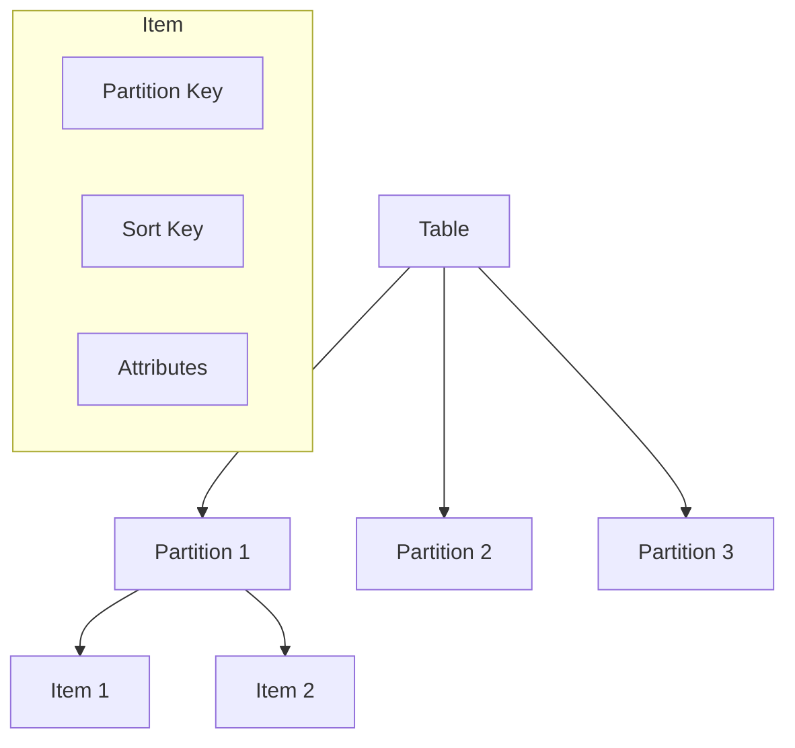

# Phase 1-2: DynamoDB 基礎

## 学習目標

この単元を終えると、以下ができるようになります：

- DynamoDB のデータモデルを理解できる
- パーティションキーとソートキーを設計できる
- 基本的な CRUD 操作ができる

## DynamoDB のデータモデル



### キー設計

| キータイプ | 説明 | 例 |
|-----------|------|-----|
| **Partition Key** | 分散のキー | userId |
| **Sort Key** | 並び順 | createdAt |
| **複合キー** | PK + SK | userId + orderId |

## ハンズオン

### 演習1: 基本操作

```python
# dynamodb_basics.py
"""
DynamoDB基本操作
"""

import boto3
from boto3.dynamodb.conditions import Key, Attr
from decimal import Decimal
import json

dynamodb = boto3.resource('dynamodb')
table = dynamodb.Table('orders')

# ===== Create =====
def create_order(order: dict):
    """
    アイテム作成
    """
    # float を Decimal に変換（DynamoDB要件）
    order = json.loads(
        json.dumps(order),
        parse_float=Decimal
    )
    
    table.put_item(
        Item=order,
        ConditionExpression='attribute_not_exists(orderId)'  # 重複防止
    )
    return order

# ===== Read =====
def get_order(order_id: str):
    """
    単一アイテム取得
    """
    response = table.get_item(
        Key={'orderId': order_id}
    )
    return response.get('Item')

def get_orders_by_user(user_id: str, limit: int = 10):
    """
    GSI を使ったクエリ
    """
    response = table.query(
        IndexName='UserIdIndex',
        KeyConditionExpression=Key('userId').eq(user_id),
        Limit=limit,
        ScanIndexForward=False  # 降順
    )
    return response['Items']

# ===== Update =====
def update_order_status(order_id: str, status: str):
    """
    アイテム更新
    """
    response = table.update_item(
        Key={'orderId': order_id},
        UpdateExpression='SET #status = :status, updatedAt = :now',
        ExpressionAttributeNames={
            '#status': 'status'  # 予約語対策
        },
        ExpressionAttributeValues={
            ':status': status,
            ':now': '2024-01-15T10:00:00Z'
        },
        ReturnValues='ALL_NEW'
    )
    return response['Attributes']

# ===== Delete =====
def delete_order(order_id: str):
    """
    アイテム削除
    """
    table.delete_item(
        Key={'orderId': order_id},
        ConditionExpression='#status = :cancelled',
        ExpressionAttributeNames={'#status': 'status'},
        ExpressionAttributeValues={':cancelled': 'cancelled'}
    )
```

### 演習2: バッチ操作

```python
# batch_operations.py
"""
バッチ操作
"""

import boto3

dynamodb = boto3.resource('dynamodb')
table = dynamodb.Table('products')

def batch_write(items: list):
    """
    複数アイテムを一括書き込み
    最大25アイテム/リクエスト
    """
    with table.batch_writer() as batch:
        for item in items:
            batch.put_item(Item=item)

def batch_get(keys: list):
    """
    複数アイテムを一括取得
    最大100アイテム/リクエスト
    """
    response = dynamodb.batch_get_item(
        RequestItems={
            'products': {
                'Keys': keys
            }
        }
    )
    return response['Responses']['products']

# 使用例
products = [
    {'productId': 'PROD-001', 'name': 'Book', 'price': 1500},
    {'productId': 'PROD-002', 'name': 'Pen', 'price': 200},
    {'productId': 'PROD-003', 'name': 'Notebook', 'price': 500},
]
batch_write(products)

keys = [
    {'productId': 'PROD-001'},
    {'productId': 'PROD-002'}
]
result = batch_get(keys)
```

### 演習3: 条件式

```python
# condition_expressions.py
"""
条件式の活用
"""

import boto3
from boto3.dynamodb.conditions import Attr

dynamodb = boto3.resource('dynamodb')
table = dynamodb.Table('inventory')

def decrease_stock(product_id: str, quantity: int):
    """
    在庫を減らす（条件付き）
    在庫が足りない場合は失敗
    """
    try:
        response = table.update_item(
            Key={'productId': product_id},
            UpdateExpression='SET stock = stock - :qty',
            ConditionExpression='stock >= :qty',
            ExpressionAttributeValues={
                ':qty': quantity
            },
            ReturnValues='ALL_NEW'
        )
        return response['Attributes']
    except dynamodb.meta.client.exceptions.ConditionalCheckFailedException:
        raise InsufficientStockError(f'Not enough stock for {product_id}')

def optimistic_update(product_id: str, new_price: int, expected_version: int):
    """
    楽観的ロック
    """
    try:
        response = table.update_item(
            Key={'productId': product_id},
            UpdateExpression='SET price = :price, version = version + :inc',
            ConditionExpression='version = :expected',
            ExpressionAttributeValues={
                ':price': new_price,
                ':expected': expected_version,
                ':inc': 1
            },
            ReturnValues='ALL_NEW'
        )
        return response['Attributes']
    except dynamodb.meta.client.exceptions.ConditionalCheckFailedException:
        raise OptimisticLockError('Item was modified by another process')

class InsufficientStockError(Exception):
    pass

class OptimisticLockError(Exception):
    pass
```

### 演習4: Scan とフィルター

```python
# scan_filter.py
"""
Scanとフィルター（注意が必要）
"""

import boto3
from boto3.dynamodb.conditions import Attr

dynamodb = boto3.resource('dynamodb')
table = dynamodb.Table('orders')

def scan_with_filter(status: str):
    """
    Scan（非推奨: フルスキャン）
    
    注意: Scan は全アイテムを読み取る
    - コスト高
    - パフォーマンス低
    → GSI を使うべき
    """
    items = []
    last_key = None
    
    while True:
        params = {
            'FilterExpression': Attr('status').eq(status)
        }
        if last_key:
            params['ExclusiveStartKey'] = last_key
        
        response = table.scan(**params)
        items.extend(response['Items'])
        
        last_key = response.get('LastEvaluatedKey')
        if not last_key:
            break
    
    return items

# 改善: GSI を使う
def query_by_status(status: str):
    """
    GSI でクエリ（推奨）
    
    GSI: StatusIndex (status = PK)
    """
    response = table.query(
        IndexName='StatusIndex',
        KeyConditionExpression=Key('status').eq(status)
    )
    return response['Items']
```

## DynamoDB の容量モード

| モード | 特徴 | ユースケース |
|-------|------|-------------|
| **On-Demand** | 自動スケール | 予測困難 |
| **Provisioned** | 事前設定 | 安定ワークロード |

## 理解度確認

### 問題

DynamoDB で「ユーザーID」で検索し「注文日時」で並び替える場合、最適なキー設計は何か。

**A.** PK: orderId

**B.** PK: userId, SK: orderDate

**C.** PK: orderDate, SK: userId

**D.** PK: userId のみ

---

### 解答・解説

**正解: B**

検索条件（userId）をパーティションキー、並び替え条件（orderDate）をソートキーに設定します。これにより1回のクエリで効率的にデータを取得できます。

---

## 次のステップ

DynamoDB 基礎を学びました。次はシングルテーブル設計を学びましょう。

**次の単元**: [Phase 2-1: シングルテーブル設計](../phase2/01_シングルテーブル設計.md)
