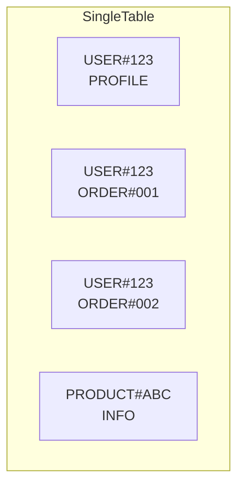

# Phase 2-1: シングルテーブル設計

## 学習目標

この単元を終えると、以下ができるようになります：

- シングルテーブル設計のメリットを理解できる
- GSI/LSI を効果的に設計できる
- 複数エンティティを1テーブルで管理できる

## シングルテーブル設計



### なぜシングルテーブルか

| メリット | 説明 |
|---------|------|
| **JOINレス** | 関連データを1クエリで取得 |
| **トランザクション** | 同一テーブルで完結 |
| **運用簡素化** | テーブル管理が1つ |
| **コスト** | 複数テーブルより効率的 |

## ハンズオン

### 演習1: エンティティ設計

```python
# single_table_design.py
"""
シングルテーブル設計

エンティティ:
- User（ユーザー）
- Order（注文）
- OrderItem（注文明細）
- Product（商品）

アクセスパターン:
1. ユーザー情報取得
2. ユーザーの注文一覧
3. 注文の詳細（明細含む）
4. 商品情報取得
"""

# テーブル設計
TABLE_DESIGN = {
    'TableName': 'SingleTable',
    'KeySchema': [
        {'AttributeName': 'PK', 'KeyType': 'HASH'},
        {'AttributeName': 'SK', 'KeyType': 'RANGE'}
    ],
    'GlobalSecondaryIndexes': [
        {
            'IndexName': 'GSI1',
            'KeySchema': [
                {'AttributeName': 'GSI1PK', 'KeyType': 'HASH'},
                {'AttributeName': 'GSI1SK', 'KeyType': 'RANGE'}
            ]
        }
    ]
}

# アイテム設計
ITEMS = [
    # User
    {
        'PK': 'USER#123',
        'SK': 'PROFILE',
        'userId': '123',
        'name': '田中太郎',
        'email': 'tanaka@example.com',
        'GSI1PK': 'USER',
        'GSI1SK': 'USER#123'
    },
    
    # Order
    {
        'PK': 'USER#123',
        'SK': 'ORDER#2024-01-15#ORD-001',
        'orderId': 'ORD-001',
        'orderDate': '2024-01-15',
        'status': 'confirmed',
        'totalAmount': 3000,
        'GSI1PK': 'ORDER#ORD-001',
        'GSI1SK': 'ORDER#ORD-001'
    },
    
    # OrderItem (Order に紐づく)
    {
        'PK': 'ORDER#ORD-001',
        'SK': 'ITEM#001',
        'productId': 'PROD-ABC',
        'productName': 'Book',
        'quantity': 2,
        'unitPrice': 1500
    },
    
    # Product
    {
        'PK': 'PRODUCT#ABC',
        'SK': 'INFO',
        'productId': 'PROD-ABC',
        'name': 'Book',
        'price': 1500,
        'GSI1PK': 'PRODUCT',
        'GSI1SK': 'PRODUCT#ABC'
    }
]
```

### 演習2: アクセスパターン実装

```python
# access_patterns.py
"""
各アクセスパターンの実装
"""

import boto3
from boto3.dynamodb.conditions import Key

dynamodb = boto3.resource('dynamodb')
table = dynamodb.Table('SingleTable')

# パターン1: ユーザー情報取得
def get_user(user_id: str):
    response = table.get_item(
        Key={
            'PK': f'USER#{user_id}',
            'SK': 'PROFILE'
        }
    )
    return response.get('Item')

# パターン2: ユーザーの注文一覧
def get_user_orders(user_id: str):
    response = table.query(
        KeyConditionExpression=
            Key('PK').eq(f'USER#{user_id}') &
            Key('SK').begins_with('ORDER#'),
        ScanIndexForward=False  # 新しい順
    )
    return response['Items']

# パターン3: 注文詳細（明細含む）
def get_order_with_items(order_id: str):
    # 注文情報と明細を一括取得
    response = table.query(
        KeyConditionExpression=Key('PK').eq(f'ORDER#{order_id}')
    )
    
    items = response['Items']
    order = None
    order_items = []
    
    for item in items:
        if item['SK'].startswith('ITEM#'):
            order_items.append(item)
        else:
            order = item
    
    if order:
        order['items'] = order_items
    
    return order

# パターン4: ユーザーのプロフィールと最近の注文を1クエリで
def get_user_with_recent_orders(user_id: str, limit: int = 5):
    response = table.query(
        KeyConditionExpression=Key('PK').eq(f'USER#{user_id}'),
        Limit=limit + 1  # プロフィール + 注文
    )
    
    items = response['Items']
    profile = None
    orders = []
    
    for item in items:
        if item['SK'] == 'PROFILE':
            profile = item
        else:
            orders.append(item)
    
    return {
        'profile': profile,
        'orders': orders
    }
```

### 演習3: GSI の活用

```python
# gsi_patterns.py
"""
GSI（Global Secondary Index）パターン
"""

import boto3
from boto3.dynamodb.conditions import Key

dynamodb = boto3.resource('dynamodb')
table = dynamodb.Table('SingleTable')

# GSI1: 逆引き・横断検索用
# GSI1PK: エンティティタイプ
# GSI1SK: エンティティID

def get_all_products():
    """全商品一覧"""
    response = table.query(
        IndexName='GSI1',
        KeyConditionExpression=Key('GSI1PK').eq('PRODUCT')
    )
    return response['Items']

def get_order_by_id(order_id: str):
    """注文IDで検索（ユーザー不明の場合）"""
    response = table.query(
        IndexName='GSI1',
        KeyConditionExpression=Key('GSI1PK').eq(f'ORDER#{order_id}')
    )
    return response['Items'][0] if response['Items'] else None

# GSI2: ステータス検索用
# GSI2PK: status
# GSI2SK: orderDate

def get_orders_by_status(status: str, limit: int = 20):
    """ステータス別の注文"""
    response = table.query(
        IndexName='GSI2',
        KeyConditionExpression=Key('GSI2PK').eq(status),
        ScanIndexForward=False,
        Limit=limit
    )
    return response['Items']
```

### 演習4: トランザクション

```python
# transactions.py
"""
DynamoDBトランザクション
"""

import boto3
from datetime import datetime
import uuid

dynamodb = boto3.client('dynamodb')

def create_order_transaction(user_id: str, items: list):
    """
    注文作成トランザクション
    
    1. 注文レコード作成
    2. 各商品の在庫を減らす
    """
    order_id = str(uuid.uuid4())[:8]
    now = datetime.utcnow().isoformat()
    
    transact_items = []
    
    # 注文レコード
    total = sum(item['price'] * item['quantity'] for item in items)
    transact_items.append({
        'Put': {
            'TableName': 'SingleTable',
            'Item': {
                'PK': {'S': f'USER#{user_id}'},
                'SK': {'S': f'ORDER#{now}#{order_id}'},
                'orderId': {'S': order_id},
                'orderDate': {'S': now},
                'totalAmount': {'N': str(total)},
                'status': {'S': 'pending'}
            }
        }
    })
    
    # 注文明細
    for i, item in enumerate(items):
        transact_items.append({
            'Put': {
                'TableName': 'SingleTable',
                'Item': {
                    'PK': {'S': f'ORDER#{order_id}'},
                    'SK': {'S': f'ITEM#{i:03d}'},
                    'productId': {'S': item['productId']},
                    'quantity': {'N': str(item['quantity'])},
                    'unitPrice': {'N': str(item['price'])}
                }
            }
        })
        
        # 在庫更新
        transact_items.append({
            'Update': {
                'TableName': 'SingleTable',
                'Key': {
                    'PK': {'S': f'PRODUCT#{item["productId"]}'},
                    'SK': {'S': 'INFO'}
                },
                'UpdateExpression': 'SET stock = stock - :qty',
                'ConditionExpression': 'stock >= :qty',
                'ExpressionAttributeValues': {
                    ':qty': {'N': str(item['quantity'])}
                }
            }
        })
    
    # トランザクション実行
    dynamodb.transact_write_items(TransactItems=transact_items)
    
    return order_id
```

## GSI 設計のベストプラクティス

| プラクティス | 説明 |
|-------------|------|
| **オーバーロード** | 汎用的な GSI1PK/GSI1SK |
| **スパースインデックス** | 属性がある場合のみインデックス |
| **プロジェクション** | 必要な属性のみ |
| **最大5個** | GSI は5個まで |

## 理解度確認

### 問題

シングルテーブル設計で、ユーザーのプロフィールと注文一覧を1クエリで取得するためのキー設計として最適なのはどれか。

**A.** PK: userId, SK: orderId

**B.** PK: USER#{userId}, SK: PROFILE | ORDER#{date}

**C.** PK: orderId, SK: userId

**D.** PK のみで SK なし

---

### 解答・解説

**正解: B**

PK を USER#{userId} で統一し、SK でエンティティタイプを分けます。SK が PROFILE のアイテムと ORDER# で始まるアイテムが同じパーティションに配置され、1回の Query で取得できます。

---

## 次のステップ

シングルテーブル設計を学びました。次はアクセスパターンを詳しく学びましょう。

**次の単元**: [Phase 2-2: アクセスパターン](./02_アクセスパターン.md)
