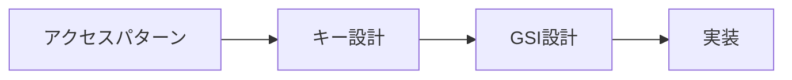

# Phase 2-2: アクセスパターン

## 学習目標

この単元を終えると、以下ができるようになります：

- アクセスパターンを先に定義できる
- パターン別のキー設計ができる
- 階層構造を表現できる

## アクセスパターン駆動設計



### 設計プロセス

1. **アクセスパターンを列挙**
2. **PKとSKを決定**
3. **GSIが必要か判断**
4. **テーブル設計を完成**

## ハンズオン

### 演習1: EC サイトのアクセスパターン

```python
# ecommerce_patterns.py
"""
ECサイトのアクセスパターン分析
"""

ACCESS_PATTERNS = [
    # ユーザー関連
    {'id': 1, 'name': 'ユーザー情報取得', 'key': 'userId'},
    {'id': 2, 'name': 'ユーザーの注文一覧', 'key': 'userId', 'sort': 'orderDate'},
    {'id': 3, 'name': 'ユーザーの住所一覧', 'key': 'userId'},
    
    # 注文関連
    {'id': 4, 'name': '注文詳細取得', 'key': 'orderId'},
    {'id': 5, 'name': 'ステータス別注文', 'key': 'status', 'sort': 'orderDate'},
    {'id': 6, 'name': '期間別注文', 'key': 'orderDate range'},
    
    # 商品関連
    {'id': 7, 'name': '商品情報取得', 'key': 'productId'},
    {'id': 8, 'name': 'カテゴリ別商品', 'key': 'category', 'sort': 'price'},
    {'id': 9, 'name': '商品のレビュー', 'key': 'productId', 'sort': 'reviewDate'},
]

# キー設計
KEY_DESIGN = {
    'PK': 'Entity#{entityId}',
    'SK': 'Type#...',
    'GSI1': {'PK': 'Type', 'SK': 'Entity#{entityId}'},  # 逆引き
    'GSI2': {'PK': 'status', 'SK': 'orderDate'},        # ステータス検索
    'GSI3': {'PK': 'category', 'SK': 'price'},          # カテゴリ検索
}
```

### 演習2: 階層構造の表現

```python
# hierarchical_data.py
"""
階層構造データの表現

例: 組織図
Company
├── Department A
│   ├── Team 1
│   └── Team 2
└── Department B
    └── Team 3
"""

import boto3
from boto3.dynamodb.conditions import Key

dynamodb = boto3.resource('dynamodb')
table = dynamodb.Table('Organization')

# アイテム設計
ITEMS = [
    # 会社
    {'PK': 'ORG#ACME', 'SK': 'COMPANY', 'name': 'ACME Corp', 'type': 'company'},
    
    # 部門
    {'PK': 'ORG#ACME', 'SK': 'DEPT#A', 'name': 'Engineering', 'type': 'department'},
    {'PK': 'ORG#ACME', 'SK': 'DEPT#B', 'name': 'Sales', 'type': 'department'},
    
    # チーム
    {'PK': 'ORG#ACME', 'SK': 'DEPT#A#TEAM#1', 'name': 'Backend', 'type': 'team'},
    {'PK': 'ORG#ACME', 'SK': 'DEPT#A#TEAM#2', 'name': 'Frontend', 'type': 'team'},
    {'PK': 'ORG#ACME', 'SK': 'DEPT#B#TEAM#3', 'name': 'Enterprise', 'type': 'team'},
]

def get_all_organization(org_id: str):
    """組織全体を取得"""
    response = table.query(
        KeyConditionExpression=Key('PK').eq(f'ORG#{org_id}')
    )
    return response['Items']

def get_department_with_teams(org_id: str, dept_id: str):
    """部門とその配下のチーム"""
    response = table.query(
        KeyConditionExpression=
            Key('PK').eq(f'ORG#{org_id}') &
            Key('SK').begins_with(f'DEPT#{dept_id}')
    )
    return response['Items']

def get_only_departments(org_id: str):
    """部門のみ（チーム除く）"""
    response = table.query(
        KeyConditionExpression=
            Key('PK').eq(f'ORG#{org_id}') &
            Key('SK').begins_with('DEPT#'),
        FilterExpression=Attr('type').eq('department')
    )
    return response['Items']
```

### 演習3: 時系列データ

```python
# time_series.py
"""
時系列データの設計

例: IoTセンサーデータ
"""

from datetime import datetime, timedelta
import boto3
from boto3.dynamodb.conditions import Key

dynamodb = boto3.resource('dynamodb')
table = dynamodb.Table('SensorData')

# キー設計
# PK: SENSOR#{sensorId}#YYYY-MM（月ごとにパーティション分割）
# SK: YYYY-MM-DDTHH:mm:ss

def store_sensor_data(sensor_id: str, value: float, timestamp: datetime = None):
    """センサーデータ保存"""
    timestamp = timestamp or datetime.utcnow()
    month = timestamp.strftime('%Y-%m')
    
    table.put_item(Item={
        'PK': f'SENSOR#{sensor_id}#{month}',
        'SK': timestamp.isoformat(),
        'sensorId': sensor_id,
        'value': value,
        'timestamp': timestamp.isoformat()
    })

def get_sensor_data_range(sensor_id: str, start: datetime, end: datetime):
    """期間指定でデータ取得"""
    items = []
    
    # 月をまたぐ場合は複数クエリ
    current = start.replace(day=1)
    while current <= end:
        month = current.strftime('%Y-%m')
        
        response = table.query(
            KeyConditionExpression=
                Key('PK').eq(f'SENSOR#{sensor_id}#{month}') &
                Key('SK').between(start.isoformat(), end.isoformat())
        )
        items.extend(response['Items'])
        
        # 次の月へ
        if current.month == 12:
            current = current.replace(year=current.year + 1, month=1)
        else:
            current = current.replace(month=current.month + 1)
    
    return items

# TTL で自動削除
def store_with_ttl(sensor_id: str, value: float, retention_days: int = 30):
    """TTL付きでデータ保存"""
    now = datetime.utcnow()
    ttl = int((now + timedelta(days=retention_days)).timestamp())
    
    month = now.strftime('%Y-%m')
    table.put_item(Item={
        'PK': f'SENSOR#{sensor_id}#{month}',
        'SK': now.isoformat(),
        'value': value,
        'ttl': ttl  # エポック秒
    })
```

### 演習4: Many-to-Many

```python
# many_to_many.py
"""
多対多リレーション

例: ユーザーとグループ
"""

import boto3
from boto3.dynamodb.conditions import Key

dynamodb = boto3.resource('dynamodb')
table = dynamodb.Table('UserGroups')

# アイテム設計（隣接リスト）
ITEMS = [
    # User → Groups
    {'PK': 'USER#alice', 'SK': 'GROUP#developers', 'role': 'member'},
    {'PK': 'USER#alice', 'SK': 'GROUP#admins', 'role': 'admin'},
    {'PK': 'USER#bob', 'SK': 'GROUP#developers', 'role': 'member'},
    
    # Group → Users (GSI で逆引き可能にする)
    # GSI1PK: GROUP#developers, GSI1SK: USER#alice
]

def get_user_groups(user_id: str):
    """ユーザーが所属するグループ"""
    response = table.query(
        KeyConditionExpression=
            Key('PK').eq(f'USER#{user_id}') &
            Key('SK').begins_with('GROUP#')
    )
    return response['Items']

def get_group_members(group_id: str):
    """グループのメンバー（GSI使用）"""
    response = table.query(
        IndexName='GSI1',
        KeyConditionExpression=Key('GSI1PK').eq(f'GROUP#{group_id}')
    )
    return response['Items']

def add_user_to_group(user_id: str, group_id: str, role: str = 'member'):
    """ユーザーをグループに追加"""
    table.put_item(Item={
        'PK': f'USER#{user_id}',
        'SK': f'GROUP#{group_id}',
        'GSI1PK': f'GROUP#{group_id}',
        'GSI1SK': f'USER#{user_id}',
        'role': role,
        'joinedAt': datetime.utcnow().isoformat()
    })
```

## アクセスパターン別 GSI 設計

| パターン | GSI 設計 |
|---------|---------|
| 逆引き | GSI1PK = SK, GSI1SK = PK |
| ステータス検索 | GSI2PK = status |
| 日付範囲 | GSI3PK = type, GSI3SK = date |

## 理解度確認

### 問題

IoT センサーデータを DynamoDB に保存する際、パーティションのホットスポットを避ける最適な設計は何か。

**A.** PK: sensorId のみ

**B.** PK: SENSOR#{sensorId}#{YYYY-MM}

**C.** PK: timestamp

**D.** PK: random UUID

---

### 解答・解説

**正解: B**

月ごとにパーティションを分割することで、書き込みが分散されます。sensorId のみだと単一パーティションに集中し、timestamp だと古いデータの検索が困難になります。

---

## 次のステップ

アクセスパターンを学びました。次は総仕上げです。

**次の単元**: [Phase 3-1: 総仕上げ](../phase3/01_総仕上げ.md)
