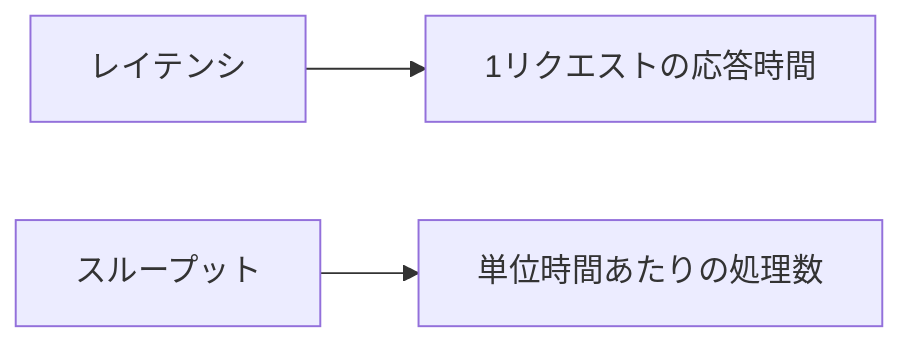
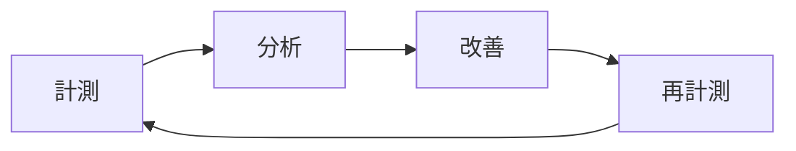

# Phase 1-1: パフォーマンス基礎

## 学習目標

この単元を終えると、以下ができるようになります：

- パフォーマンス指標を理解できる
- 計測の重要性を説明できる
- レイテンシとスループットを区別できる

## パフォーマンス指標

### レイテンシ vs スループット



| 指標 | 説明 | 例 |
|------|------|-----|
| レイテンシ | 応答時間 | 200ms |
| スループット | 処理量/秒 | 1000 req/s |
| P50 | 50%タイル | 中央値 |
| P95 | 95%タイル | ほぼ最悪 |
| P99 | 99%タイル | 最悪ケース |

### なぜ P95/P99 が重要？

```
1000リクエスト中：
- 平均: 100ms（速く見える）
- P99: 2000ms（50人が2秒待つ）
```

## 計測の原則

> 推測するな、計測せよ



## ハンズオン

### 演習1: 基本的な計測

```python
# timing.py
import time
from functools import wraps
from typing import Callable

def measure_time(func: Callable):
    """関数の実行時間を計測するデコレータ"""
    @wraps(func)
    def wrapper(*args, **kwargs):
        start = time.perf_counter()
        result = func(*args, **kwargs)
        elapsed = time.perf_counter() - start
        print(f'{func.__name__}: {elapsed*1000:.2f}ms')
        return result
    return wrapper

@measure_time
def slow_function():
    time.sleep(0.5)
    return 'done'

@measure_time
def fast_function():
    return sum(range(1000000))

slow_function()  # slow_function: 500.12ms
fast_function()  # fast_function: 23.45ms
```

### 演習2: パーセンタイル計算

```python
# percentile.py
import statistics
import random

def calculate_percentiles(data: list[float]) -> dict:
    """パーセンタイルを計算"""
    sorted_data = sorted(data)
    n = len(sorted_data)
    
    return {
        'min': sorted_data[0],
        'p50': statistics.median(sorted_data),
        'p95': sorted_data[int(n * 0.95)],
        'p99': sorted_data[int(n * 0.99)],
        'max': sorted_data[-1],
        'mean': statistics.mean(sorted_data),
    }

# シミュレーション: レスポンスタイム
response_times = [random.gauss(100, 20) for _ in range(1000)]
# 外れ値を追加（10%が遅い）
response_times.extend([random.gauss(500, 100) for _ in range(100)])

stats = calculate_percentiles(response_times)
print(f'P50: {stats["p50"]:.2f}ms')
print(f'P95: {stats["p95"]:.2f}ms')
print(f'P99: {stats["p99"]:.2f}ms')
```

### 演習3: 簡易ベンチマーク

```python
# benchmark.py
import time
import statistics
from contextlib import contextmanager

class Benchmark:
    def __init__(self, name: str, iterations: int = 100):
        self.name = name
        self.iterations = iterations
        self.times = []
    
    @contextmanager
    def measure(self):
        start = time.perf_counter()
        yield
        elapsed = time.perf_counter() - start
        self.times.append(elapsed * 1000)
    
    def run(self, func):
        for _ in range(self.iterations):
            with self.measure():
                func()
        self.report()
    
    def report(self):
        print(f'\n=== {self.name} ({self.iterations} iterations) ===')
        print(f'Mean:   {statistics.mean(self.times):.2f}ms')
        print(f'Stdev:  {statistics.stdev(self.times):.2f}ms')
        print(f'Min:    {min(self.times):.2f}ms')
        print(f'Max:    {max(self.times):.2f}ms')
        
        sorted_times = sorted(self.times)
        n = len(sorted_times)
        print(f'P50:    {sorted_times[int(n*0.5)]:.2f}ms')
        print(f'P95:    {sorted_times[int(n*0.95)]:.2f}ms')

# 使用例
def target_function():
    sum(range(100000))

bench = Benchmark('sum_benchmark', iterations=100)
bench.run(target_function)
```

### 演習4: HTTP レスポンスタイム計測

```python
# http_benchmark.py
import httpx
import asyncio
import statistics
import time

async def benchmark_endpoint(url: str, num_requests: int = 100):
    """エンドポイントのベンチマーク"""
    times = []
    
    async with httpx.AsyncClient() as client:
        for _ in range(num_requests):
            start = time.perf_counter()
            response = await client.get(url)
            elapsed = (time.perf_counter() - start) * 1000
            times.append(elapsed)
    
    sorted_times = sorted(times)
    n = len(sorted_times)
    
    print(f'\n=== {url} ({num_requests} requests) ===')
    print(f'Mean:   {statistics.mean(times):.2f}ms')
    print(f'P50:    {sorted_times[int(n*0.5)]:.2f}ms')
    print(f'P95:    {sorted_times[int(n*0.95)]:.2f}ms')
    print(f'P99:    {sorted_times[int(n*0.99)]:.2f}ms')
    print(f'Throughput: {num_requests / (sum(times)/1000):.2f} req/s')

# 使用
# asyncio.run(benchmark_endpoint('http://localhost:8000/api/users'))
```

## AWS での計測

| AWS サービス | 用途 |
|-------------|------|
| CloudWatch Metrics | 基本メトリクス |
| X-Ray | 分散トレーシング |
| CloudWatch Logs Insights | ログ分析 |

あなたが使っている **Lambda** の場合：
- Duration（実行時間）
- Cold Start（コールドスタート）

## 理解度確認

### 問題

1000 リクエストの応答時間を計測した結果、平均が 100ms、P99 が 2000ms だった。この結果から言えることはどれか。

**A.** ほとんどのリクエストが 2000ms かかる

**B.** 約 10 リクエストが 2000ms 以上かかる

**C.** システムは安定している

**D.** 平均値だけ見れば問題ない

---

### 解答・解説

**正解: B**

P99 = 2000ms は「99%のリクエストは2000ms以下」つまり、1000リクエスト中約10リクエスト（1%）が2000ms以上かかることを意味します。

---

## 次のステップ

パフォーマンス基礎を学びました。次はプロファイリングを学びましょう。

**次の単元**: [Phase 1-2: プロファイリング](./02_プロファイリング.md)
