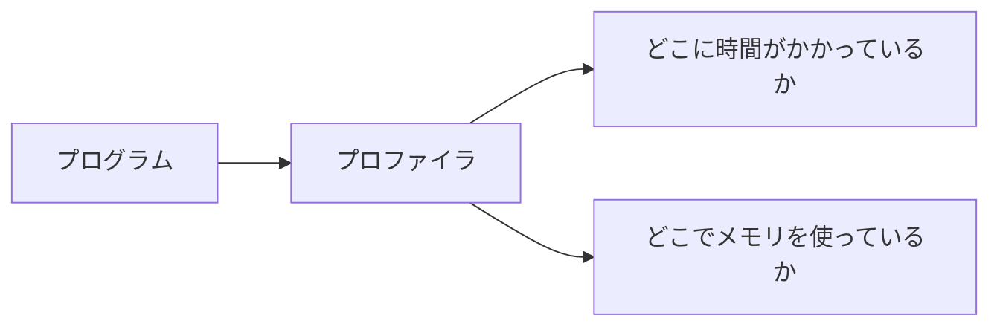

# Phase 1-2: プロファイリング

## 学習目標

この単元を終えると、以下ができるようになります：

- ボトルネックを特定できる
- cProfile を使える
- メモリプロファイリングができる

## プロファイリングとは



## CPU プロファイリング

### 演習1: cProfile

```python
# profile_example.py
import cProfile
import pstats
from io import StringIO

def slow_function():
    result = []
    for i in range(10000):
        result.append(i ** 2)
    return result

def medium_function():
    return [i ** 2 for i in range(10000)]

def fast_function():
    import numpy as np
    return np.arange(10000) ** 2

def main():
    slow_function()
    medium_function()
    # fast_function()  # numpy 版

# プロファイリング実行
profiler = cProfile.Profile()
profiler.enable()

main()

profiler.disable()

# 結果を表示
stats = pstats.Stats(profiler)
stats.sort_stats('cumulative')
stats.print_stats(10)  # 上位10件
```

### 演習2: line_profiler

```bash
pip install line_profiler
```

```python
# line_profile_example.py
from line_profiler import profile

@profile
def process_data(data):
    result = []
    for item in data:          # ここで時間がかかる
        processed = item ** 2
        result.append(processed)
    return result

@profile
def main():
    data = list(range(100000))
    result = process_data(data)
    return len(result)

if __name__ == '__main__':
    main()
```

実行:
```bash
kernprof -l -v line_profile_example.py
```

### 演習3: デコレータでプロファイリング

```python
# profiler_decorator.py
import cProfile
import pstats
from functools import wraps
from io import StringIO

def profile_func(func):
    """関数単位でプロファイリング"""
    @wraps(func)
    def wrapper(*args, **kwargs):
        profiler = cProfile.Profile()
        try:
            return profiler.runcall(func, *args, **kwargs)
        finally:
            stream = StringIO()
            stats = pstats.Stats(profiler, stream=stream)
            stats.sort_stats('cumulative')
            stats.print_stats(10)
            print(stream.getvalue())
    return wrapper

@profile_func
def slow_algorithm(n):
    result = 0
    for i in range(n):
        for j in range(n):
            result += i * j
    return result

slow_algorithm(500)
```

## メモリプロファイリング

### 演習4: memory_profiler

```bash
pip install memory_profiler
```

```python
# memory_profile_example.py
from memory_profiler import profile

@profile
def create_large_list():
    data = [i for i in range(1000000)]
    return data

@profile
def create_large_dict():
    data = {i: i**2 for i in range(1000000)}
    return data

if __name__ == '__main__':
    list_data = create_large_list()
    dict_data = create_large_dict()
```

実行:
```bash
python -m memory_profiler memory_profile_example.py
```

### 演習5: tracemalloc

```python
# tracemalloc_example.py
import tracemalloc

# 追跡開始
tracemalloc.start()

# メモリを使う処理
data = [i ** 2 for i in range(1000000)]
data_dict = {i: str(i) for i in range(100000)}

# スナップショット取得
snapshot = tracemalloc.take_snapshot()
top_stats = snapshot.statistics('lineno')

print('\n=== Top 10 Memory Usage ===')
for stat in top_stats[:10]:
    print(stat)

# 現在のメモリ使用量
current, peak = tracemalloc.get_traced_memory()
print(f'\nCurrent: {current / 1024 / 1024:.2f} MB')
print(f'Peak: {peak / 1024 / 1024:.2f} MB')

tracemalloc.stop()
```

## FastAPI でのプロファイリング

```python
# fastapi_profiling.py
from fastapi import FastAPI, Request
import time
import cProfile
import pstats
from io import StringIO

app = FastAPI()

@app.middleware("http")
async def profile_middleware(request: Request, call_next):
    """リクエストのプロファイリング"""
    profiler = cProfile.Profile()
    profiler.enable()
    
    start = time.perf_counter()
    response = await call_next(request)
    elapsed = time.perf_counter() - start
    
    profiler.disable()
    
    if elapsed > 0.5:  # 500ms 以上の場合
        stream = StringIO()
        stats = pstats.Stats(profiler, stream=stream)
        stats.sort_stats('cumulative')
        stats.print_stats(10)
        print(f'\n=== Slow Request: {request.url.path} ({elapsed*1000:.2f}ms) ===')
        print(stream.getvalue())
    
    response.headers['X-Response-Time'] = f'{elapsed*1000:.2f}ms'
    return response

@app.get('/slow')
def slow_endpoint():
    # 意図的に遅い処理
    result = sum(i ** 2 for i in range(1000000))
    return {'result': result}
```

## ボトルネックの見つけ方

| 症状 | 可能性 |
|------|--------|
| CPU 100% | アルゴリズムの問題 |
| メモリ増加 | メモリリーク |
| I/O 待ち | DB/ネットワーク |
| 応答時間増加 | N+1 問題 |

## 理解度確認

### 問題

Python で関数ごとの CPU 使用時間を計測するのに適したツールはどれか。

**A.** tracemalloc

**B.** cProfile

**C.** gc

**D.** sys.getsizeof

---

### 解答・解説

**正解: B**

cProfile は Python 標準の CPU プロファイラで、関数ごとの呼び出し回数と実行時間を計測できます。

---

## 次のステップ

プロファイリングを学びました。次はデータベース最適化を学びましょう。

**次の単元**: [Phase 2-1: データベース最適化](../phase2/01_データベース最適化.md)
