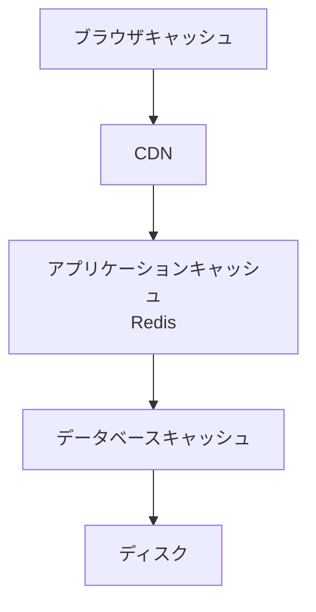

# Phase 3-1: キャッシュ戦略

## 学習目標

この単元を終えると、以下ができるようになります：

- 多層キャッシュを設計できる
- 適切なキャッシュ戦略を選択できる
- キャッシュの無効化を実装できる

## キャッシュの階層



| 層 | 速度 | 容量 | 例 |
|---|------|------|-----|
| L1 | 最速 | 最小 | メモリ |
| L2 | 速い | 小 | Redis |
| L3 | 中 | 大 | CDN |
| L4 | 遅い | 最大 | DB |

## ハンズオン

### 演習1: 多層キャッシュ

```python
# multi_layer_cache.py
import redis
import json
from functools import lru_cache
from typing import Optional, Callable, TypeVar

T = TypeVar('T')

class MultiLayerCache:
    """多層キャッシュ"""
    
    def __init__(self, redis_url: str = 'redis://localhost:6379'):
        self.redis = redis.from_url(redis_url, decode_responses=True)
        self._local_cache = {}
    
    def get(
        self,
        key: str,
        fetch_fn: Callable[[], T],
        local_ttl: int = 60,
        redis_ttl: int = 3600
    ) -> T:
        """
        1. ローカルキャッシュを確認
        2. Redis を確認
        3. なければ取得して両方にキャッシュ
        """
        # L1: ローカルキャッシュ
        if key in self._local_cache:
            return self._local_cache[key]
        
        # L2: Redis
        cached = self.redis.get(key)
        if cached:
            data = json.loads(cached)
            self._local_cache[key] = data  # ローカルにも保存
            return data
        
        # キャッシュミス: データ取得
        data = fetch_fn()
        
        # 両方のキャッシュに保存
        self.redis.setex(key, redis_ttl, json.dumps(data))
        self._local_cache[key] = data
        
        return data
    
    def invalidate(self, key: str):
        """キャッシュを無効化"""
        self.redis.delete(key)
        self._local_cache.pop(key, None)

# 使用例
cache = MultiLayerCache()

def get_user(user_id: int) -> dict:
    def fetch():
        # DB から取得（遅い）
        import time
        time.sleep(0.1)
        return {'id': user_id, 'name': f'User {user_id}'}
    
    return cache.get(f'user:{user_id}', fetch)
```

### 演習2: HTTP キャッシュヘッダー

```python
# http_cache.py
from fastapi import FastAPI, Response
from datetime import datetime, timedelta

app = FastAPI()

@app.get('/static-data')
def static_data(response: Response):
    """静的データ: 長期キャッシュ"""
    response.headers['Cache-Control'] = 'public, max-age=86400'  # 1日
    return {'data': 'static content'}

@app.get('/dynamic-data')
def dynamic_data(response: Response):
    """動的データ: キャッシュなし"""
    response.headers['Cache-Control'] = 'no-store'
    return {'timestamp': datetime.now().isoformat()}

@app.get('/user-data')
def user_data(response: Response):
    """ユーザーデータ: 条件付きキャッシュ"""
    response.headers['Cache-Control'] = 'private, max-age=60'  # 1分
    return {'user': 'private data'}

@app.get('/api/products')
def products(response: Response):
    """API レスポンス: ETag を使用"""
    data = get_products()
    etag = generate_etag(data)
    
    response.headers['ETag'] = etag
    response.headers['Cache-Control'] = 'public, max-age=0, must-revalidate'
    
    return data
```

### 演習3: キャッシュ無効化パターン

```python
# cache_invalidation.py
import redis
from enum import Enum

class InvalidationStrategy(Enum):
    IMMEDIATE = 'immediate'      # 即座に削除
    TTL = 'ttl'                  # TTL で期限切れ
    VERSIONED = 'versioned'      # バージョン付け
    TAG_BASED = 'tag_based'      # タグベース

class CacheManager:
    def __init__(self):
        self.r = redis.Redis(host='localhost', port=6379, decode_responses=True)
    
    # 1. 即座に削除
    def invalidate_immediate(self, key: str):
        self.r.delete(key)
    
    # 2. パターンマッチで削除
    def invalidate_pattern(self, pattern: str):
        cursor = 0
        while True:
            cursor, keys = self.r.scan(cursor, match=pattern, count=100)
            if keys:
                self.r.delete(*keys)
            if cursor == 0:
                break
    
    # 3. バージョン付け
    def get_versioned(self, key: str, version: int):
        return self.r.get(f'{key}:v{version}')
    
    def set_versioned(self, key: str, version: int, value: str, ttl: int = 3600):
        self.r.setex(f'{key}:v{version}', ttl, value)
    
    # 4. タグベース
    def set_with_tags(self, key: str, value: str, tags: list[str], ttl: int = 3600):
        self.r.setex(key, ttl, value)
        for tag in tags:
            self.r.sadd(f'tag:{tag}', key)
    
    def invalidate_by_tag(self, tag: str):
        keys = self.r.smembers(f'tag:{tag}')
        if keys:
            self.r.delete(*keys)
        self.r.delete(f'tag:{tag}')
```

### 演習4: キャッシュ効果の測定

```python
# cache_metrics.py
import redis
import time
from dataclasses import dataclass, field

@dataclass
class CacheMetrics:
    hits: int = 0
    misses: int = 0
    total_time_saved: float = 0.0
    
    @property
    def hit_rate(self) -> float:
        total = self.hits + self.misses
        return self.hits / total if total > 0 else 0.0

class MetricedCache:
    def __init__(self):
        self.r = redis.Redis(host='localhost', port=6379, decode_responses=True)
        self.metrics = CacheMetrics()
    
    def get(self, key: str, fetch_fn, ttl: int = 3600):
        # キャッシュ確認
        start = time.perf_counter()
        cached = self.r.get(key)
        cache_time = time.perf_counter() - start
        
        if cached:
            self.metrics.hits += 1
            # 想定される DB 時間との差を計算
            self.metrics.total_time_saved += 0.1 - cache_time
            return cached
        
        # キャッシュミス
        self.metrics.misses += 1
        
        # データ取得
        data = fetch_fn()
        self.r.setex(key, ttl, data)
        
        return data
    
    def report(self):
        print(f'\n=== Cache Metrics ===')
        print(f'Hits: {self.metrics.hits}')
        print(f'Misses: {self.metrics.misses}')
        print(f'Hit Rate: {self.metrics.hit_rate:.2%}')
        print(f'Time Saved: {self.metrics.total_time_saved*1000:.2f}ms')
```

## 理解度確認

### 問題

キャッシュの「Cache-Control: private」はどのような意味か。

**A.** キャッシュしない

**B.** ブラウザのみキャッシュ可（CDN不可）

**C.** 1分間キャッシュ

**D.** 常に最新を取得

---

### 解答・解説

**正解: B**

`private` はブラウザ（エンドユーザー）のみがキャッシュ可能で、CDN などの共有キャッシュには保存されません。ユーザー固有のデータに使用します。

---

## 次のステップ

キャッシュ戦略を学びました。次は N+1 問題を学びましょう。

**次の単元**: [Phase 3-2: N+1 問題](./02_N+1問題.md)
