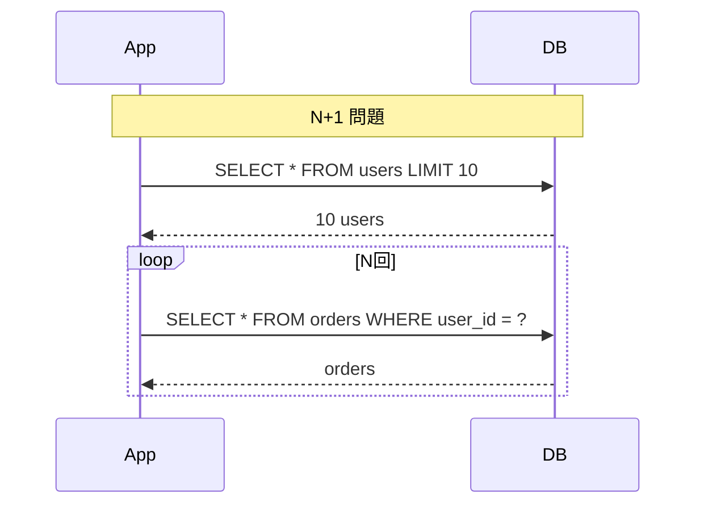

# Phase 3-2: N+1 問題

## 学習目標

この単元を終えると、以下ができるようになります：

- N+1 問題を理解できる
- N+1 問題を検出できる
- N+1 問題を解決できる

## N+1 問題とは



| 方式 | クエリ数 | 問題 |
|------|---------|------|
| N+1 | 1 + N | 遅い |
| JOIN | 1 | 速い |
| Eager Loading | 2 | 速い |

## ハンズオン

### 準備: SQLAlchemy モデル

```python
# models.py
from sqlalchemy import create_engine, Column, Integer, String, ForeignKey
from sqlalchemy.orm import declarative_base, relationship, Session

Base = declarative_base()

class User(Base):
    __tablename__ = 'users'
    
    id = Column(Integer, primary_key=True)
    name = Column(String(100))
    orders = relationship('Order', back_populates='user')

class Order(Base):
    __tablename__ = 'orders'
    
    id = Column(Integer, primary_key=True)
    user_id = Column(Integer, ForeignKey('users.id'))
    amount = Column(Integer)
    user = relationship('User', back_populates='orders')

# 接続
engine = create_engine('sqlite:///test.db', echo=True)
Base.metadata.create_all(engine)
```

### 演習1: N+1 問題の再現

```python
# n_plus_1_problem.py
from sqlalchemy.orm import Session
from models import engine, User, Order

# テストデータ作成
with Session(engine) as session:
    for i in range(10):
        user = User(name=f'User {i}')
        session.add(user)
        session.flush()
        
        for j in range(5):
            order = Order(user_id=user.id, amount=j * 100)
            session.add(order)
    
    session.commit()

# N+1 問題
with Session(engine) as session:
    users = session.query(User).all()  # 1クエリ
    
    for user in users:
        # ここで N 回クエリが発生！
        print(f'{user.name}: {len(user.orders)} orders')

# 出力:
# SELECT * FROM users                      -- 1回目
# SELECT * FROM orders WHERE user_id = 1   -- 2回目
# SELECT * FROM orders WHERE user_id = 2   -- 3回目
# ...（10回）
```

### 演習2: Eager Loading で解決

```python
# eager_loading.py
from sqlalchemy.orm import Session, joinedload, selectinload
from models import engine, User

# 方法1: joinedload（JOIN で取得）
with Session(engine) as session:
    users = session.query(User).options(
        joinedload(User.orders)
    ).all()  # 1クエリ（JOIN）
    
    for user in users:
        print(f'{user.name}: {len(user.orders)} orders')

# 方法2: selectinload（IN句で取得）
with Session(engine) as session:
    users = session.query(User).options(
        selectinload(User.orders)
    ).all()  # 2クエリ（SELECT ... WHERE user_id IN (...))
    
    for user in users:
        print(f'{user.name}: {len(user.orders)} orders')
```

### 演習3: N+1 問題の検出

```python
# n_plus_1_detector.py
import logging
from sqlalchemy import event
from sqlalchemy.engine import Engine
from collections import defaultdict
from contextlib import contextmanager

class QueryCounter:
    def __init__(self):
        self.queries = defaultdict(int)
        self.total = 0
    
    def log_query(self, query: str):
        # 正規化（パラメータを除去）
        normalized = query.split(' WHERE')[0]
        self.queries[normalized] += 1
        self.total += 1
    
    def detect_n_plus_1(self, threshold: int = 3):
        """N+1 問題を検出"""
        issues = []
        for query, count in self.queries.items():
            if count >= threshold:
                issues.append((query, count))
        return issues
    
    def report(self):
        print(f'\n=== Query Report ===')
        print(f'Total queries: {self.total}')
        
        issues = self.detect_n_plus_1()
        if issues:
            print('\n⚠️ Potential N+1 problems:')
            for query, count in issues:
                print(f'  - {query[:50]}... ({count} times)')

counter = QueryCounter()

@event.listens_for(Engine, 'before_cursor_execute')
def receive_before_cursor_execute(conn, cursor, statement, parameters, context, executemany):
    counter.log_query(statement)

# 使用例
with Session(engine) as session:
    users = session.query(User).all()
    for user in users:
        _ = user.orders  # N+1 発生

counter.report()
```

### 演習4: FastAPI での解決

```python
# fastapi_n_plus_1.py
from fastapi import FastAPI, Depends
from sqlalchemy.orm import Session, selectinload
from typing import List

app = FastAPI()

def get_db():
    db = Session(engine)
    try:
        yield db
    finally:
        db.close()

# ❌ N+1 問題
@app.get('/users/bad')
def get_users_bad(db: Session = Depends(get_db)):
    users = db.query(User).all()
    return [
        {
            'id': user.id,
            'name': user.name,
            'order_count': len(user.orders)  # N回のクエリ
        }
        for user in users
    ]

# ✅ Eager Loading
@app.get('/users/good')
def get_users_good(db: Session = Depends(get_db)):
    users = db.query(User).options(
        selectinload(User.orders)
    ).all()
    
    return [
        {
            'id': user.id,
            'name': user.name,
            'order_count': len(user.orders)  # クエリなし
        }
        for user in users
    ]
```

## 解決策の比較

| 方法 | クエリ数 | メモリ | 用途 |
|------|---------|--------|------|
| joinedload | 1 | 多い | 小さなリレーション |
| selectinload | 2 | 少ない | 大きなリレーション |
| subqueryload | 2 | 中 | 複雑なクエリ |

## 理解度確認

### 問題

SQLAlchemy で N+1 問題を解決するのに適した方法はどれか。

**A.** lazy='dynamic' を設定

**B.** selectinload() を使う

**C.** all() の代わりに first() を使う

**D.** キャッシュを使う

---

### 解答・解説

**正解: B**

`selectinload()` は IN 句を使って関連データを一括取得し、N+1 問題を解決します。

```python
session.query(User).options(selectinload(User.orders)).all()
```

---

## 次のステップ

N+1 問題を学びました。次は非同期処理を学びましょう。

**次の単元**: [Phase 4-1: 非同期処理](../phase4/01_非同期処理.md)
