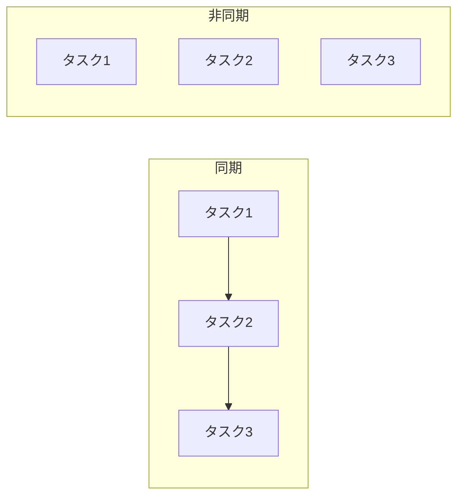

# Phase 4-1: 非同期処理

## 学習目標

この単元を終えると、以下ができるようになります：

- async/await を使える
- 並行処理と並列処理を区別できる
- I/O バウンドな処理を最適化できる

## 同期 vs 非同期



| 項目 | 同期 | 非同期 |
|------|------|--------|
| I/O 待ち | ブロック | 他の処理 |
| コード | シンプル | やや複雑 |
| 向いている | CPU バウンド | I/O バウンド |

## ハンズオン

### 演習1: 基本的な async/await

```python
# async_basic.py
import asyncio
import time

async def fetch_data(id: int) -> dict:
    """API 呼び出しをシミュレート"""
    await asyncio.sleep(1)  # 1秒待機
    return {'id': id, 'data': f'Data {id}'}

# 同期版（遅い）
def sync_fetch_all():
    start = time.perf_counter()
    results = []
    
    for i in range(5):
        time.sleep(1)
        results.append({'id': i, 'data': f'Data {i}'})
    
    print(f'Sync: {time.perf_counter() - start:.2f}s')
    return results

# 非同期版（速い）
async def async_fetch_all():
    start = time.perf_counter()
    
    # 並行して実行
    tasks = [fetch_data(i) for i in range(5)]
    results = await asyncio.gather(*tasks)
    
    print(f'Async: {time.perf_counter() - start:.2f}s')
    return results

# 実行
sync_fetch_all()      # Sync: 5.00s
asyncio.run(async_fetch_all())  # Async: 1.00s
```

### 演習2: HTTP リクエストの並行処理

```python
# async_http.py
import asyncio
import httpx
import time

async def fetch_url(client: httpx.AsyncClient, url: str) -> dict:
    response = await client.get(url)
    return {'url': url, 'status': response.status_code}

async def fetch_all_urls(urls: list[str]) -> list[dict]:
    async with httpx.AsyncClient() as client:
        tasks = [fetch_url(client, url) for url in urls]
        return await asyncio.gather(*tasks)

# 使用例
urls = [
    'https://httpbin.org/delay/1',
    'https://httpbin.org/delay/1',
    'https://httpbin.org/delay/1',
]

start = time.perf_counter()
results = asyncio.run(fetch_all_urls(urls))
print(f'Total: {time.perf_counter() - start:.2f}s')
# Total: 1.xx s（並行なので5秒ではなく1秒）
```

### 演習3: Semaphore で並行数制限

```python
# async_semaphore.py
import asyncio
import httpx

async def fetch_with_limit(
    client: httpx.AsyncClient,
    url: str,
    semaphore: asyncio.Semaphore
) -> dict:
    async with semaphore:
        response = await client.get(url)
        return {'url': url, 'status': response.status_code}

async def fetch_all_limited(urls: list[str], max_concurrent: int = 10):
    semaphore = asyncio.Semaphore(max_concurrent)
    
    async with httpx.AsyncClient() as client:
        tasks = [
            fetch_with_limit(client, url, semaphore)
            for url in urls
        ]
        return await asyncio.gather(*tasks)

# 100 URL を同時に最大10接続で処理
urls = [f'https://httpbin.org/get?id={i}' for i in range(100)]
results = asyncio.run(fetch_all_limited(urls, max_concurrent=10))
```

### 演習4: FastAPI での非同期

```python
# async_fastapi.py
from fastapi import FastAPI
import httpx
import asyncio

app = FastAPI()

# ❌ 同期（I/O でブロック）
@app.get('/sync')
def sync_endpoint():
    import requests
    response = requests.get('https://httpbin.org/delay/1')
    return response.json()

# ✅ 非同期（I/O 待ちで他を処理）
@app.get('/async')
async def async_endpoint():
    async with httpx.AsyncClient() as client:
        response = await client.get('https://httpbin.org/delay/1')
        return response.json()

# ✅ 複数の API を並行呼び出し
@app.get('/parallel')
async def parallel_endpoint():
    async with httpx.AsyncClient() as client:
        tasks = [
            client.get('https://httpbin.org/delay/1'),
            client.get('https://httpbin.org/delay/1'),
            client.get('https://httpbin.org/delay/1'),
        ]
        responses = await asyncio.gather(*tasks)
        return [r.json() for r in responses]
```

### 演習5: タイムアウト

```python
# async_timeout.py
import asyncio
import httpx

async def fetch_with_timeout(url: str, timeout: float = 5.0):
    try:
        async with httpx.AsyncClient(timeout=timeout) as client:
            response = await client.get(url)
            return {'url': url, 'status': response.status_code}
    except httpx.TimeoutException:
        return {'url': url, 'error': 'timeout'}

# asyncio.wait_for を使う方法
async def fetch_with_asyncio_timeout(url: str, timeout: float = 5.0):
    async with httpx.AsyncClient() as client:
        try:
            response = await asyncio.wait_for(
                client.get(url),
                timeout=timeout
            )
            return {'status': response.status_code}
        except asyncio.TimeoutError:
            return {'error': 'timeout'}
```

## 注意点

| やること | やらないこと |
|---------|-------------|
| I/O 処理を async | CPU 処理を async |
| asyncio.gather | 個別に await |
| 適切なタイムアウト | 無限待機 |
| 並行数制限 | 大量の同時接続 |

## 理解度確認

### 問題

以下のコードで、3つの API 呼び出しにかかる時間はおよそ何秒か（各 API は 1 秒かかる）。

```python
async def main():
    tasks = [fetch(1), fetch(2), fetch(3)]
    await asyncio.gather(*tasks)
```

**A.** 1秒

**B.** 3秒

**C.** 5秒

**D.** 実行順序による

---

### 解答・解説

**正解: A**

`asyncio.gather` は全てのタスクを並行実行するため、3つの 1 秒タスクは約 1 秒で完了します。

---

## 次のステップ

非同期処理を学びました。次は並列処理を学びましょう。

**次の単元**: [Phase 4-2: 並列処理](./02_並列処理.md)
