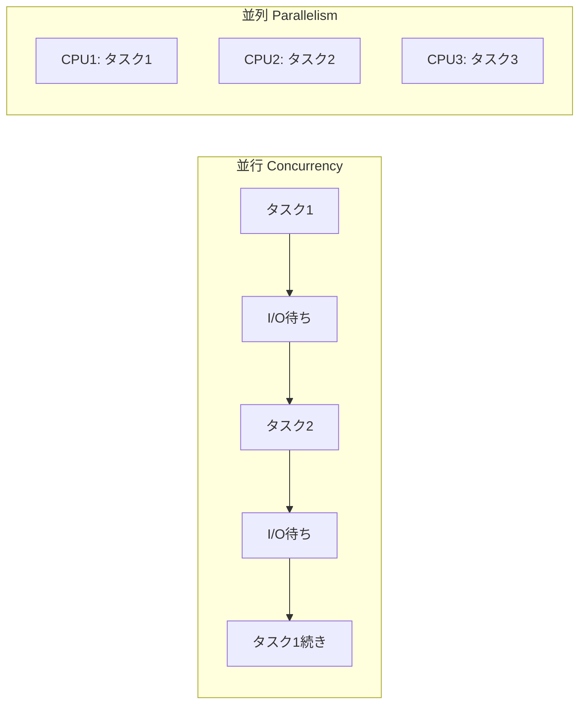

# Phase 4-2: 並列処理

## 学習目標

この単元を終えると、以下ができるようになります：

- マルチプロセスを使える
- CPU バウンドな処理を最適化できる
- 並行と並列の使い分けができる

## 並行 vs 並列



| 項目 | 並行 (Concurrency) | 並列 (Parallelism) |
|------|-------------------|-------------------|
| 実行 | 1つずつ切り替え | 同時に実行 |
| 向き | I/O バウンド | CPU バウンド |
| Python | asyncio, threading | multiprocessing |
| GIL | 影響あり | 影響なし |

## ハンズオン

### 演習1: GIL の影響

```python
# gil_demo.py
import threading
import time

def cpu_bound_task(n: int) -> int:
    """CPU バウンドな処理"""
    result = 0
    for i in range(n):
        result += i ** 2
    return result

# シングルスレッド
def single_thread():
    start = time.perf_counter()
    for _ in range(4):
        cpu_bound_task(10_000_000)
    print(f'Single: {time.perf_counter() - start:.2f}s')

# マルチスレッド（GIL のため速くならない）
def multi_thread():
    start = time.perf_counter()
    threads = [
        threading.Thread(target=cpu_bound_task, args=(10_000_000,))
        for _ in range(4)
    ]
    for t in threads:
        t.start()
    for t in threads:
        t.join()
    print(f'Multi-thread: {time.perf_counter() - start:.2f}s')

single_thread()   # Single: 4.00s
multi_thread()    # Multi-thread: 4.00s（速くならない！）
```

### 演習2: multiprocessing で並列化

```python
# multiprocess_demo.py
from multiprocessing import Pool, cpu_count
import time

def cpu_bound_task(n: int) -> int:
    result = 0
    for i in range(n):
        result += i ** 2
    return result

# シングルプロセス
def single_process():
    start = time.perf_counter()
    results = [cpu_bound_task(10_000_000) for _ in range(4)]
    print(f'Single: {time.perf_counter() - start:.2f}s')
    return results

# マルチプロセス（速くなる！）
def multi_process():
    start = time.perf_counter()
    with Pool(processes=cpu_count()) as pool:
        results = pool.map(cpu_bound_task, [10_000_000] * 4)
    print(f'Multi-process: {time.perf_counter() - start:.2f}s')
    return results

if __name__ == '__main__':
    single_process()   # Single: 4.00s
    multi_process()    # Multi-process: 1.00s（4倍速！）
```

### 演習3: ProcessPoolExecutor

```python
# process_pool_executor.py
from concurrent.futures import ProcessPoolExecutor, as_completed
import time

def heavy_computation(x: int) -> int:
    """重い計算"""
    return sum(i ** 2 for i in range(x))

def process_batch(items: list[int], max_workers: int = None) -> list[int]:
    """バッチ処理を並列化"""
    results = []
    
    with ProcessPoolExecutor(max_workers=max_workers) as executor:
        # submit で非同期に投入
        futures = {
            executor.submit(heavy_computation, item): item
            for item in items
        }
        
        # 完了したものから取得
        for future in as_completed(futures):
            item = futures[future]
            try:
                result = future.result()
                results.append((item, result))
            except Exception as e:
                results.append((item, f'Error: {e}'))
    
    return results

if __name__ == '__main__':
    items = [1_000_000, 2_000_000, 3_000_000, 4_000_000]
    
    start = time.perf_counter()
    results = process_batch(items)
    print(f'Time: {time.perf_counter() - start:.2f}s')
```

### 演習4: 画像処理の並列化

```python
# parallel_image_processing.py
from concurrent.futures import ProcessPoolExecutor
from PIL import Image
import os

def process_image(input_path: str, output_path: str):
    """画像をリサイズ"""
    img = Image.open(input_path)
    img = img.resize((800, 600))
    img.save(output_path)
    return output_path

def batch_process_images(input_dir: str, output_dir: str):
    """ディレクトリ内の画像を並列処理"""
    os.makedirs(output_dir, exist_ok=True)
    
    tasks = []
    for filename in os.listdir(input_dir):
        if filename.endswith(('.jpg', '.png')):
            input_path = os.path.join(input_dir, filename)
            output_path = os.path.join(output_dir, f'resized_{filename}')
            tasks.append((input_path, output_path))
    
    with ProcessPoolExecutor() as executor:
        results = list(executor.map(
            lambda args: process_image(*args),
            tasks
        ))
    
    return results
```

### 演習5: 組み合わせ

```python
# combined_async_parallel.py
import asyncio
from concurrent.futures import ProcessPoolExecutor
import httpx

def cpu_intensive(data: str) -> str:
    """CPU バウンドな処理"""
    # 重い処理（例: データ解析）
    return data.upper() * 1000

async def fetch_and_process(url: str, executor: ProcessPoolExecutor):
    """I/O + CPU の組み合わせ"""
    # I/O バウンド: 非同期
    async with httpx.AsyncClient() as client:
        response = await client.get(url)
        data = response.text
    
    # CPU バウンド: 別プロセス
    loop = asyncio.get_event_loop()
    result = await loop.run_in_executor(executor, cpu_intensive, data)
    
    return result

async def main():
    urls = ['https://httpbin.org/get' for _ in range(10)]
    
    with ProcessPoolExecutor() as executor:
        tasks = [fetch_and_process(url, executor) for url in urls]
        results = await asyncio.gather(*tasks)
    
    return results

if __name__ == '__main__':
    asyncio.run(main())
```

## 使い分けガイド

| 処理タイプ | 解決策 | 例 |
|-----------|--------|-----|
| I/O バウンド | asyncio | API呼び出し、DB |
| CPU バウンド | multiprocessing | 計算、画像処理 |
| 混合 | 組み合わせ | 上記演習5 |

## 理解度確認

### 問題

Python で CPU バウンドな処理を高速化するのに適した方法はどれか。

**A.** asyncio

**B.** threading

**C.** multiprocessing

**D.** time.sleep

---

### 解答・解説

**正解: C**

Python の GIL（Global Interpreter Lock）のため、threading では CPU バウンドな処理は速くなりません。multiprocessing を使うと GIL を回避し、複数 CPU コアを活用できます。

---

## 次のステップ

並列処理を学びました。次は総仕上げです。

**次の単元**: [Phase 5-1: 総仕上げ](../phase5/01_総仕上げ.md)
