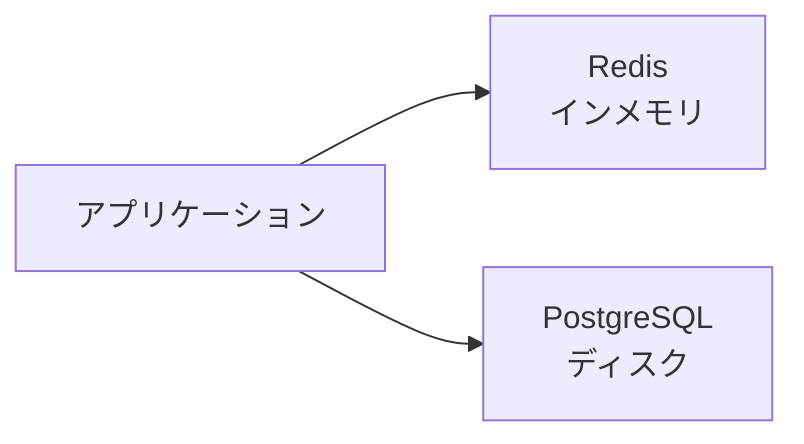

# Phase 1-1: Redis 入門

## 学習目標

この単元を終えると、以下ができるようになります：

- Redis の特徴を説明できる
- 主要なデータ型を理解できる
- ユースケースを挙げられる

## 概念解説

### Redis とは



**Redis** = インメモリデータストア（超高速）

### 特徴

| 特徴 | 説明 |
|------|------|
| 高速 | メモリ上で動作、ミリ秒以下 |
| データ構造 | 文字列、リスト、セット等 |
| 永続化 | オプションでディスク保存 |
| レプリケーション | マスター/レプリカ構成 |

### AWS との比較

| 機能 | Redis (OSS) | AWS |
|------|-------------|-----|
| キャッシュ | Redis | ElastiCache for Redis |
| セッション | Redis | ElastiCache / DynamoDB |
| キュー | Redis Lists | SQS |

あなたが使う可能性がある **ElastiCache** の中身は Redis です。

## Redis のデータ型

### String（文字列）

```
SET key "value"
GET key
```

用途: キャッシュ、カウンター、セッション

### List（リスト）

```
LPUSH mylist "a"
RPUSH mylist "b"
LRANGE mylist 0 -1
```

用途: キュー、タイムライン

### Set（集合）

```
SADD myset "a" "b" "c"
SMEMBERS myset
SISMEMBER myset "a"
```

用途: タグ、ユニークユーザー

### Hash（ハッシュ）

```
HSET user:1 name "Alice" age 25
HGET user:1 name
HGETALL user:1
```

用途: オブジェクトの保存

### Sorted Set（ソート済み集合）

```
ZADD leaderboard 100 "Alice" 200 "Bob"
ZRANGE leaderboard 0 -1 WITHSCORES
```

用途: ランキング、スケジュール

## 環境構築

```yaml
# docker-compose.yml
services:
  redis:
    image: redis:7
    ports:
      - "6379:6379"
    command: redis-server --appendonly yes
    volumes:
      - redis_data:/data

volumes:
  redis_data:
```

```bash
docker-compose up -d

# CLI 接続
docker exec -it <container_id> redis-cli
```

## ハンズオン

### 演習1: 基本操作

```bash
# redis-cli 接続後

# String
SET greeting "Hello, Redis!"
GET greeting

# 有効期限付き
SET session:abc123 "user_data" EX 3600
TTL session:abc123

# カウンター
SET visits 0
INCR visits
INCR visits
GET visits
```

### 演習2: リスト操作

```bash
# タスクキュー
LPUSH tasks "task1"
LPUSH tasks "task2"
LPUSH tasks "task3"

# 右から取り出し（FIFO）
RPOP tasks

# 全て表示
LRANGE tasks 0 -1
```

### 演習3: ハッシュ操作

```bash
# ユーザー情報
HSET user:1 name "Alice" email "alice@example.com" age 25

# 取得
HGET user:1 name
HGETALL user:1

# 更新
HINCRBY user:1 age 1
```

### 演習4: ソート済み集合

```bash
# ランキング
ZADD scores 100 "Alice"
ZADD scores 85 "Bob"
ZADD scores 92 "Charlie"

# 上位3名（スコア降順）
ZREVRANGE scores 0 2 WITHSCORES

# ランク取得
ZREVRANK scores "Alice"
```

## 理解度確認

### 問題

Redis でランキング機能を実装するのに最適なデータ型はどれか。

**A.** String

**B.** List

**C.** Set

**D.** Sorted Set

---

### 解答・解説

**正解: D**

Sorted Set（ZSET）は：
- スコアでソートされる
- O(log N) で追加・取得
- ランク取得が可能

```bash
ZADD leaderboard 100 "Alice"
ZREVRANK leaderboard "Alice"  # ランク取得
```

---

## 次のステップ

Redis 入門を学びました。次は基本操作を詳しく学びましょう。

**次の単元**: [Phase 1-2: Redis 基本操作](./02_Redis基本操作.md)
