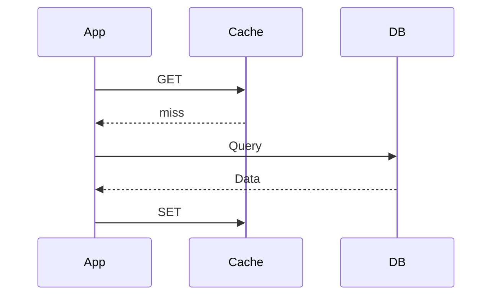
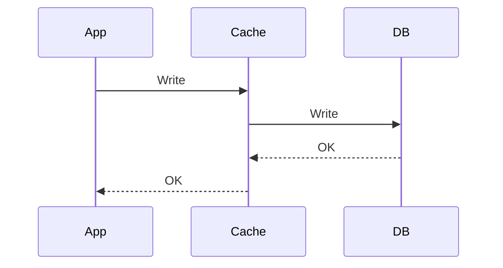

# Phase 2-2: キャッシュパターン

## 学習目標

この単元を終えると、以下ができるようになります：

- 主要なキャッシュパターンを実装できる
- 適切な TTL を設計できる
- キャッシュ無効化を実装できる

## キャッシュパターン

### Cache-Aside（Lazy Loading）



```python
# cache_aside.py
import redis
import json

r = redis.Redis(host='localhost', port=6379, decode_responses=True)

def get_user(user_id: int) -> dict:
    cache_key = f'user:{user_id}'
    
    # 1. キャッシュを確認
    cached = r.get(cache_key)
    if cached:
        print('Cache hit!')
        return json.loads(cached)
    
    # 2. キャッシュミス → DB から取得
    print('Cache miss!')
    user = fetch_from_db(user_id)
    
    # 3. キャッシュに保存
    r.setex(cache_key, 3600, json.dumps(user))
    
    return user

def fetch_from_db(user_id: int) -> dict:
    # DB クエリをシミュレート
    return {'id': user_id, 'name': 'Alice', 'email': 'alice@example.com'}
```

### Write-Through



```python
# write_through.py
def update_user(user_id: int, data: dict) -> dict:
    cache_key = f'user:{user_id}'
    
    # 1. DB を更新
    user = update_in_db(user_id, data)
    
    # 2. キャッシュを更新
    r.setex(cache_key, 3600, json.dumps(user))
    
    return user
```

### Write-Behind (Write-Back)

```python
# write_behind.py
def update_user_async(user_id: int, data: dict):
    cache_key = f'user:{user_id}'
    
    # 1. キャッシュを即座に更新
    r.setex(cache_key, 3600, json.dumps(data))
    
    # 2. 非同期で DB 更新
    queue_db_update(user_id, data)
```

## ハンズオン

### 演習1: Cache-Aside パターン

```python
# cache_service.py
import redis
import json
import time
from typing import Optional, Callable, TypeVar

T = TypeVar('T')

class CacheService:
    def __init__(self, redis_url: str = 'redis://localhost:6379'):
        self.r = redis.from_url(redis_url, decode_responses=True)
    
    def get_or_set(
        self,
        key: str,
        fetch_fn: Callable[[], T],
        ttl: int = 3600
    ) -> T:
        """Cache-Aside パターン"""
        cached = self.r.get(key)
        
        if cached:
            return json.loads(cached)
        
        data = fetch_fn()
        self.r.setex(key, ttl, json.dumps(data))
        return data
    
    def invalidate(self, key: str) -> bool:
        return self.r.delete(key) > 0
    
    def invalidate_pattern(self, pattern: str):
        """パターンに一致するキーを削除"""
        cursor = 0
        while True:
            cursor, keys = self.r.scan(cursor, match=pattern, count=100)
            if keys:
                self.r.delete(*keys)
            if cursor == 0:
                break

# 使用例
cache = CacheService()

def get_products():
    def fetch():
        time.sleep(1)  # DB クエリをシミュレート
        return [{'id': 1, 'name': 'iPhone'}, {'id': 2, 'name': 'MacBook'}]
    
    return cache.get_or_set('products:all', fetch, ttl=300)

# 1回目: DB から取得
products = get_products()

# 2回目: キャッシュから取得
products = get_products()
```

### 演習2: デコレータパターン

```python
# cache_decorator.py
import redis
import json
import functools
from typing import Callable

r = redis.Redis(host='localhost', port=6379, decode_responses=True)

def cached(key_prefix: str, ttl: int = 3600):
    def decorator(func: Callable):
        @functools.wraps(func)
        def wrapper(*args, **kwargs):
            # キーを生成
            cache_key = f'{key_prefix}:{args}:{kwargs}'
            
            # キャッシュを確認
            cached_value = r.get(cache_key)
            if cached_value:
                return json.loads(cached_value)
            
            # 関数を実行
            result = func(*args, **kwargs)
            
            # キャッシュに保存
            r.setex(cache_key, ttl, json.dumps(result))
            
            return result
        return wrapper
    return decorator

# 使用例
@cached('user', ttl=600)
def get_user(user_id: int) -> dict:
    print(f'Fetching user {user_id} from DB...')
    return {'id': user_id, 'name': 'Alice'}

# 1回目: DB から取得
user = get_user(1)

# 2回目: キャッシュから取得
user = get_user(1)
```

### 演習3: キャッシュ無効化

```python
# cache_invalidation.py
import redis
import json

r = redis.Redis(host='localhost', port=6379, decode_responses=True)

class ProductCache:
    PREFIX = 'product'
    
    @staticmethod
    def key(product_id: int) -> str:
        return f'{ProductCache.PREFIX}:{product_id}'
    
    @staticmethod
    def list_key() -> str:
        return f'{ProductCache.PREFIX}:list'
    
    def get(self, product_id: int) -> dict:
        data = r.get(self.key(product_id))
        return json.loads(data) if data else None
    
    def set(self, product: dict, ttl: int = 3600):
        r.setex(self.key(product['id']), ttl, json.dumps(product))
    
    def delete(self, product_id: int):
        # 個別キャッシュを削除
        r.delete(self.key(product_id))
        # リストキャッシュも削除
        r.delete(self.list_key())
    
    def invalidate_all(self):
        """全ての商品キャッシュを削除"""
        cursor = 0
        while True:
            cursor, keys = r.scan(cursor, match=f'{self.PREFIX}:*', count=100)
            if keys:
                r.delete(*keys)
            if cursor == 0:
                break

# 使用例
cache = ProductCache()

# 商品更新時
def update_product(product_id: int, data: dict):
    # DB 更新
    updated = update_in_db(product_id, data)
    
    # キャッシュ無効化
    cache.delete(product_id)
    
    return updated
```

### 演習4: TTL 戦略

```python
# ttl_strategy.py
from enum import Enum

class CacheTTL(Enum):
    SHORT = 60          # 1分: 頻繁に変わるデータ
    MEDIUM = 300        # 5分: 標準
    LONG = 3600         # 1時間: あまり変わらないデータ
    DAY = 86400         # 1日: 静的データ
    WEEK = 604800       # 1週間: マスタデータ

# データ種別ごとの TTL
TTL_CONFIG = {
    'user': CacheTTL.MEDIUM.value,
    'product': CacheTTL.LONG.value,
    'category': CacheTTL.DAY.value,
    'session': CacheTTL.LONG.value,
    'rate_limit': CacheTTL.SHORT.value,
}

def get_ttl(data_type: str) -> int:
    return TTL_CONFIG.get(data_type, CacheTTL.MEDIUM.value)
```

## キャッシュの落とし穴

| 問題 | 解決策 |
|------|--------|
| キャッシュスタンピード | ロック、確率的早期更新 |
| ホットキー | レプリケーション、ローカルキャッシュ |
| 大きなオブジェクト | 圧縮、分割 |
| 不整合 | TTL、イベント駆動更新 |

## 理解度確認

### 問題

Cache-Aside パターンの処理順序として正しいのはどれか。

**A.** DB読み取り → キャッシュ確認 → キャッシュ保存

**B.** キャッシュ確認 → DB読み取り → キャッシュ保存

**C.** キャッシュ保存 → DB読み取り → キャッシュ確認

**D.** DB読み取り → キャッシュ保存 → キャッシュ確認

---

### 解答・解説

**正解: B**

1. キャッシュを確認
2. ミスなら DB から読み取り
3. キャッシュに保存

---

## 次のステップ

キャッシュパターンを学びました。次はセッション管理を学びましょう。

**次の単元**: [Phase 3-1: セッション管理](../phase3/01_セッション管理.md)
