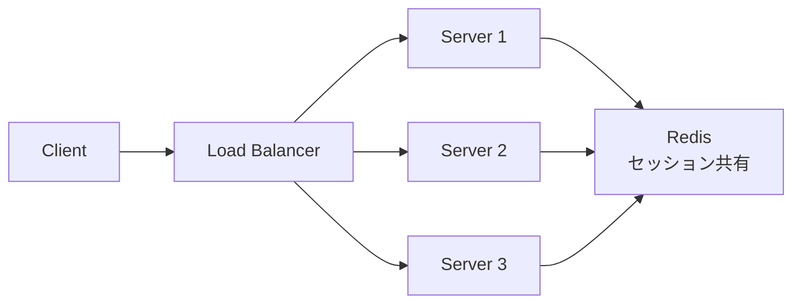

# Phase 3-1: セッション管理

## 学習目標

この単元を終えると、以下ができるようになります：

- Redis でセッションを管理できる
- 分散環境でのセッション共有を理解できる
- セッションストアを実装できる

## なぜ Redis でセッション管理？



| 方式 | メリット | デメリット |
|------|---------|-----------|
| メモリ | 高速 | スケールしない |
| ファイル | シンプル | 共有できない |
| DB | 永続化 | 遅い |
| **Redis** | 高速+共有 | 運用コスト |

## ハンズオン

### 演習1: 基本的なセッションストア

```python
# session_store.py
import redis
import json
import secrets
from datetime import datetime, timedelta
from typing import Optional

class SessionStore:
    def __init__(
        self,
        redis_url: str = 'redis://localhost:6379',
        prefix: str = 'session',
        default_ttl: int = 3600
    ):
        self.r = redis.from_url(redis_url, decode_responses=True)
        self.prefix = prefix
        self.default_ttl = default_ttl
    
    def _key(self, session_id: str) -> str:
        return f'{self.prefix}:{session_id}'
    
    def create(self, data: dict, ttl: int = None) -> str:
        """新しいセッションを作成"""
        session_id = secrets.token_urlsafe(32)
        session_data = {
            **data,
            'created_at': datetime.now().isoformat(),
            'last_accessed': datetime.now().isoformat()
        }
        
        self.r.setex(
            self._key(session_id),
            ttl or self.default_ttl,
            json.dumps(session_data)
        )
        
        return session_id
    
    def get(self, session_id: str) -> Optional[dict]:
        """セッションを取得"""
        data = self.r.get(self._key(session_id))
        if not data:
            return None
        return json.loads(data)
    
    def update(self, session_id: str, data: dict, refresh: bool = True):
        """セッションを更新"""
        current = self.get(session_id)
        if not current:
            raise ValueError('Session not found')
        
        updated = {
            **current,
            **data,
            'last_accessed': datetime.now().isoformat()
        }
        
        key = self._key(session_id)
        
        if refresh:
            # TTL をリセット（スライディングウィンドウ）
            self.r.setex(key, self.default_ttl, json.dumps(updated))
        else:
            # 現在の TTL を維持
            ttl = self.r.ttl(key)
            self.r.setex(key, ttl, json.dumps(updated))
    
    def delete(self, session_id: str) -> bool:
        """セッションを削除"""
        return self.r.delete(self._key(session_id)) > 0
    
    def refresh(self, session_id: str) -> bool:
        """TTL をリセット"""
        key = self._key(session_id)
        if self.r.exists(key):
            return self.r.expire(key, self.default_ttl)
        return False

# 使用例
store = SessionStore()

# ログイン時
session_id = store.create({
    'user_id': 1,
    'username': 'alice',
    'role': 'admin'
})
print(f'Session ID: {session_id}')

# リクエスト時
session = store.get(session_id)
if session:
    print(f'User: {session["username"]}')
    store.refresh(session_id)  # TTL を延長

# ログアウト時
store.delete(session_id)
```

### 演習2: FastAPI との統合

```python
# session_middleware.py
from fastapi import FastAPI, Request, Response, HTTPException
from fastapi.responses import JSONResponse
import redis
import json
import secrets

app = FastAPI()

r = redis.Redis(host='localhost', port=6379, decode_responses=True)
SESSION_TTL = 3600

def get_session_id(request: Request) -> str:
    return request.cookies.get('session_id')

def get_session(request: Request) -> dict:
    session_id = get_session_id(request)
    if not session_id:
        return None
    
    data = r.get(f'session:{session_id}')
    if data:
        # TTL を延長
        r.expire(f'session:{session_id}', SESSION_TTL)
        return json.loads(data)
    return None

def create_session(response: Response, data: dict) -> str:
    session_id = secrets.token_urlsafe(32)
    r.setex(f'session:{session_id}', SESSION_TTL, json.dumps(data))
    response.set_cookie(
        key='session_id',
        value=session_id,
        httponly=True,
        secure=True,
        samesite='lax',
        max_age=SESSION_TTL
    )
    return session_id

def delete_session(request: Request, response: Response):
    session_id = get_session_id(request)
    if session_id:
        r.delete(f'session:{session_id}')
    response.delete_cookie('session_id')

# エンドポイント
@app.post("/login")
async def login(request: Request, response: Response):
    # 認証処理（省略）
    user = {'id': 1, 'username': 'alice'}
    
    session_id = create_session(response, {
        'user_id': user['id'],
        'username': user['username']
    })
    
    return {'message': 'Logged in', 'user': user}

@app.get("/me")
async def get_current_user(request: Request):
    session = get_session(request)
    if not session:
        raise HTTPException(status_code=401, detail='Not authenticated')
    
    return {'user': session}

@app.post("/logout")
async def logout(request: Request, response: Response):
    delete_session(request, response)
    return {'message': 'Logged out'}
```

### 演習3: セッション一覧（管理機能）

```python
# session_admin.py
from typing import List

class SessionAdmin:
    def __init__(self, redis_client):
        self.r = redis_client
        self.prefix = 'session'
    
    def list_sessions(self, user_id: int = None) -> List[dict]:
        """全セッションを取得"""
        sessions = []
        cursor = 0
        
        while True:
            cursor, keys = self.r.scan(cursor, match=f'{self.prefix}:*', count=100)
            
            for key in keys:
                data = self.r.get(key)
                if data:
                    session = json.loads(data)
                    if user_id is None or session.get('user_id') == user_id:
                        session['session_id'] = key.split(':')[1]
                        session['ttl'] = self.r.ttl(key)
                        sessions.append(session)
            
            if cursor == 0:
                break
        
        return sessions
    
    def revoke_all_sessions(self, user_id: int):
        """ユーザーの全セッションを削除"""
        sessions = self.list_sessions(user_id)
        for session in sessions:
            self.r.delete(f'{self.prefix}:{session["session_id"]}')
        return len(sessions)
    
    def get_active_users_count(self) -> int:
        """アクティブユーザー数"""
        user_ids = set()
        sessions = self.list_sessions()
        for session in sessions:
            if 'user_id' in session:
                user_ids.add(session['user_id'])
        return len(user_ids)
```

## セキュリティ考慮事項

| 項目 | 対策 |
|------|------|
| セッション固定 | ログイン時に ID 再生成 |
| セッションハイジャック | HTTPS、HttpOnly Cookie |
| 不正なセッション | 署名、暗号化 |
| セッション無限増加 | TTL 必須 |

## 理解度確認

### 問題

Redis でセッションの TTL をリセット（延長）するコマンドはどれか。

**A.** SETEX

**B.** EXPIRE

**C.** TTL

**D.** PERSIST

---

### 解答・解説

**正解: B**

```bash
EXPIRE session:abc123 3600
```

または値も更新する場合は SETEX：
```bash
SETEX session:abc123 3600 "data"
```

---

## 次のステップ

セッション管理を学びました。次は高度な機能を学びましょう。

**次の単元**: [Phase 3-2: 高度な機能](./02_高度な機能.md)
