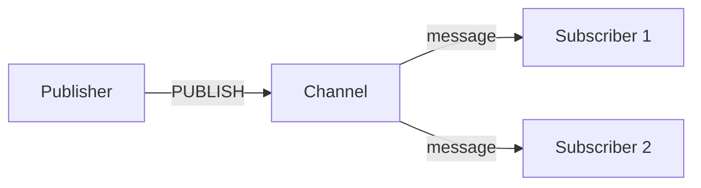

# Phase 3-2: 高度な機能

## 学習目標

この単元を終えると、以下ができるようになります：

- Pub/Sub でリアルタイム通信できる
- レート制限を実装できる
- 分散ロックを実装できる

## Pub/Sub



### 基本的な Pub/Sub

```python
# publisher.py
import redis

r = redis.Redis(host='localhost', port=6379)

# メッセージを送信
r.publish('notifications', 'Hello, subscribers!')
r.publish('notifications', 'New message!')
```

```python
# subscriber.py
import redis

r = redis.Redis(host='localhost', port=6379)
pubsub = r.pubsub()

# チャンネルを購読
pubsub.subscribe('notifications')

# メッセージを受信
for message in pubsub.listen():
    if message['type'] == 'message':
        print(f"Received: {message['data'].decode()}")
```

## ハンズオン

### 演習1: リアルタイム通知

```python
# notification_service.py
import redis
import json
from threading import Thread

class NotificationService:
    def __init__(self):
        self.r = redis.Redis(host='localhost', port=6379)
        self.pubsub = self.r.pubsub()
    
    def publish(self, channel: str, message: dict):
        """通知を送信"""
        self.r.publish(channel, json.dumps(message))
    
    def subscribe(self, channel: str, callback):
        """チャンネルを購読"""
        self.pubsub.subscribe(channel)
        
        def listen():
            for message in self.pubsub.listen():
                if message['type'] == 'message':
                    data = json.loads(message['data'])
                    callback(data)
        
        thread = Thread(target=listen, daemon=True)
        thread.start()
        return thread

# 使用例
service = NotificationService()

def on_message(data):
    print(f"Notification: {data}")

# 購読
service.subscribe('user:1:notifications', on_message)

# 通知送信
service.publish('user:1:notifications', {
    'type': 'new_message',
    'from': 'Alice',
    'content': 'Hello!'
})
```

### 演習2: レート制限

```python
# rate_limiter.py
import redis
import time

class RateLimiter:
    def __init__(self, redis_client):
        self.r = redis_client
    
    def is_allowed(
        self,
        key: str,
        max_requests: int,
        window_seconds: int
    ) -> tuple[bool, int]:
        """
        固定ウィンドウ方式
        
        Returns:
            (allowed: bool, remaining: int)
        """
        now = int(time.time())
        window = now // window_seconds
        redis_key = f'rate:{key}:{window}'
        
        pipe = self.r.pipeline()
        pipe.incr(redis_key)
        pipe.expire(redis_key, window_seconds)
        results = pipe.execute()
        
        count = results[0]
        remaining = max(0, max_requests - count)
        
        return count <= max_requests, remaining
    
    def sliding_window(
        self,
        key: str,
        max_requests: int,
        window_seconds: int
    ) -> tuple[bool, int]:
        """
        スライディングウィンドウ方式（より正確）
        """
        now = time.time()
        redis_key = f'rate:{key}'
        
        pipe = self.r.pipeline()
        
        # 古いエントリを削除
        pipe.zremrangebyscore(redis_key, 0, now - window_seconds)
        
        # 現在のリクエストを追加
        pipe.zadd(redis_key, {str(now): now})
        
        # カウント
        pipe.zcard(redis_key)
        
        # TTL 設定
        pipe.expire(redis_key, window_seconds)
        
        results = pipe.execute()
        count = results[2]
        
        if count > max_requests:
            # リクエストを削除（オーバー分）
            self.r.zrem(redis_key, str(now))
            return False, 0
        
        return True, max_requests - count

# 使用例
r = redis.Redis(host='localhost', port=6379)
limiter = RateLimiter(r)

# API エンドポイントで使用
def api_endpoint(user_id: str):
    allowed, remaining = limiter.is_allowed(
        key=f'api:{user_id}',
        max_requests=100,
        window_seconds=60
    )
    
    if not allowed:
        raise Exception('Rate limit exceeded')
    
    # 処理続行
    print(f'Remaining: {remaining}')
```

### 演習3: 分散ロック

```python
# distributed_lock.py
import redis
import time
import uuid

class DistributedLock:
    def __init__(self, redis_client, name: str, timeout: int = 10):
        self.r = redis_client
        self.name = f'lock:{name}'
        self.timeout = timeout
        self.token = None
    
    def acquire(self, blocking: bool = True, retry_interval: float = 0.1) -> bool:
        """ロックを取得"""
        self.token = str(uuid.uuid4())
        
        while True:
            # NX: 存在しない場合のみ設定
            # EX: TTL を設定
            acquired = self.r.set(
                self.name,
                self.token,
                nx=True,
                ex=self.timeout
            )
            
            if acquired:
                return True
            
            if not blocking:
                return False
            
            time.sleep(retry_interval)
    
    def release(self) -> bool:
        """ロックを解放"""
        # Lua スクリプトでアトミックに削除
        script = """
        if redis.call('get', KEYS[1]) == ARGV[1] then
            return redis.call('del', KEYS[1])
        else
            return 0
        end
        """
        result = self.r.eval(script, 1, self.name, self.token)
        return result == 1
    
    def __enter__(self):
        self.acquire()
        return self
    
    def __exit__(self, exc_type, exc_val, exc_tb):
        self.release()

# 使用例
r = redis.Redis(host='localhost', port=6379)

# Context manager として使用
with DistributedLock(r, 'resource:1', timeout=30):
    print('Lock acquired!')
    # 排他的な処理
    time.sleep(2)
print('Lock released!')

# 手動で使用
lock = DistributedLock(r, 'resource:2')
if lock.acquire(blocking=False):
    try:
        print('Got the lock!')
    finally:
        lock.release()
else:
    print('Could not acquire lock')
```

### 演習4: キャッシュウォームアップ

```python
# cache_warmup.py
import redis
import json
from concurrent.futures import ThreadPoolExecutor

class CacheWarmer:
    def __init__(self, redis_client):
        self.r = redis_client
    
    def warmup_products(self, product_ids: list):
        """商品キャッシュをウォームアップ"""
        def warm(product_id):
            product = fetch_product_from_db(product_id)
            self.r.setex(
                f'product:{product_id}',
                3600,
                json.dumps(product)
            )
            return product_id
        
        with ThreadPoolExecutor(max_workers=10) as executor:
            results = list(executor.map(warm, product_ids))
        
        return len(results)
    
    def warmup_from_access_log(self, top_n: int = 100):
        """アクセスログから人気商品をウォームアップ"""
        # アクセス数上位を取得
        top_products = self.r.zrevrange('product:access_count', 0, top_n - 1)
        return self.warmup_products(top_products)
```

## 理解度確認

### 問題

Redis で分散ロックを実装する際に使うコマンドオプションはどれか。

**A.** SET key value

**B.** SET key value NX

**C.** SET key value XX

**D.** SETNX key value

---

### 解答・解説

**正解: B**

```bash
SET lock:resource "token" NX EX 30
```

- `NX`: キーが存在しない場合のみ設定
- `EX`: 有効期限を秒で設定

これでアトミックにロックを取得できます。

---

## 次のステップ

高度な機能を学びました。次は総仕上げです。

**次の単元**: [Phase 4-1: 総仕上げ](../phase4/01_総仕上げ.md)
