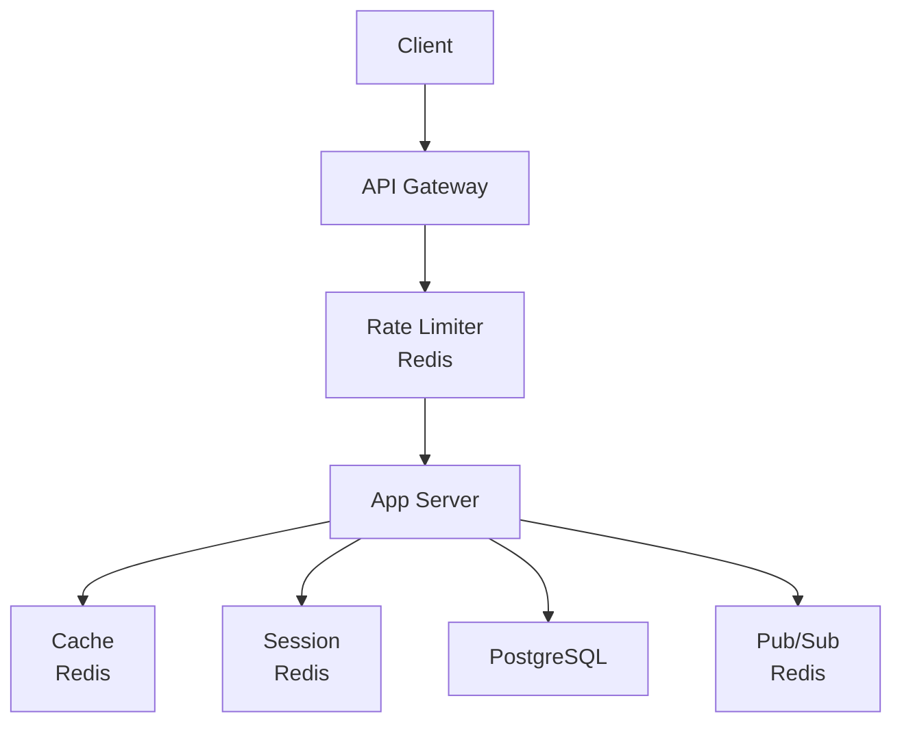

# Phase 4-1: 総仕上げ ～ キャッシュ戦略の設計 ～

## 学習目標

この単元を終えると、以下ができるようになります：

- 本番レベルのキャッシュ設計ができる
- パフォーマンス改善を数値化できる
- 運用上の注意点を理解できる

## 総合演習: E コマースのキャッシュ設計

### 要件

```
- 商品一覧のキャッシュ
- 商品詳細のキャッシュ
- ユーザーセッション
- レート制限
- リアルタイム在庫通知
```

### アーキテクチャ



### 統合キャッシュサービス

```python
# cache_service.py
import redis
import json
from typing import Optional, Callable, TypeVar
from functools import wraps
import time

T = TypeVar('T')

class CacheConfig:
    """キャッシュ設定"""
    TTL = {
        'product_list': 300,      # 5分
        'product_detail': 3600,   # 1時間
        'category': 86400,        # 1日
        'user_profile': 600,      # 10分
        'session': 3600,          # 1時間
    }
    
    PREFIX = {
        'product': 'product',
        'category': 'category',
        'user': 'user',
        'session': 'session',
        'rate': 'rate',
    }

class EcommerceCacheService:
    def __init__(self, redis_url: str = 'redis://localhost:6379'):
        self.r = redis.from_url(redis_url, decode_responses=True)
        self.config = CacheConfig()
    
    # ========== 商品キャッシュ ==========
    
    def get_product(self, product_id: int) -> Optional[dict]:
        key = f'{self.config.PREFIX["product"]}:{product_id}'
        data = self.r.get(key)
        return json.loads(data) if data else None
    
    def set_product(self, product: dict):
        key = f'{self.config.PREFIX["product"]}:{product["id"]}'
        self.r.setex(key, self.config.TTL['product_detail'], json.dumps(product))
    
    def get_product_list(self, page: int = 1, category: str = None) -> Optional[list]:
        key = f'{self.config.PREFIX["product"]}:list:{category or "all"}:{page}'
        data = self.r.get(key)
        return json.loads(data) if data else None
    
    def set_product_list(self, products: list, page: int = 1, category: str = None):
        key = f'{self.config.PREFIX["product"]}:list:{category or "all"}:{page}'
        self.r.setex(key, self.config.TTL['product_list'], json.dumps(products))
    
    def invalidate_product(self, product_id: int):
        """商品キャッシュを無効化"""
        # 商品詳細を削除
        self.r.delete(f'{self.config.PREFIX["product"]}:{product_id}')
        
        # 商品リストも削除（パターンマッチ）
        self._delete_pattern(f'{self.config.PREFIX["product"]}:list:*')
    
    # ========== セッション ==========
    
    def create_session(self, user_data: dict) -> str:
        import secrets
        session_id = secrets.token_urlsafe(32)
        key = f'{self.config.PREFIX["session"]}:{session_id}'
        self.r.setex(key, self.config.TTL['session'], json.dumps(user_data))
        return session_id
    
    def get_session(self, session_id: str) -> Optional[dict]:
        key = f'{self.config.PREFIX["session"]}:{session_id}'
        data = self.r.get(key)
        if data:
            # TTL を延長
            self.r.expire(key, self.config.TTL['session'])
            return json.loads(data)
        return None
    
    def delete_session(self, session_id: str):
        self.r.delete(f'{self.config.PREFIX["session"]}:{session_id}')
    
    # ========== レート制限 ==========
    
    def check_rate_limit(
        self, 
        key: str, 
        max_requests: int, 
        window_seconds: int
    ) -> tuple[bool, int]:
        now = int(time.time())
        window = now // window_seconds
        redis_key = f'{self.config.PREFIX["rate"]}:{key}:{window}'
        
        pipe = self.r.pipeline()
        pipe.incr(redis_key)
        pipe.expire(redis_key, window_seconds)
        results = pipe.execute()
        
        count = results[0]
        remaining = max(0, max_requests - count)
        
        return count <= max_requests, remaining
    
    # ========== Pub/Sub ==========
    
    def publish_stock_update(self, product_id: int, stock: int):
        """在庫更新を通知"""
        message = json.dumps({
            'product_id': product_id,
            'stock': stock,
            'timestamp': time.time()
        })
        self.r.publish('stock:updates', message)
    
    # ========== ユーティリティ ==========
    
    def _delete_pattern(self, pattern: str):
        cursor = 0
        while True:
            cursor, keys = self.r.scan(cursor, match=pattern, count=100)
            if keys:
                self.r.delete(*keys)
            if cursor == 0:
                break

# デコレータ
def cached(cache_type: str):
    def decorator(func: Callable):
        @wraps(func)
        def wrapper(self, *args, **kwargs):
            cache_key = f'{cache_type}:{args}:{kwargs}'
            
            cached_value = self.cache.r.get(cache_key)
            if cached_value:
                return json.loads(cached_value)
            
            result = func(self, *args, **kwargs)
            
            ttl = CacheConfig.TTL.get(cache_type, 300)
            self.cache.r.setex(cache_key, ttl, json.dumps(result))
            
            return result
        return wrapper
    return decorator
```

### FastAPI との統合

```python
# main.py
from fastapi import FastAPI, Depends, HTTPException, Request, Response
from cache_service import EcommerceCacheService

app = FastAPI()
cache = EcommerceCacheService()

# レート制限ミドルウェア
@app.middleware("http")
async def rate_limit_middleware(request: Request, call_next):
    client_ip = request.client.host
    
    allowed, remaining = cache.check_rate_limit(
        key=f'ip:{client_ip}',
        max_requests=100,
        window_seconds=60
    )
    
    if not allowed:
        return Response(
            content='Rate limit exceeded',
            status_code=429,
            headers={'X-RateLimit-Remaining': '0'}
        )
    
    response = await call_next(request)
    response.headers['X-RateLimit-Remaining'] = str(remaining)
    return response

# 商品一覧
@app.get("/products")
async def get_products(page: int = 1, category: str = None):
    # キャッシュを確認
    products = cache.get_product_list(page, category)
    
    if not products:
        # DB から取得
        products = fetch_products_from_db(page, category)
        # キャッシュに保存
        cache.set_product_list(products, page, category)
    
    return products

# 商品詳細
@app.get("/products/{product_id}")
async def get_product(product_id: int):
    product = cache.get_product(product_id)
    
    if not product:
        product = fetch_product_from_db(product_id)
        if not product:
            raise HTTPException(status_code=404)
        cache.set_product(product)
    
    return product

# 商品更新
@app.put("/products/{product_id}")
async def update_product(product_id: int, data: dict):
    product = update_product_in_db(product_id, data)
    
    # キャッシュを無効化
    cache.invalidate_product(product_id)
    
    # 在庫更新を通知
    if 'stock' in data:
        cache.publish_stock_update(product_id, data['stock'])
    
    return product
```

## パフォーマンス計測

```python
# benchmark.py
import time
import statistics

def benchmark_with_cache():
    times = []
    for _ in range(100):
        start = time.time()
        get_product(1)  # キャッシュあり
        times.append(time.time() - start)
    
    print(f'With cache:')
    print(f'  Mean: {statistics.mean(times)*1000:.2f}ms')
    print(f'  P99:  {statistics.quantiles(times, n=100)[98]*1000:.2f}ms')

def benchmark_without_cache():
    times = []
    for _ in range(100):
        start = time.time()
        fetch_from_db(1)  # DB 直接
        times.append(time.time() - start)
    
    print(f'Without cache:')
    print(f'  Mean: {statistics.mean(times)*1000:.2f}ms')
    print(f'  P99:  {statistics.quantiles(times, n=100)[98]*1000:.2f}ms')
```

## 運用チェックリスト

```markdown
## キャッシュ設計
- [ ] TTL は適切か
- [ ] 無効化戦略は明確か
- [ ] メモリ使用量は見積もったか

## 可用性
- [ ] Redis のレプリケーション
- [ ] フェイルオーバー戦略
- [ ] キャッシュミス時の fallback

## 監視
- [ ] キャッシュヒット率
- [ ] メモリ使用量
- [ ] レイテンシ
```

## カリキュラム完了！

おめでとうございます！Redis・キャッシュ戦略のカリキュラムを完了しました。

### 学んだこと

1. **Redis 基礎** - データ型、コマンド
2. **Python 連携** - redis-py、パイプライン
3. **キャッシュパターン** - Cache-Aside、Write-Through
4. **セッション管理** - 分散セッション
5. **高度な機能** - Pub/Sub、レート制限、分散ロック

### 次のステップ

- **Redis Cluster** - 水平スケーリング
- **Redis Sentinel** - 高可用性
- **Redis Streams** - イベントストリーミング
