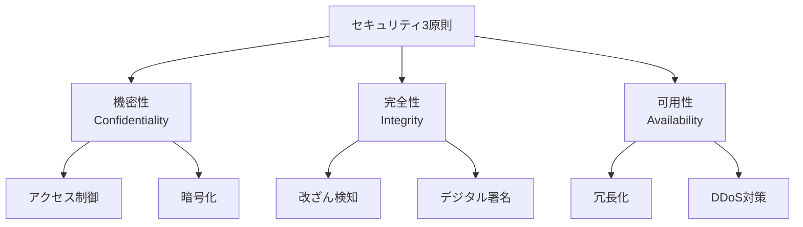

# Phase 1-1: セキュリティ概論

## 学習目標

この単元を終えると、以下ができるようになります：

- OWASP Top 10 を説明できる
- セキュリティの3原則を理解できる
- 脅威モデリングができる

## セキュリティの3原則（CIA）



## OWASP Top 10 (2021)

| 順位 | 脆弱性 | 説明 |
|------|--------|------|
| A01 | **アクセス制御の欠陥** | 認可の不備 |
| A02 | **暗号化の失敗** | 平文保存、弱い暗号 |
| A03 | **インジェクション** | SQL, Command, XSS |
| A04 | **安全でない設計** | 設計段階の欠陥 |
| A05 | **セキュリティ設定ミス** | デフォルト設定 |
| A06 | **脆弱なコンポーネント** | 古いライブラリ |
| A07 | **認証の欠陥** | 弱いパスワード |
| A08 | **ソフトウェアの整合性** | CI/CDへの攻撃 |
| A09 | **ログ・監視の不備** | 検知できない |
| A10 | **SSRF** | サーバーサイドリクエスト |

## ハンズオン

### 演習1: 脅威モデリング

```python
# threat_modeling.py
"""
STRIDEフレームワークによる脅威モデリング
"""

from dataclasses import dataclass
from typing import List
from enum import Enum

class ThreatType(Enum):
    SPOOFING = 'なりすまし'       # S
    TAMPERING = '改ざん'          # T
    REPUDIATION = '否認'         # R
    INFO_DISCLOSURE = '情報漏洩'  # I
    DENIAL_OF_SERVICE = 'サービス拒否'  # D
    ELEVATION = '権限昇格'        # E

@dataclass
class Threat:
    type: ThreatType
    description: str
    target: str
    mitigation: str
    severity: str  # High, Medium, Low

def analyze_system(components: List[str]) -> List[Threat]:
    """
    システムコンポーネントに対する脅威分析
    """
    threats = []
    
    for component in components:
        if 'API' in component:
            threats.extend([
                Threat(
                    type=ThreatType.SPOOFING,
                    description='APIキーの盗用',
                    target=component,
                    mitigation='JWT + 短い有効期限',
                    severity='High'
                ),
                Threat(
                    type=ThreatType.TAMPERING,
                    description='リクエストの改ざん',
                    target=component,
                    mitigation='入力検証、署名',
                    severity='High'
                )
            ])
        
        if 'Database' in component:
            threats.extend([
                Threat(
                    type=ThreatType.INFO_DISCLOSURE,
                    description='SQLインジェクション',
                    target=component,
                    mitigation='プリペアドステートメント',
                    severity='High'
                )
            ])
        
        if 'User' in component:
            threats.extend([
                Threat(
                    type=ThreatType.SPOOFING,
                    description='アカウント乗っ取り',
                    target=component,
                    mitigation='MFA、強いパスワード',
                    severity='High'
                )
            ])
    
    return threats

# 使用例
components = ['API Gateway', 'User Service', 'Database']
threats = analyze_system(components)
for threat in threats:
    print(f'{threat.type.value}: {threat.description} -> {threat.mitigation}')
```

### 演習2: セキュリティヘッダー

```python
# security_headers.py
"""
セキュリティヘッダーの実装
"""

from flask import Flask, Response

app = Flask(__name__)

@app.after_request
def add_security_headers(response: Response) -> Response:
    """
    セキュリティヘッダーを追加
    """
    # XSS対策
    response.headers['X-XSS-Protection'] = '1; mode=block'
    response.headers['X-Content-Type-Options'] = 'nosniff'
    
    # クリックジャッキング対策
    response.headers['X-Frame-Options'] = 'DENY'
    
    # HTTPS強制
    response.headers['Strict-Transport-Security'] = 'max-age=31536000; includeSubDomains'
    
    # コンテンツセキュリティポリシー
    response.headers['Content-Security-Policy'] = (
        "default-src 'self'; "
        "script-src 'self' 'unsafe-inline'; "
        "style-src 'self' 'unsafe-inline'; "
        "img-src 'self' data: https:; "
        "font-src 'self'; "
        "connect-src 'self' https://api.example.com"
    )
    
    # リファラーポリシー
    response.headers['Referrer-Policy'] = 'strict-origin-when-cross-origin'
    
    # 権限ポリシー
    response.headers['Permissions-Policy'] = (
        'geolocation=(), camera=(), microphone=()'
    )
    
    return response
```

### 演習3: 入力検証

```python
# input_validation.py
"""
入力検証の実装
"""

import re
from typing import Optional
from pydantic import BaseModel, validator, EmailStr
from pydantic.types import constr

class UserInput(BaseModel):
    """
    ユーザー入力のバリデーション
    """
    username: constr(min_length=3, max_length=20, regex='^[a-zA-Z0-9_]+$')
    email: EmailStr
    password: constr(min_length=8)
    age: Optional[int] = None
    
    @validator('password')
    def validate_password(cls, v):
        if not re.search(r'[A-Z]', v):
            raise ValueError('大文字を含める必要があります')
        if not re.search(r'[a-z]', v):
            raise ValueError('小文字を含める必要があります')
        if not re.search(r'\d', v):
            raise ValueError('数字を含める必要があります')
        if not re.search(r'[!@#$%^&*]', v):
            raise ValueError('特殊文字を含める必要があります')
        return v
    
    @validator('age')
    def validate_age(cls, v):
        if v is not None and (v < 0 or v > 150):
            raise ValueError('年齢が不正です')
        return v

def sanitize_html(text: str) -> str:
    """HTMLタグを除去"""
    import html
    # HTMLエスケープ
    return html.escape(text)

def sanitize_filename(filename: str) -> str:
    """ファイル名をサニタイズ"""
    # パストラバーサル対策
    filename = filename.replace('..', '')
    filename = filename.replace('/', '')
    filename = filename.replace('\\', '')
    # 許可された文字のみ
    return re.sub(r'[^a-zA-Z0-9._-]', '', filename)
```

## セキュリティの層

| 層 | 対策 |
|---|------|
| **ネットワーク** | ファイアウォール、WAF |
| **アプリケーション** | 入力検証、認証 |
| **データ** | 暗号化、アクセス制御 |
| **物理** | データセンター保護 |

## 理解度確認

### 問題

OWASP Top 10 で最も順位が高い脆弱性は何か。

**A.** SQLインジェクション

**B.** アクセス制御の欠陥

**C.** XSS

**D.** 暗号化の失敗

---

### 解答・解説

**正解: B**

2021年版では「アクセス制御の欠陥」が1位です。認可の不備により、本来アクセスできないリソースにアクセスできてしまう脆弱性が最も多く報告されています。

---

## 次のステップ

セキュリティ概論を学びました。次はインジェクション攻撃を学びましょう。

**次の単元**: [Phase 1-2: インジェクション](./02_インジェクション.md)
