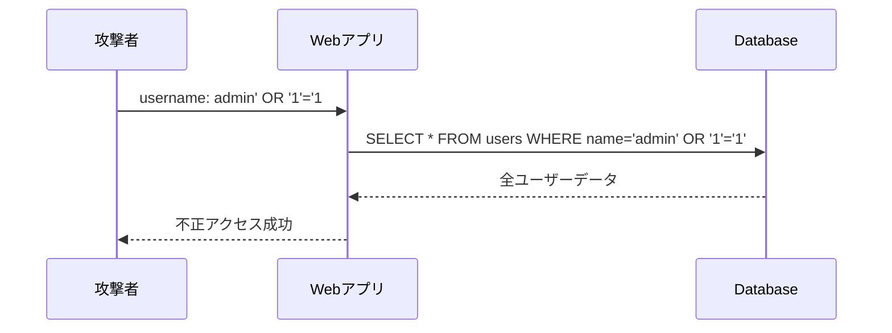

# Phase 1-2: インジェクション

## 学習目標

この単元を終えると、以下ができるようになります：

- SQL インジェクションを理解し防御できる
- コマンドインジェクションを防止できる
- NoSQL インジェクションに対策できる

## SQL インジェクション



## ハンズオン

### 演習1: 脆弱なコード（NG例）

```python
# vulnerable_code.py
"""
⚠️ 脆弱なコード例（絶対に使わない）
"""

import sqlite3

def vulnerable_login(username: str, password: str):
    """
    ❌ 脆弱: 文字列連結でSQLを構築
    
    攻撃例:
    username: admin' OR '1'='1' --
    password: anything
    
    生成されるSQL:
    SELECT * FROM users WHERE username='admin' OR '1'='1' --' AND password='anything'
    """
    conn = sqlite3.connect('users.db')
    cursor = conn.cursor()
    
    # ❌ 危険: ユーザー入力を直接埋め込み
    query = f"SELECT * FROM users WHERE username='{username}' AND password='{password}'"
    cursor.execute(query)
    
    return cursor.fetchone()

def vulnerable_search(keyword: str):
    """
    ❌ 脆弱: LIKE句でも同様
    
    攻撃例:
    keyword: %' UNION SELECT username, password FROM users --
    """
    conn = sqlite3.connect('products.db')
    cursor = conn.cursor()
    
    # ❌ 危険
    query = f"SELECT * FROM products WHERE name LIKE '%{keyword}%'"
    cursor.execute(query)
    
    return cursor.fetchall()
```

### 演習2: 安全なコード（OK例）

```python
# secure_code.py
"""
✅ 安全なコード例
"""

import sqlite3
from typing import Optional, Tuple

def secure_login(username: str, password: str) -> Optional[Tuple]:
    """
    ✅ 安全: パラメータ化クエリを使用
    """
    conn = sqlite3.connect('users.db')
    cursor = conn.cursor()
    
    # ✅ プリペアドステートメント（プレースホルダー使用）
    query = "SELECT * FROM users WHERE username = ? AND password = ?"
    cursor.execute(query, (username, password))
    
    return cursor.fetchone()

def secure_search(keyword: str):
    """
    ✅ 安全: LIKE句もパラメータ化
    """
    conn = sqlite3.connect('products.db')
    cursor = conn.cursor()
    
    # ✅ ワイルドカードもパラメータ内で処理
    query = "SELECT * FROM products WHERE name LIKE ?"
    cursor.execute(query, (f'%{keyword}%',))
    
    return cursor.fetchall()

# SQLAlchemy（ORM）を使う場合
from sqlalchemy import create_engine, text
from sqlalchemy.orm import sessionmaker

engine = create_engine('sqlite:///users.db')
Session = sessionmaker(bind=engine)

def secure_login_orm(username: str, password: str):
    """
    ✅ 安全: ORMを使用
    """
    session = Session()
    
    # ✅ ORMは自動的にパラメータ化
    user = session.query(User).filter(
        User.username == username,
        User.password == password
    ).first()
    
    return user

def secure_raw_query(user_id: int):
    """
    ✅ 安全: 生SQLでもパラメータ化
    """
    session = Session()
    
    # ✅ text() + bindparams
    query = text("SELECT * FROM users WHERE id = :user_id")
    result = session.execute(query, {'user_id': user_id})
    
    return result.fetchone()
```

### 演習3: コマンドインジェクション

```python
# command_injection.py
"""
コマンドインジェクション対策
"""

import subprocess
import shlex
from typing import List

# ❌ 脆弱なコード
def vulnerable_ping(host: str):
    """
    攻撃例:
    host: 127.0.0.1; rm -rf /
    """
    import os
    os.system(f'ping -c 1 {host}')  # ❌ 危険

# ✅ 安全なコード
def secure_ping(host: str) -> str:
    """
    ✅ subprocessで引数を分離
    """
    # 入力検証
    import re
    if not re.match(r'^[a-zA-Z0-9.-]+$', host):
        raise ValueError('Invalid host')
    
    # ✅ shell=False + 引数リスト
    result = subprocess.run(
        ['ping', '-c', '1', host],
        capture_output=True,
        text=True,
        timeout=10
    )
    
    return result.stdout

def secure_command(command: str, args: List[str]) -> str:
    """
    ✅ 許可されたコマンドのみ実行
    """
    ALLOWED_COMMANDS = {'ping', 'nslookup', 'dig'}
    
    if command not in ALLOWED_COMMANDS:
        raise ValueError(f'Command not allowed: {command}')
    
    # 引数をエスケープ
    safe_args = [shlex.quote(arg) for arg in args]
    
    result = subprocess.run(
        [command] + safe_args,
        capture_output=True,
        text=True,
        timeout=30
    )
    
    return result.stdout
```

### 演習4: NoSQL インジェクション

```python
# nosql_injection.py
"""
NoSQLインジェクション対策（MongoDB）
"""

from pymongo import MongoClient
from bson import ObjectId
import re

client = MongoClient('mongodb://localhost:27017/')
db = client['myapp']

# ❌ 脆弱なコード
def vulnerable_find(username: str, password: dict):
    """
    攻撃例:
    password: {"$ne": ""}  # 空でないパスワードすべてにマッチ
    または
    password: {"$gt": ""}  # 任意の文字列にマッチ
    """
    user = db.users.find_one({
        'username': username,
        'password': password  # ❌ dictをそのまま使用
    })
    return user

# ✅ 安全なコード
def secure_find(username: str, password: str):
    """
    ✅ 型チェックと演算子の禁止
    """
    # 型チェック
    if not isinstance(username, str) or not isinstance(password, str):
        raise ValueError('Invalid input type')
    
    # $演算子を禁止
    if username.startswith('$') or password.startswith('$'):
        raise ValueError('Invalid characters')
    
    user = db.users.find_one({
        'username': username,
        'password': password
    })
    return user

def secure_query_with_validation(query_params: dict):
    """
    ✅ クエリパラメータの検証
    """
    ALLOWED_FIELDS = {'name', 'category', 'price'}
    
    safe_query = {}
    for key, value in query_params.items():
        # フィールド名のホワイトリスト
        if key not in ALLOWED_FIELDS:
            continue
        
        # 値の型チェック
        if isinstance(value, (str, int, float)):
            safe_query[key] = value
        elif isinstance(value, dict):
            # 演算子のホワイトリスト
            ALLOWED_OPERATORS = {'$eq', '$gt', '$lt', '$gte', '$lte'}
            for op, val in value.items():
                if op in ALLOWED_OPERATORS and isinstance(val, (str, int, float)):
                    safe_query[key] = {op: val}
    
    return db.products.find(safe_query)
```

## インジェクション対策まとめ

| 攻撃 | 対策 |
|------|------|
| SQL | プリペアドステートメント、ORM |
| Command | subprocess + 引数分離 |
| NoSQL | 型チェック、演算子禁止 |
| XPath | パラメータ化 |
| LDAP | エスケープ |

## 理解度確認

### 問題

SQL インジェクションを防ぐ最も効果的な方法は何か。

**A.** 入力値から「'」を削除する

**B.** プリペアドステートメント（パラメータ化クエリ）

**C.** 入力値の長さを制限する

**D.** エラーメッセージを非表示にする

---

### 解答・解説

**正解: B**

プリペアドステートメントは SQL 文と値を分離して送信するため、値が SQL として解釈されることを根本的に防ぎます。入力値のサニタイズは漏れが発生しやすく、完全な対策にはなりません。

---

## 次のステップ

インジェクションを学びました。次は認証の脆弱性を学びましょう。

**次の単元**: [Phase 2-1: 認証の脆弱性](../phase2/01_認証の脆弱性.md)
