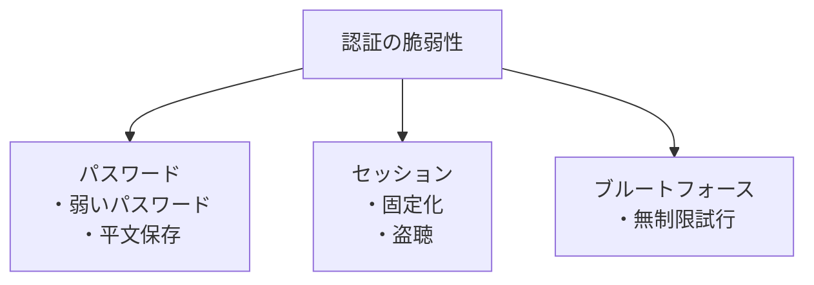

# Phase 2-1: 認証の脆弱性

## 学習目標

この単元を終えると、以下ができるようになります：

- 安全なパスワード管理を実装できる
- セッション管理の脆弱性を理解できる
- 多要素認証を実装できる

## 認証の脆弱性



## ハンズオン

### 演習1: 安全なパスワードハッシュ

```python
# password_hashing.py
"""
パスワードハッシュの実装
"""

import bcrypt
import hashlib
import secrets
from argon2 import PasswordHasher
from argon2.exceptions import VerifyMismatchError

# ❌ 脆弱: MD5/SHA1
def vulnerable_hash(password: str) -> str:
    """
    ❌ MD5は高速すぎて総当たりに弱い
    ❌ ソルトがない → レインボーテーブル攻撃
    """
    return hashlib.md5(password.encode()).hexdigest()

# ✅ 推奨: bcrypt
class BcryptHasher:
    """
    ✅ bcrypt: 計算コストを調整可能
    """
    
    @staticmethod
    def hash(password: str) -> str:
        # ソルトを自動生成、コスト因子12（推奨）
        salt = bcrypt.gensalt(rounds=12)
        hashed = bcrypt.hashpw(password.encode(), salt)
        return hashed.decode()
    
    @staticmethod
    def verify(password: str, hashed: str) -> bool:
        return bcrypt.checkpw(password.encode(), hashed.encode())

# ✅ 最推奨: Argon2
class Argon2Hasher:
    """
    ✅ Argon2: 最新の推奨アルゴリズム（Password Hashing Competition優勝）
    """
    
    def __init__(self):
        self.ph = PasswordHasher(
            time_cost=2,      # 反復回数
            memory_cost=65536,  # メモリ使用量(KB)
            parallelism=4     # 並列度
        )
    
    def hash(self, password: str) -> str:
        return self.ph.hash(password)
    
    def verify(self, password: str, hashed: str) -> bool:
        try:
            self.ph.verify(hashed, password)
            return True
        except VerifyMismatchError:
            return False
    
    def needs_rehash(self, hashed: str) -> bool:
        """パラメータ更新時に再ハッシュが必要か"""
        return self.ph.check_needs_rehash(hashed)

# 使用例
hasher = Argon2Hasher()
hashed = hasher.hash('MySecurePassword123!')
print(hasher.verify('MySecurePassword123!', hashed))  # True
```

### 演習2: パスワードポリシー

```python
# password_policy.py
"""
パスワードポリシーの実装
"""

import re
from typing import List, Tuple
import requests

class PasswordPolicy:
    """
    NISTガイドラインに基づくパスワードポリシー
    """
    
    MIN_LENGTH = 8
    MAX_LENGTH = 128
    
    # よく使われるパスワード（実際はもっと大きなリスト）
    COMMON_PASSWORDS = {
        'password', '123456', 'qwerty', 'admin', 'letmein',
        'welcome', 'monkey', 'dragon', 'master', 'login'
    }
    
    @classmethod
    def validate(cls, password: str, username: str = None) -> Tuple[bool, List[str]]:
        """
        パスワードを検証
        """
        errors = []
        
        # 長さチェック
        if len(password) < cls.MIN_LENGTH:
            errors.append(f'{cls.MIN_LENGTH}文字以上必要です')
        
        if len(password) > cls.MAX_LENGTH:
            errors.append(f'{cls.MAX_LENGTH}文字以下にしてください')
        
        # よく使われるパスワードチェック
        if password.lower() in cls.COMMON_PASSWORDS:
            errors.append('よく使われるパスワードは使用できません')
        
        # ユーザー名との類似性
        if username and username.lower() in password.lower():
            errors.append('ユーザー名を含むパスワードは使用できません')
        
        # 繰り返しチェック
        if re.search(r'(.)\1{2,}', password):
            errors.append('同じ文字の3回以上の繰り返しは禁止です')
        
        return len(errors) == 0, errors
    
    @classmethod
    def check_pwned(cls, password: str) -> bool:
        """
        Have I Been Pwned API で漏洩チェック
        """
        sha1 = hashlib.sha1(password.encode()).hexdigest().upper()
        prefix, suffix = sha1[:5], sha1[5:]
        
        response = requests.get(
            f'https://api.pwnedpasswords.com/range/{prefix}'
        )
        
        for line in response.text.splitlines():
            if line.startswith(suffix):
                return True  # 漏洩している
        
        return False
```

### 演習3: セッション管理

```python
# session_management.py
"""
安全なセッション管理
"""

import secrets
import hashlib
from datetime import datetime, timedelta
from typing import Optional
import redis

class SecureSessionManager:
    """
    安全なセッション管理
    """
    
    SESSION_DURATION = timedelta(hours=1)
    
    def __init__(self):
        self.redis = redis.Redis(host='localhost', port=6379, db=0)
    
    def create_session(self, user_id: str, ip: str, user_agent: str) -> str:
        """
        セッション作成
        """
        # ✅ 暗号学的に安全なランダムID
        session_id = secrets.token_urlsafe(32)
        
        # セッションデータ
        session_data = {
            'user_id': user_id,
            'created_at': datetime.utcnow().isoformat(),
            'ip': ip,
            'user_agent': user_agent,
            'last_activity': datetime.utcnow().isoformat()
        }
        
        # Redis に保存（TTL付き）
        self.redis.hset(f'session:{session_id}', mapping=session_data)
        self.redis.expire(f'session:{session_id}', int(self.SESSION_DURATION.total_seconds()))
        
        return session_id
    
    def validate_session(self, session_id: str, ip: str, user_agent: str) -> Optional[str]:
        """
        セッション検証
        """
        session_key = f'session:{session_id}'
        
        if not self.redis.exists(session_key):
            return None
        
        session_data = self.redis.hgetall(session_key)
        
        # IP/UserAgent のバインディング（オプション）
        if session_data.get(b'ip', b'').decode() != ip:
            # IPが変わった場合は警戒
            pass
        
        # 最終アクティビティ更新
        self.redis.hset(session_key, 'last_activity', datetime.utcnow().isoformat())
        self.redis.expire(session_key, int(self.SESSION_DURATION.total_seconds()))
        
        return session_data.get(b'user_id', b'').decode()
    
    def regenerate_session(self, old_session_id: str) -> str:
        """
        ✅ 認証後にセッションIDを再生成（セッション固定化対策）
        """
        session_key = f'session:{old_session_id}'
        session_data = self.redis.hgetall(session_key)
        
        # 古いセッション削除
        self.redis.delete(session_key)
        
        # 新しいセッション作成
        new_session_id = secrets.token_urlsafe(32)
        new_key = f'session:{new_session_id}'
        
        self.redis.hset(new_key, mapping=session_data)
        self.redis.expire(new_key, int(self.SESSION_DURATION.total_seconds()))
        
        return new_session_id
    
    def destroy_session(self, session_id: str):
        """セッション破棄"""
        self.redis.delete(f'session:{session_id}')
    
    def destroy_all_sessions(self, user_id: str):
        """ユーザーの全セッション破棄（パスワード変更時など）"""
        for key in self.redis.scan_iter('session:*'):
            if self.redis.hget(key, 'user_id') == user_id.encode():
                self.redis.delete(key)
```

### 演習4: レート制限

```python
# rate_limiting.py
"""
ブルートフォース対策
"""

import redis
from datetime import datetime
from functools import wraps

class RateLimiter:
    """
    レート制限（ブルートフォース対策）
    """
    
    def __init__(self):
        self.redis = redis.Redis(host='localhost', port=6379, db=0)
    
    def is_rate_limited(
        self,
        key: str,
        max_attempts: int = 5,
        window_seconds: int = 300
    ) -> bool:
        """
        レート制限チェック
        """
        current = self.redis.get(f'rate:{key}')
        
        if current and int(current) >= max_attempts:
            return True
        
        return False
    
    def record_attempt(self, key: str, window_seconds: int = 300):
        """
        試行を記録
        """
        rate_key = f'rate:{key}'
        
        pipe = self.redis.pipeline()
        pipe.incr(rate_key)
        pipe.expire(rate_key, window_seconds)
        pipe.execute()
    
    def reset(self, key: str):
        """成功時にリセット"""
        self.redis.delete(f'rate:{key}')

# ログイン例
def login(username: str, password: str, ip: str):
    limiter = RateLimiter()
    
    # IPとユーザー名でレート制限
    ip_key = f'login:ip:{ip}'
    user_key = f'login:user:{username}'
    
    if limiter.is_rate_limited(ip_key) or limiter.is_rate_limited(user_key):
        raise RateLimitExceeded('ログイン試行回数が上限を超えました')
    
    if authenticate(username, password):
        limiter.reset(ip_key)
        limiter.reset(user_key)
        return True
    else:
        limiter.record_attempt(ip_key)
        limiter.record_attempt(user_key)
        return False

class RateLimitExceeded(Exception):
    pass

def authenticate(username, password):
    pass
```

## 認証のベストプラクティス

| 項目 | 対策 |
|------|------|
| パスワード保存 | Argon2 / bcrypt |
| セッションID | 暗号学的乱数（32バイト+） |
| ログイン後 | セッションID再生成 |
| ブルートフォース | レート制限 |
| MFA | TOTP / WebAuthn |

## 理解度確認

### 問題

パスワードハッシュに最も適したアルゴリズムはどれか。

**A.** MD5

**B.** SHA-256

**C.** Argon2

**D.** AES-256

---

### 解答・解説

**正解: C**

Argon2 はパスワードハッシュ専用に設計され、メモリハード・時間ハードの特性があります。MD5/SHA は高速すぎてブルートフォースに弱く、AES は暗号化であってハッシュではありません。

---

## 次のステップ

認証の脆弱性を学びました。次は XSS と CSRF を学びましょう。

**次の単元**: [Phase 2-2: XSS と CSRF](./02_XSS_CSRF.md)
