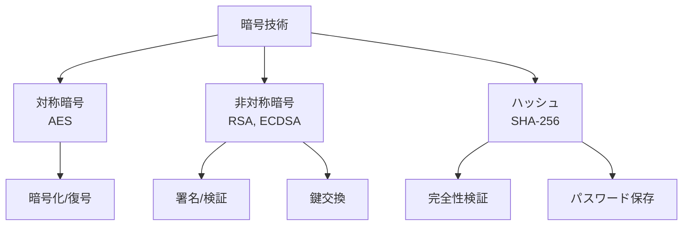

# Phase 3-1: 暗号化とハッシュ

## 学習目標

この単元を終えると、以下ができるようになります：

- 対称暗号と非対称暗号を使い分けられる
- ハッシュ関数の適切な用途を理解できる
- Python で暗号化を実装できる

## 暗号の種類



### 暗号の使い分け

| 用途 | アルゴリズム |
|------|-------------|
| データ暗号化 | AES-256-GCM |
| 鍵交換 | RSA, ECDH |
| デジタル署名 | RSA, ECDSA |
| パスワード | Argon2, bcrypt |
| 完全性検証 | SHA-256, HMAC |

## ハンズオン

### 演習1: 対称暗号（AES）

```python
# symmetric_encryption.py
"""
対称暗号（AES-256-GCM）
"""

from cryptography.hazmat.primitives.ciphers.aead import AESGCM
from cryptography.hazmat.primitives import hashes
from cryptography.hazmat.primitives.kdf.pbkdf2 import PBKDF2HMAC
import os
import base64

class AESEncryption:
    """
    AES-256-GCM 暗号化
    
    GCM モード: 暗号化 + 認証（改ざん検知）
    """
    
    KEY_SIZE = 32  # 256 bit
    NONCE_SIZE = 12  # 96 bit (GCM推奨)
    
    @staticmethod
    def generate_key() -> bytes:
        """暗号化キーを生成"""
        return os.urandom(AESEncryption.KEY_SIZE)
    
    @staticmethod
    def derive_key(password: str, salt: bytes) -> bytes:
        """パスワードからキーを導出"""
        kdf = PBKDF2HMAC(
            algorithm=hashes.SHA256(),
            length=AESEncryption.KEY_SIZE,
            salt=salt,
            iterations=100000,
        )
        return kdf.derive(password.encode())
    
    @staticmethod
    def encrypt(plaintext: bytes, key: bytes, associated_data: bytes = None) -> bytes:
        """
        暗号化
        
        戻り値: nonce + ciphertext + tag
        """
        nonce = os.urandom(AESEncryption.NONCE_SIZE)
        aesgcm = AESGCM(key)
        
        ciphertext = aesgcm.encrypt(nonce, plaintext, associated_data)
        
        return nonce + ciphertext
    
    @staticmethod
    def decrypt(encrypted: bytes, key: bytes, associated_data: bytes = None) -> bytes:
        """復号"""
        nonce = encrypted[:AESEncryption.NONCE_SIZE]
        ciphertext = encrypted[AESEncryption.NONCE_SIZE:]
        
        aesgcm = AESGCM(key)
        
        return aesgcm.decrypt(nonce, ciphertext, associated_data)

# 使用例
key = AESEncryption.generate_key()
plaintext = b'Sensitive data'
encrypted = AESEncryption.encrypt(plaintext, key)
decrypted = AESEncryption.decrypt(encrypted, key)
assert decrypted == plaintext
```

### 演習2: 非対称暗号（RSA）

```python
# asymmetric_encryption.py
"""
非対称暗号（RSA）
"""

from cryptography.hazmat.primitives import hashes
from cryptography.hazmat.primitives.asymmetric import rsa, padding
from cryptography.hazmat.primitives import serialization

class RSAEncryption:
    """
    RSA 暗号化/署名
    """
    
    @staticmethod
    def generate_key_pair():
        """キーペア生成"""
        private_key = rsa.generate_private_key(
            public_exponent=65537,
            key_size=2048,
        )
        public_key = private_key.public_key()
        
        return private_key, public_key
    
    @staticmethod
    def encrypt(plaintext: bytes, public_key) -> bytes:
        """公開鍵で暗号化"""
        return public_key.encrypt(
            plaintext,
            padding.OAEP(
                mgf=padding.MGF1(algorithm=hashes.SHA256()),
                algorithm=hashes.SHA256(),
                label=None
            )
        )
    
    @staticmethod
    def decrypt(ciphertext: bytes, private_key) -> bytes:
        """秘密鍵で復号"""
        return private_key.decrypt(
            ciphertext,
            padding.OAEP(
                mgf=padding.MGF1(algorithm=hashes.SHA256()),
                algorithm=hashes.SHA256(),
                label=None
            )
        )
    
    @staticmethod
    def sign(message: bytes, private_key) -> bytes:
        """秘密鍵で署名"""
        return private_key.sign(
            message,
            padding.PSS(
                mgf=padding.MGF1(hashes.SHA256()),
                salt_length=padding.PSS.MAX_LENGTH
            ),
            hashes.SHA256()
        )
    
    @staticmethod
    def verify(message: bytes, signature: bytes, public_key) -> bool:
        """公開鍵で検証"""
        try:
            public_key.verify(
                signature,
                message,
                padding.PSS(
                    mgf=padding.MGF1(hashes.SHA256()),
                    salt_length=padding.PSS.MAX_LENGTH
                ),
                hashes.SHA256()
            )
            return True
        except Exception:
            return False
    
    @staticmethod
    def serialize_public_key(public_key) -> bytes:
        """公開鍵をPEM形式に"""
        return public_key.public_bytes(
            encoding=serialization.Encoding.PEM,
            format=serialization.PublicFormat.SubjectPublicKeyInfo
        )

# 使用例
private_key, public_key = RSAEncryption.generate_key_pair()

# 暗号化/復号
encrypted = RSAEncryption.encrypt(b'Secret', public_key)
decrypted = RSAEncryption.decrypt(encrypted, private_key)

# 署名/検証
signature = RSAEncryption.sign(b'Message', private_key)
is_valid = RSAEncryption.verify(b'Message', signature, public_key)
```

### 演習3: ハッシュと HMAC

```python
# hashing.py
"""
ハッシュ関数とHMAC
"""

import hashlib
import hmac
import secrets

class Hashing:
    """
    ハッシュ関数
    """
    
    @staticmethod
    def sha256(data: bytes) -> str:
        """SHA-256 ハッシュ"""
        return hashlib.sha256(data).hexdigest()
    
    @staticmethod
    def sha256_file(filepath: str) -> str:
        """ファイルのハッシュ"""
        sha256 = hashlib.sha256()
        
        with open(filepath, 'rb') as f:
            for chunk in iter(lambda: f.read(8192), b''):
                sha256.update(chunk)
        
        return sha256.hexdigest()
    
    @staticmethod
    def hmac_sha256(key: bytes, message: bytes) -> str:
        """
        HMAC-SHA256
        
        ハッシュ + 秘密鍵 = メッセージ認証コード
        """
        return hmac.new(key, message, hashlib.sha256).hexdigest()
    
    @staticmethod
    def verify_hmac(key: bytes, message: bytes, signature: str) -> bool:
        """HMAC検証（タイミング攻撃対策）"""
        expected = hmac.new(key, message, hashlib.sha256).hexdigest()
        return hmac.compare_digest(expected, signature)

# API 署名の例
def sign_request(api_key: str, timestamp: str, body: str) -> str:
    """APIリクエストの署名"""
    message = f'{timestamp}:{body}'.encode()
    return Hashing.hmac_sha256(api_key.encode(), message)

def verify_request(api_key: str, timestamp: str, body: str, signature: str) -> bool:
    """署名検証"""
    message = f'{timestamp}:{body}'.encode()
    return Hashing.verify_hmac(api_key.encode(), message, signature)
```

### 演習4: シークレット管理

```python
# secrets_management.py
"""
シークレット管理
"""

import boto3
import json
from functools import lru_cache

class SecretsManager:
    """
    AWS Secrets Manager
    """
    
    def __init__(self):
        self.client = boto3.client('secretsmanager')
    
    @lru_cache(maxsize=10)
    def get_secret(self, secret_name: str) -> dict:
        """
        シークレットを取得（キャッシュ付き）
        """
        response = self.client.get_secret_value(SecretId=secret_name)
        
        if 'SecretString' in response:
            return json.loads(response['SecretString'])
        else:
            # バイナリの場合
            return response['SecretBinary']
    
    def rotate_secret(self, secret_name: str):
        """シークレットのローテーション開始"""
        self.client.rotate_secret(SecretId=secret_name)
        # キャッシュクリア
        self.get_secret.cache_clear()

# 環境変数からシークレット取得（開発用）
import os

def get_secret(name: str) -> str:
    """
    環境変数 or Secrets Manager
    """
    # 開発環境: 環境変数
    if os.getenv('ENV') == 'development':
        return os.environ.get(name, '')
    
    # 本番環境: Secrets Manager
    sm = SecretsManager()
    secrets = sm.get_secret('myapp/production')
    return secrets.get(name, '')
```

## 暗号のベストプラクティス

| 項目 | 推奨 |
|------|------|
| 対称暗号 | AES-256-GCM |
| 非対称暗号 | RSA-2048+, ECDSA P-256 |
| ハッシュ | SHA-256+ |
| パスワード | Argon2id |
| 乱数生成 | secrets モジュール |

## 理解度確認

### 問題

AES-GCM モードの利点は何か。

**A.** 暗号化速度が最速

**B.** 暗号化と認証（改ざん検知）を同時に行える

**C.** 鍵長が短くて済む

**D.** パスワード保存に最適

---

### 解答・解説

**正解: B**

GCM（Galois/Counter Mode）は認証付き暗号モードで、暗号化と同時にメッセージ認証コード（MAC）を生成します。復号時に改ざんを検知できるため、別途 HMAC を計算する必要がありません。

---

## 次のステップ

暗号化とハッシュを学びました。次は AWS セキュリティを学びましょう。

**次の単元**: [Phase 3-2: AWS セキュリティ](./02_AWSセキュリティ.md)
