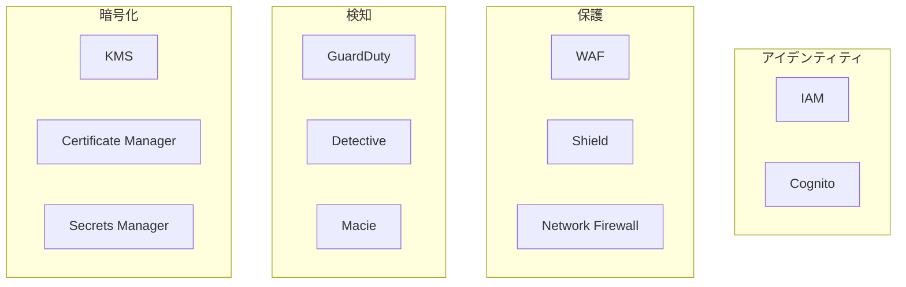

# Phase 3-2: AWS セキュリティ

## 学習目標

この単元を終えると、以下ができるようになります：

- IAM のベストプラクティスを実践できる
- AWS WAF を設定できる
- セキュリティサービスを活用できる

## AWS セキュリティサービス



## ハンズオン

### 演習1: IAM ベストプラクティス

```python
# iam_best_practices.py
"""
IAMポリシーのベストプラクティス
"""

import boto3
import json

iam = boto3.client('iam')

# ✅ 最小権限の原則
MINIMAL_POLICY = {
    "Version": "2012-10-17",
    "Statement": [
        {
            "Effect": "Allow",
            "Action": [
                "s3:GetObject",
                "s3:PutObject"
            ],
            "Resource": [
                "arn:aws:s3:::my-bucket/uploads/*"
            ],
            # ✅ 条件で制限
            "Condition": {
                "StringEquals": {
                    "s3:x-amz-acl": "private"
                },
                "IpAddress": {
                    "aws:SourceIp": "203.0.113.0/24"
                }
            }
        }
    ]
}

# ❌ 避けるべきポリシー
BAD_POLICY = {
    "Version": "2012-10-17",
    "Statement": [
        {
            "Effect": "Allow",
            "Action": "*",  # ❌ 全権限
            "Resource": "*"  # ❌ 全リソース
        }
    ]
}

# ✅ Lambda 用の最小権限ロール
LAMBDA_ROLE_POLICY = {
    "Version": "2012-10-17",
    "Statement": [
        # CloudWatch Logs
        {
            "Effect": "Allow",
            "Action": [
                "logs:CreateLogStream",
                "logs:PutLogEvents"
            ],
            "Resource": "arn:aws:logs:*:*:log-group:/aws/lambda/my-function:*"
        },
        # 特定の DynamoDB テーブル
        {
            "Effect": "Allow",
            "Action": [
                "dynamodb:GetItem",
                "dynamodb:PutItem",
                "dynamodb:UpdateItem",
                "dynamodb:Query"
            ],
            "Resource": "arn:aws:dynamodb:*:*:table/my-table"
        },
        # 特定の S3 バケット
        {
            "Effect": "Allow",
            "Action": [
                "s3:GetObject"
            ],
            "Resource": "arn:aws:s3:::my-bucket/*"
        }
    ]
}

def create_minimal_role(role_name: str, policy_document: dict):
    """最小権限のロールを作成"""
    
    # 信頼ポリシー
    assume_role_policy = {
        "Version": "2012-10-17",
        "Statement": [
            {
                "Effect": "Allow",
                "Principal": {
                    "Service": "lambda.amazonaws.com"
                },
                "Action": "sts:AssumeRole"
            }
        ]
    }
    
    # ロール作成
    iam.create_role(
        RoleName=role_name,
        AssumeRolePolicyDocument=json.dumps(assume_role_policy)
    )
    
    # インラインポリシー追加
    iam.put_role_policy(
        RoleName=role_name,
        PolicyName='MinimalPolicy',
        PolicyDocument=json.dumps(policy_document)
    )
```

### 演習2: AWS WAF 設定

```python
# waf_configuration.py
"""
AWS WAF設定
"""

import boto3

wafv2 = boto3.client('wafv2')

def create_web_acl():
    """
    Web ACL を作成
    """
    response = wafv2.create_web_acl(
        Name='MyWebACL',
        Scope='REGIONAL',  # ALB, API Gateway 用
        DefaultAction={'Allow': {}},
        Rules=[
            # AWS マネージドルール: SQLインジェクション
            {
                'Name': 'AWSManagedRulesSQLiRuleSet',
                'Priority': 1,
                'Statement': {
                    'ManagedRuleGroupStatement': {
                        'VendorName': 'AWS',
                        'Name': 'AWSManagedRulesSQLiRuleSet'
                    }
                },
                'OverrideAction': {'None': {}},
                'VisibilityConfig': {
                    'SampledRequestsEnabled': True,
                    'CloudWatchMetricsEnabled': True,
                    'MetricName': 'SQLiRuleSet'
                }
            },
            # AWS マネージドルール: 一般的な攻撃
            {
                'Name': 'AWSManagedRulesCommonRuleSet',
                'Priority': 2,
                'Statement': {
                    'ManagedRuleGroupStatement': {
                        'VendorName': 'AWS',
                        'Name': 'AWSManagedRulesCommonRuleSet'
                    }
                },
                'OverrideAction': {'None': {}},
                'VisibilityConfig': {
                    'SampledRequestsEnabled': True,
                    'CloudWatchMetricsEnabled': True,
                    'MetricName': 'CommonRuleSet'
                }
            },
            # レート制限
            {
                'Name': 'RateLimitRule',
                'Priority': 3,
                'Statement': {
                    'RateBasedStatement': {
                        'Limit': 1000,  # 5分あたり
                        'AggregateKeyType': 'IP'
                    }
                },
                'Action': {'Block': {}},
                'VisibilityConfig': {
                    'SampledRequestsEnabled': True,
                    'CloudWatchMetricsEnabled': True,
                    'MetricName': 'RateLimit'
                }
            },
            # IP ブロックリスト
            {
                'Name': 'IPBlockList',
                'Priority': 0,
                'Statement': {
                    'IPSetReferenceStatement': {
                        'ARN': 'arn:aws:wafv2:...:ipset/BlockedIPs/...'
                    }
                },
                'Action': {'Block': {}},
                'VisibilityConfig': {
                    'SampledRequestsEnabled': True,
                    'CloudWatchMetricsEnabled': True,
                    'MetricName': 'IPBlockList'
                }
            }
        ],
        VisibilityConfig={
            'SampledRequestsEnabled': True,
            'CloudWatchMetricsEnabled': True,
            'MetricName': 'MyWebACL'
        }
    )
    
    return response['Summary']['ARN']
```

### 演習3: KMS 暗号化

```python
# kms_encryption.py
"""
AWS KMS による暗号化
"""

import boto3
import base64

kms = boto3.client('kms')

class KMSEncryption:
    def __init__(self, key_id: str):
        self.key_id = key_id
    
    def encrypt(self, plaintext: str) -> str:
        """
        KMSで暗号化
        """
        response = kms.encrypt(
            KeyId=self.key_id,
            Plaintext=plaintext.encode(),
            EncryptionContext={
                'purpose': 'data-protection'
            }
        )
        
        return base64.b64encode(response['CiphertextBlob']).decode()
    
    def decrypt(self, ciphertext_b64: str) -> str:
        """
        KMSで復号
        """
        ciphertext = base64.b64decode(ciphertext_b64)
        
        response = kms.decrypt(
            CiphertextBlob=ciphertext,
            EncryptionContext={
                'purpose': 'data-protection'
            }
        )
        
        return response['Plaintext'].decode()
    
    def generate_data_key(self) -> tuple:
        """
        データキー生成（エンベロープ暗号化）
        """
        response = kms.generate_data_key(
            KeyId=self.key_id,
            KeySpec='AES_256'
        )
        
        # 平文キー（暗号化に使用後すぐに破棄）
        plaintext_key = response['Plaintext']
        # 暗号化済みキー（データと一緒に保存）
        encrypted_key = response['CiphertextBlob']
        
        return plaintext_key, encrypted_key

# 使用例
kms_enc = KMSEncryption('alias/my-key')

# 小さなデータ: 直接暗号化
encrypted = kms_enc.encrypt('sensitive data')
decrypted = kms_enc.decrypt(encrypted)

# 大きなデータ: エンベロープ暗号化
plaintext_key, encrypted_key = kms_enc.generate_data_key()
# plaintext_key で AES 暗号化
# encrypted_key をデータと一緒に保存
```

### 演習4: GuardDuty と Security Hub

```python
# security_monitoring.py
"""
セキュリティ監視
"""

import boto3

guardduty = boto3.client('guardduty')
securityhub = boto3.client('securityhub')

def enable_guardduty():
    """GuardDuty を有効化"""
    response = guardduty.create_detector(
        Enable=True,
        FindingPublishingFrequency='FIFTEEN_MINUTES'
    )
    return response['DetectorId']

def get_findings(detector_id: str, severity_min: float = 7.0):
    """高重要度の検出結果を取得"""
    response = guardduty.list_findings(
        DetectorId=detector_id,
        FindingCriteria={
            'Criterion': {
                'severity': {
                    'Gte': severity_min
                }
            }
        }
    )
    
    if response['FindingIds']:
        findings = guardduty.get_findings(
            DetectorId=detector_id,
            FindingIds=response['FindingIds']
        )
        return findings['Findings']
    
    return []

def get_security_hub_findings():
    """Security Hub の検出結果"""
    response = securityhub.get_findings(
        Filters={
            'SeverityLabel': [
                {'Value': 'CRITICAL', 'Comparison': 'EQUALS'},
                {'Value': 'HIGH', 'Comparison': 'EQUALS'}
            ],
            'WorkflowStatus': [
                {'Value': 'NEW', 'Comparison': 'EQUALS'}
            ]
        }
    )
    return response['Findings']
```

## AWS セキュリティチェックリスト

| 項目 | 対策 |
|------|------|
| ルートアカウント | MFA必須、使用しない |
| IAM | 最小権限、定期的なレビュー |
| S3 | パブリックアクセスブロック |
| 暗号化 | KMS、転送中はTLS |
| ログ | CloudTrail、VPC Flow Logs |
| 監視 | GuardDuty、Security Hub |

## 理解度確認

### 問題

AWS で最小権限の原則を実践する方法として正しいのはどれか。

**A.** 管理者に AdministratorAccess を付与

**B.** 必要なアクションとリソースのみを許可するカスタムポリシー

**C.** PowerUserAccess を全員に付与

**D.** IAM グループを使わない

---

### 解答・解説

**正解: B**

最小権限の原則では、必要なアクション（s3:GetObject など）と必要なリソース（特定のバケット）のみを許可します。条件（Condition）を使ってさらに制限することも重要です。

---

## 次のステップ

AWS セキュリティを学びました。次は総仕上げです。

**次の単元**: [Phase 4-1: 総仕上げ](../phase4/01_総仕上げ.md)
