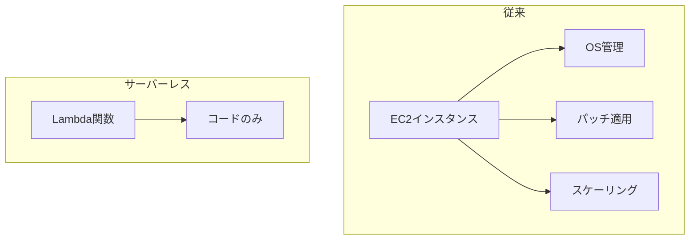

# Phase 1-1: サーバーレス概論

## 学習目標

この単元を終えると、以下ができるようになります：

- サーバーレスの本質を説明できる
- 従来アーキテクチャとの違いを比較できる
- 適切なユースケースを判断できる

## サーバーレスとは



### サーバーレスの原則

| 原則 | 説明 |
|------|------|
| **ノーサーバー管理** | インフラを意識しない |
| **自動スケーリング** | 0 から無限大へ |
| **従量課金** | 使った分だけ |
| **高可用性** | デフォルトで冗長化 |

## Lambda vs EC2

| 観点 | Lambda | EC2 |
|------|--------|-----|
| 課金単位 | リクエスト + 実行時間 | 時間 |
| スケーリング | 自動 | 設定必要 |
| 実行時間 | 最大15分 | 無制限 |
| コールドスタート | あり | なし |
| 適用 | イベント駆動 | 常時稼働 |

## ハンズオン

### 演習1: Lambda の基本構造

```python
# lambda_function.py
"""
Lambda関数の基本構造
"""

import json
import logging
import os
from typing import Any, Dict

# ロガー設定（Lambda外で初期化）
logger = logging.getLogger()
logger.setLevel(logging.INFO)

# 環境変数（Lambda外で取得）
TABLE_NAME = os.environ.get('TABLE_NAME', 'default-table')

def lambda_handler(event: Dict[str, Any], context) -> Dict[str, Any]:
    """
    Lambda ハンドラー
    
    Args:
        event: トリガーからのイベントデータ
        context: 実行コンテキスト（残り時間、関数名など）
    
    Returns:
        レスポンス
    """
    # リクエストIDをログに含める
    request_id = context.aws_request_id
    logger.info(f'Request ID: {request_id}')
    logger.info(f'Event: {json.dumps(event)}')
    
    try:
        # ビジネスロジック
        result = process_event(event)
        
        return {
            'statusCode': 200,
            'headers': {
                'Content-Type': 'application/json',
                'X-Request-Id': request_id
            },
            'body': json.dumps(result)
        }
    
    except ValidationError as e:
        logger.warning(f'Validation error: {e}')
        return {
            'statusCode': 400,
            'body': json.dumps({'error': str(e)})
        }
    
    except Exception as e:
        logger.error(f'Unexpected error: {e}', exc_info=True)
        return {
            'statusCode': 500,
            'body': json.dumps({'error': 'Internal server error'})
        }

def process_event(event: Dict[str, Any]) -> Dict[str, Any]:
    """ビジネスロジック"""
    # API Gateway からの場合
    if 'httpMethod' in event:
        body = json.loads(event.get('body', '{}'))
        return {'message': f'Received: {body}'}
    
    # S3 トリガーの場合
    if 'Records' in event and event['Records'][0].get('eventSource') == 'aws:s3':
        bucket = event['Records'][0]['s3']['bucket']['name']
        key = event['Records'][0]['s3']['object']['key']
        return {'message': f'Processing {bucket}/{key}'}
    
    return {'message': 'Unknown event type'}

class ValidationError(Exception):
    pass
```

### 演習2: コンテキストの活用

```python
# context_usage.py
"""
Lambdaコンテキストの活用
"""

import time

def lambda_handler(event, context):
    """
    context オブジェクトの活用
    
    context属性:
    - function_name: 関数名
    - function_version: バージョン
    - memory_limit_in_mb: メモリ制限
    - aws_request_id: リクエストID
    - log_group_name: ログストリーム名
    - get_remaining_time_in_millis(): 残り実行時間
    """
    print(f'Function: {context.function_name}')
    print(f'Memory: {context.memory_limit_in_mb}MB')
    print(f'Request ID: {context.aws_request_id}')
    
    # 残り時間を確認しながら処理
    items = get_items_to_process()
    processed = 0
    
    for item in items:
        # 残り時間が10秒未満なら中断
        remaining = context.get_remaining_time_in_millis()
        if remaining < 10000:
            print(f'Time running out! Processed {processed} items')
            # 残りは次の呼び出しに委ねる
            return {
                'statusCode': 202,
                'body': {
                    'processed': processed,
                    'remaining': len(items) - processed
                }
            }
        
        process_item(item)
        processed += 1
    
    return {
        'statusCode': 200,
        'body': {'processed': processed}
    }

def get_items_to_process():
    return list(range(100))

def process_item(item):
    time.sleep(0.1)
```

### 演習3: 構造化ログ

```python
# structured_logging.py
"""
Lambda用構造化ログ
"""

import json
import logging
import sys
from datetime import datetime

class StructuredLogger:
    """構造化ログ出力"""
    
    def __init__(self, service_name: str):
        self.service_name = service_name
        self.logger = logging.getLogger()
        self.logger.setLevel(logging.INFO)
        
        # ハンドラー設定
        handler = logging.StreamHandler(sys.stdout)
        handler.setFormatter(logging.Formatter('%(message)s'))
        self.logger.handlers = [handler]
    
    def _log(self, level: str, message: str, **extra):
        log_entry = {
            'timestamp': datetime.utcnow().isoformat(),
            'level': level,
            'service': self.service_name,
            'message': message,
            **extra
        }
        self.logger.info(json.dumps(log_entry))
    
    def info(self, message: str, **extra):
        self._log('INFO', message, **extra)
    
    def error(self, message: str, **extra):
        self._log('ERROR', message, **extra)
    
    def warn(self, message: str, **extra):
        self._log('WARN', message, **extra)

# 使用例
logger = StructuredLogger('order-service')

def lambda_handler(event, context):
    logger.info(
        'Processing order',
        order_id='ORD-123',
        customer_id='CUST-456',
        request_id=context.aws_request_id
    )
    
    # 処理...
    
    logger.info(
        'Order processed',
        order_id='ORD-123',
        duration_ms=150
    )
```

## サーバーレスの制約

| 制約 | 対策 |
|------|------|
| 実行時間15分 | Step Functions で分割 |
| ペイロード6MB | S3経由 |
| 同時実行1000 | 予約同時実行数 |
| コールドスタート | Provisioned Concurrency |

## 理解度確認

### 問題

Lambda 関数で長時間処理（30分）が必要な場合、最適な解決策は何か。

**A.** タイムアウトを30分に設定

**B.** EC2 に移行

**C.** Step Functions で分割

**D.** 同時実行数を増やす

---

### 解答・解説

**正解: C**

Lambda の最大実行時間は15分です。長時間処理は Step Functions でワークフローに分割し、複数の Lambda 関数で処理します。処理単位を小さくすることで、エラー時のリトライも容易になります。

---

## 次のステップ

サーバーレス概論を学びました。次は Lambda を深掘りしましょう。

**次の単元**: [Phase 1-2: Lambda 深掘り](./02_Lambda深掘り.md)
