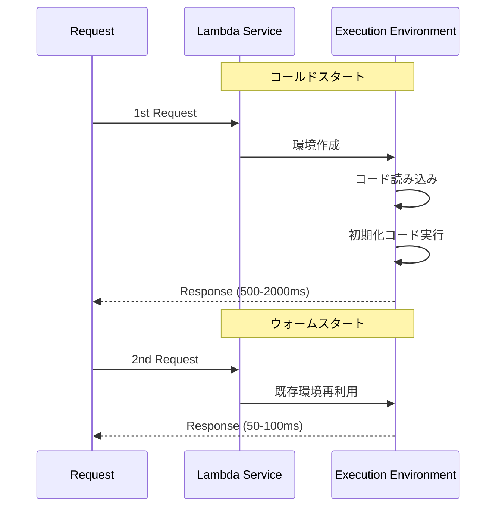

# Phase 1-2: Lambda 深掘り

## 学習目標

この単元を終えると、以下ができるようになります：

- コールドスタートを最小化できる
- Lambda のパフォーマンスを最適化できる
- 本番運用のベストプラクティスを適用できる

## コールドスタート



### コールドスタートの要因

| 要因 | 影響 | 対策 |
|------|------|------|
| ランタイム | Python < Node < Java | 軽量ランタイム選択 |
| パッケージサイズ | 大きいほど遅い | 依存関係最小化 |
| VPC | +200-500ms | VPC不要なら外す |
| メモリ | 少ないと遅い | 適切なメモリ設定 |

## ハンズオン

### 演習1: 初期化の最適化

```python
# optimized_lambda.py
"""
Lambda初期化の最適化
"""

import boto3
import json
import os
from functools import lru_cache

# ===== ハンドラー外で初期化（コールドスタート時のみ実行） =====

# 環境変数
TABLE_NAME = os.environ['TABLE_NAME']
REGION = os.environ.get('AWS_REGION', 'ap-northeast-1')

# AWS クライアント（再利用される）
dynamodb = boto3.resource('dynamodb', region_name=REGION)
table = dynamodb.Table(TABLE_NAME)

s3_client = boto3.client('s3')

# 設定の遅延読み込み
@lru_cache(maxsize=1)
def get_config():
    """設定を一度だけ読み込む"""
    response = s3_client.get_object(
        Bucket=os.environ['CONFIG_BUCKET'],
        Key='config.json'
    )
    return json.loads(response['Body'].read())

# ===== ハンドラー（毎回実行） =====

def lambda_handler(event, context):
    """
    ハンドラーはシンプルに保つ
    """
    config = get_config()  # キャッシュから取得
    
    # 処理
    result = process(event, config)
    
    return {
        'statusCode': 200,
        'body': json.dumps(result)
    }

def process(event, config):
    # ビジネスロジック
    return {'status': 'ok'}
```

### 演習2: Provisioned Concurrency

```python
# provisioned_concurrency.py
"""
Provisioned Concurrency の設定と効果測定
"""

import boto3
import time

lambda_client = boto3.client('lambda')

def setup_provisioned_concurrency(
    function_name: str,
    alias: str,
    concurrency: int
):
    """
    Provisioned Concurrency を設定
    
    コスト: $0.000004463 / GB-秒（東京）
    例: 512MB × 10並列 × 24時間 = 約$1.93/日
    """
    response = lambda_client.put_provisioned_concurrency_config(
        FunctionName=function_name,
        Qualifier=alias,
        ProvisionedConcurrentExecutions=concurrency
    )
    return response

def measure_cold_start():
    """コールドスタート計測"""
    # Provisioned なし
    start = time.time()
    response = lambda_client.invoke(
        FunctionName='my-function',
        Qualifier='$LATEST'
    )
    no_provisioned = time.time() - start
    
    # Provisioned あり
    start = time.time()
    response = lambda_client.invoke(
        FunctionName='my-function',
        Qualifier='production'  # Provisioned 設定済み
    )
    with_provisioned = time.time() - start
    
    print(f'Without Provisioned: {no_provisioned*1000:.0f}ms')
    print(f'With Provisioned: {with_provisioned*1000:.0f}ms')
```

### 演習3: メモリとパフォーマンス

```python
# memory_optimization.py
"""
メモリ設定の最適化

メモリとCPUは比例:
- 128MB: 0.1 vCPU
- 1769MB: 1 vCPU
- 10240MB: 6 vCPU

コスト計算:
- 実行時間 × メモリ
- メモリ2倍 → コスト2倍だが、CPU増加で実行時間短縮
"""

import json
import time
from typing import Dict, List

def analyze_memory_settings(
    function_name: str,
    memory_sizes: List[int]
) -> Dict:
    """
    異なるメモリ設定でのパフォーマンス分析
    
    AWS Lambda Power Tuning を使うのがベスト:
    https://github.com/alexcasalboni/aws-lambda-power-tuning
    """
    results = {}
    
    for memory in memory_sizes:
        # メモリ設定変更
        update_function_memory(function_name, memory)
        
        # 計測
        durations = []
        costs = []
        
        for _ in range(10):
            start = time.time()
            invoke_function(function_name)
            duration = time.time() - start
            
            durations.append(duration)
            # コスト計算（1GB-秒 = $0.0000166667）
            cost = (memory / 1024) * duration * 0.0000166667
            costs.append(cost)
        
        results[memory] = {
            'avg_duration': sum(durations) / len(durations),
            'avg_cost': sum(costs) / len(costs)
        }
    
    return results

# 最適なメモリを見つける
def find_optimal_memory():
    """
    経験則:
    - CPU依存: 高メモリ（1024MB+）
    - I/O依存: 低メモリでOK（256-512MB）
    - 一般的: 512-1024MB
    """
    pass

def update_function_memory(name, memory):
    pass

def invoke_function(name):
    pass
```

### 演習4: レイヤーの活用

```python
# layers/
# └── common/
#     └── python/
#         └── common/
#             ├── __init__.py
#             ├── logging.py
#             └── utils.py

# layers/common/python/common/logging.py
"""
共通ログレイヤー
"""

import json
import logging
from datetime import datetime

def setup_logger(name: str) -> logging.Logger:
    logger = logging.getLogger(name)
    logger.setLevel(logging.INFO)
    
    handler = logging.StreamHandler()
    handler.setFormatter(JsonFormatter())
    logger.handlers = [handler]
    
    return logger

class JsonFormatter(logging.Formatter):
    def format(self, record):
        log_data = {
            'timestamp': datetime.utcnow().isoformat(),
            'level': record.levelname,
            'logger': record.name,
            'message': record.getMessage(),
        }
        if record.exc_info:
            log_data['exception'] = self.formatException(record.exc_info)
        return json.dumps(log_data)

# Lambda関数で使用
# from common.logging import setup_logger
# logger = setup_logger('my-function')
```

### 演習5: X-Ray トレーシング

```python
# xray_tracing.py
"""
X-Rayによる分散トレーシング
"""

from aws_xray_sdk.core import xray_recorder
from aws_xray_sdk.core import patch_all
import boto3

# 自動パッチ（boto3, requests 等をトレース）
patch_all()

dynamodb = boto3.resource('dynamodb')
table = dynamodb.Table('orders')

def lambda_handler(event, context):
    # カスタムサブセグメント
    with xray_recorder.in_subsegment('validate_input') as subseg:
        subseg.put_annotation('order_id', event.get('order_id'))
        validate_input(event)
    
    with xray_recorder.in_subsegment('process_order') as subseg:
        result = process_order(event)
        subseg.put_metadata('result', result)
    
    with xray_recorder.in_subsegment('save_to_dynamodb'):
        save_order(result)
    
    return {'statusCode': 200, 'body': 'OK'}

def validate_input(event):
    pass

def process_order(event):
    return {'order_id': event.get('order_id'), 'status': 'processed'}

def save_order(order):
    table.put_item(Item=order)
```

## Lambda ベストプラクティス

| カテゴリ | プラクティス |
|---------|-------------|
| **初期化** | ハンドラー外で SDK クライアント作成 |
| **依存関係** | 必要最小限、レイヤーで共有 |
| **メモリ** | Power Tuning で最適化 |
| **タイムアウト** | 適切に設定（API: 29秒以下） |
| **環境変数** | 設定値は環境変数で |
| **シークレット** | Secrets Manager / Parameter Store |

## 理解度確認

### 問題

Lambda のコールドスタートを完全に排除する方法は何か。

**A.** メモリを最大に設定

**B.** Provisioned Concurrency を設定

**C.** VPC から外す

**D.** 定期的に Ping を送る

---

### 解答・解説

**正解: B**

Provisioned Concurrency は指定した数の実行環境を常に起動しておきます。追加コストがかかりますが、コールドスタートを完全に排除できます。D の定期 Ping はウォーム状態を維持しますが、確実ではありません。

---

## 次のステップ

Lambda 深掘りを学びました。次はイベント駆動設計を学びましょう。

**次の単元**: [Phase 2-1: イベント駆動設計](../phase2/01_イベント駆動設計.md)
