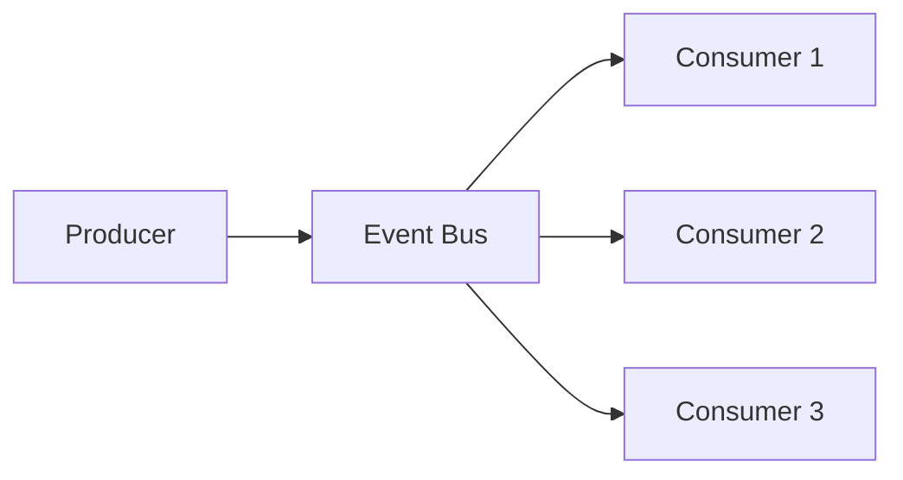

# Phase 2-1: イベント駆動設計

## 学習目標

この単元を終えると、以下ができるようになります：

- イベント駆動アーキテクチャを設計できる
- EventBridge, SNS, SQS を使い分けられる
- 非同期処理パターンを実装できる

## イベント駆動アーキテクチャ



### イベントソース

| サービス | 用途 | 特徴 |
|---------|------|------|
| **EventBridge** | イベントルーティング | スケジュール、SaaS連携 |
| **SNS** | Pub/Sub | ファンアウト |
| **SQS** | キュー | 順序保証、DLQ |
| **Kinesis** | ストリーム | 高スループット |

## ハンズオン

### 演習1: EventBridge イベント

```python
# eventbridge_producer.py
"""
EventBridgeへのイベント発行
"""

import boto3
import json
from datetime import datetime

eventbridge = boto3.client('events')

def publish_order_event(order: dict, event_type: str):
    """
    注文イベントを発行
    
    event_type: 'OrderCreated', 'OrderShipped', 'OrderCancelled'
    """
    event = {
        'Source': 'com.myapp.orders',
        'DetailType': event_type,
        'Detail': json.dumps({
            'orderId': order['order_id'],
            'customerId': order['customer_id'],
            'amount': order['amount'],
            'timestamp': datetime.utcnow().isoformat()
        }),
        'EventBusName': 'orders-bus'
    }
    
    response = eventbridge.put_events(Entries=[event])
    
    if response['FailedEntryCount'] > 0:
        raise EventPublishError(f'Failed to publish event: {response}')
    
    return response

class EventPublishError(Exception):
    pass

# eventbridge_consumer.py
"""
EventBridgeイベントの処理
"""

def lambda_handler(event, context):
    """
    EventBridge ルールからトリガー
    
    event 構造:
    {
        'version': '0',
        'id': 'abc123',
        'detail-type': 'OrderCreated',
        'source': 'com.myapp.orders',
        'time': '2024-01-01T12:00:00Z',
        'detail': {
            'orderId': 'ORD-123',
            'customerId': 'CUST-456',
            'amount': 1000
        }
    }
    """
    event_type = event['detail-type']
    detail = event['detail']
    
    handlers = {
        'OrderCreated': handle_order_created,
        'OrderShipped': handle_order_shipped,
        'OrderCancelled': handle_order_cancelled
    }
    
    handler = handlers.get(event_type)
    if handler:
        handler(detail)
    else:
        print(f'Unknown event type: {event_type}')

def handle_order_created(detail):
    # 在庫予約、メール送信などを起動
    pass

def handle_order_shipped(detail):
    # 追跡情報の更新
    pass

def handle_order_cancelled(detail):
    # 在庫戻し、返金処理
    pass
```

### 演習2: SNS + SQS ファンアウト

```python
# sns_publisher.py
"""
SNSへのメッセージ発行
"""

import boto3
import json

sns = boto3.client('sns')

def publish_to_sns(topic_arn: str, message: dict, attributes: dict = None):
    """
    SNSトピックにメッセージを発行
    """
    params = {
        'TopicArn': topic_arn,
        'Message': json.dumps(message)
    }
    
    if attributes:
        params['MessageAttributes'] = {
            key: {
                'DataType': 'String',
                'StringValue': str(value)
            }
            for key, value in attributes.items()
        }
    
    return sns.publish(**params)

# ファンアウト例
def notify_order_created(order: dict):
    """
    注文作成を複数サービスに通知
    
    SNS Topic
    ├── SQS: 在庫サービス
    ├── SQS: 配送サービス
    └── Lambda: 通知サービス
    """
    publish_to_sns(
        topic_arn='arn:aws:sns:ap-northeast-1:123456789:order-events',
        message={
            'event_type': 'OrderCreated',
            'order': order
        },
        attributes={
            'event_type': 'OrderCreated',
            'priority': 'high'
        }
    )
```

```python
# sqs_consumer.py
"""
SQSからのメッセージ処理
"""

import json

def lambda_handler(event, context):
    """
    SQS トリガーからの処理
    
    event 構造:
    {
        'Records': [
            {
                'messageId': 'abc123',
                'body': '{"event_type": "OrderCreated", ...}',
                'attributes': {...},
                'messageAttributes': {...}
            }
        ]
    }
    """
    failed_messages = []
    
    for record in event['Records']:
        try:
            message = json.loads(record['body'])
            
            # SNS 経由の場合、body が二重にエンコード
            if 'Message' in message:
                message = json.loads(message['Message'])
            
            process_message(message)
            
        except Exception as e:
            print(f'Error processing message {record["messageId"]}: {e}')
            failed_messages.append({
                'itemIdentifier': record['messageId']
            })
    
    # 部分的な失敗を報告（Lambda が自動リトライ）
    if failed_messages:
        return {
            'batchItemFailures': failed_messages
        }
    
    return {'statusCode': 200}

def process_message(message: dict):
    event_type = message.get('event_type')
    # 処理...
```

### 演習3: DLQ（Dead Letter Queue）

```python
# dlq_handler.py
"""
Dead Letter Queueの処理
"""

import json
import boto3
from datetime import datetime

sqs = boto3.client('sqs')
sns = boto3.client('sns')

def lambda_handler(event, context):
    """
    DLQ に入ったメッセージを処理
    
    1. アラート通知
    2. ログ記録
    3. 手動確認用にDBへ保存
    """
    for record in event['Records']:
        message_id = record['messageId']
        body = record['body']
        
        # 失敗回数を確認
        attributes = record.get('attributes', {})
        receive_count = int(attributes.get('ApproximateReceiveCount', 1))
        
        # アラート送信
        send_alert(message_id, body, receive_count)
        
        # DBに保存
        save_failed_message(message_id, body, receive_count)
        
        print(f'DLQ message processed: {message_id}')

def send_alert(message_id: str, body: str, receive_count: int):
    """Slack/メールにアラート"""
    sns.publish(
        TopicArn='arn:aws:sns:ap-northeast-1:123456789:alerts',
        Message=json.dumps({
            'title': 'DLQ Message Alert',
            'message_id': message_id,
            'receive_count': receive_count,
            'body_preview': body[:200]
        }),
        Subject='DLQ Alert'
    )

def save_failed_message(message_id: str, body: str, receive_count: int):
    """DynamoDB に保存"""
    dynamodb = boto3.resource('dynamodb')
    table = dynamodb.Table('failed-messages')
    
    table.put_item(Item={
        'message_id': message_id,
        'body': body,
        'receive_count': receive_count,
        'failed_at': datetime.utcnow().isoformat(),
        'status': 'pending_review'
    })
```

### 演習4: イベントスキーマ管理

```python
# event_schema.py
"""
イベントスキーマ定義（Pydantic）
"""

from pydantic import BaseModel, Field
from datetime import datetime
from typing import Optional, List
from enum import Enum

class EventType(str, Enum):
    ORDER_CREATED = 'OrderCreated'
    ORDER_SHIPPED = 'OrderShipped'
    ORDER_CANCELLED = 'OrderCancelled'

class OrderItem(BaseModel):
    product_id: str
    quantity: int
    unit_price: int

class OrderEvent(BaseModel):
    """注文イベントのスキーマ"""
    event_type: EventType
    event_id: str = Field(description='一意なイベントID')
    timestamp: datetime
    
    order_id: str
    customer_id: str
    items: List[OrderItem]
    total_amount: int
    
    # オプション
    shipping_address: Optional[str] = None
    notes: Optional[str] = None

# 使用例
def create_order_event(order: dict) -> OrderEvent:
    return OrderEvent(
        event_type=EventType.ORDER_CREATED,
        event_id=str(uuid.uuid4()),
        timestamp=datetime.utcnow(),
        order_id=order['order_id'],
        customer_id=order['customer_id'],
        items=[OrderItem(**item) for item in order['items']],
        total_amount=order['total_amount']
    )

def validate_event(raw_event: dict) -> OrderEvent:
    """イベントのバリデーション"""
    return OrderEvent(**raw_event)
```

## イベント駆動のパターン

| パターン | 説明 | AWS サービス |
|---------|------|-------------|
| ファンアウト | 1対多の配信 | SNS + SQS |
| コレオグラフィ | 分散協調 | EventBridge |
| Saga | 分散トランザクション | Step Functions |
| CQRS | 読み書き分離 | DynamoDB Streams |

## 理解度確認

### 問題

複数のサービスに同じイベントを配信し、それぞれが独自のペースで処理する場合、最適な構成は何か。

**A.** Lambda から直接各サービスを呼び出す

**B.** SNS + 各サービス用の SQS キュー

**C.** SQS キューを共有

**D.** EventBridge のみ

---

### 解答・解説

**正解: B**

SNS でファンアウトし、各サービスが専用の SQS キューを持つ構成が最適です。各サービスは自分のペースで処理でき、障害が他に影響しません。SQS の DLQ で失敗メッセージも管理できます。

---

## 次のステップ

イベント駆動設計を学びました。次は Step Functions を学びましょう。

**次の単元**: [Phase 2-2: Step Functions](./02_Step_Functions.md)
