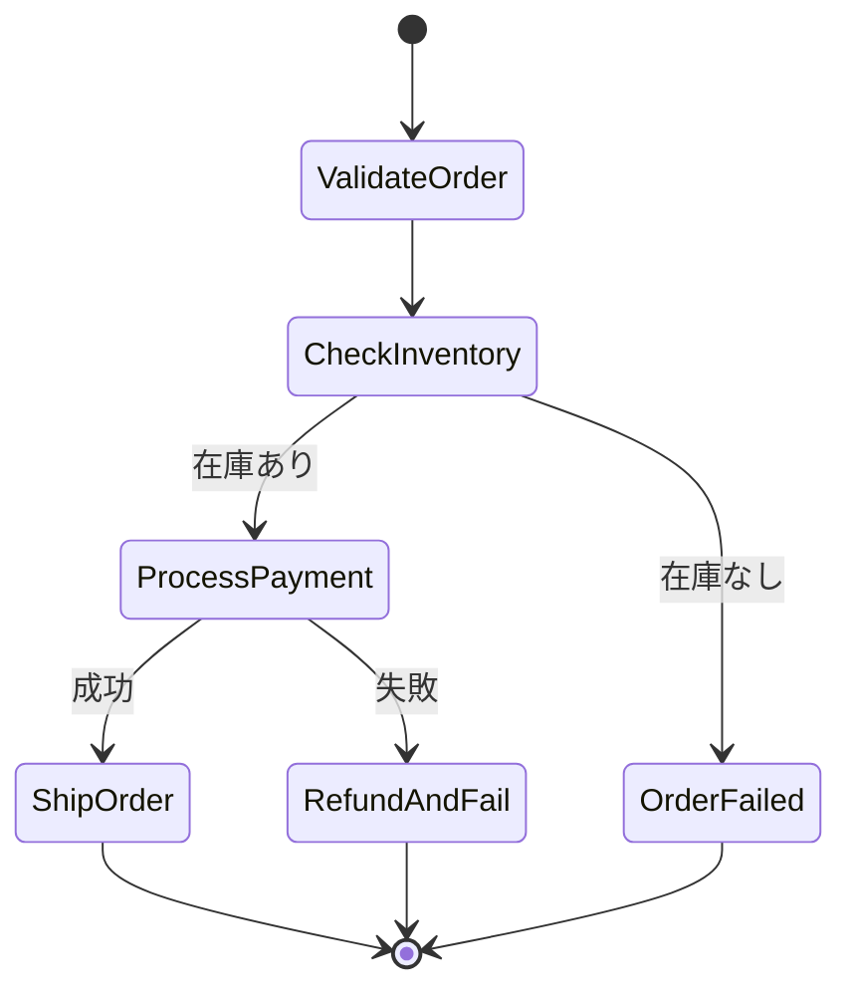

# Phase 2-2: Step Functions

## 学習目標

この単元を終えると、以下ができるようになります：

- Step Functions でワークフローを設計できる
- エラーハンドリングを実装できる
- 複雑な処理を orchestrate できる

## Step Functions とは



### Step Functions の利点

| 利点 | 説明 |
|------|------|
| **可視化** | ワークフローを図で確認 |
| **エラー処理** | リトライ、キャッチ、フォールバック |
| **状態管理** | 実行履歴を自動保存 |
| **並列処理** | 複数タスクを並行実行 |

## ハンズオン

### 演習1: 基本的なワークフロー

```json
// order_workflow.asl.json
{
  "Comment": "注文処理ワークフロー",
  "StartAt": "ValidateOrder",
  "States": {
    "ValidateOrder": {
      "Type": "Task",
      "Resource": "arn:aws:lambda:ap-northeast-1:123456789:function:validate-order",
      "Next": "CheckInventory",
      "Catch": [
        {
          "ErrorEquals": ["ValidationError"],
          "Next": "OrderFailed"
        }
      ]
    },
    
    "CheckInventory": {
      "Type": "Task",
      "Resource": "arn:aws:lambda:ap-northeast-1:123456789:function:check-inventory",
      "Next": "ProcessPayment",
      "Retry": [
        {
          "ErrorEquals": ["ServiceUnavailable"],
          "IntervalSeconds": 2,
          "MaxAttempts": 3,
          "BackoffRate": 2.0
        }
      ],
      "Catch": [
        {
          "ErrorEquals": ["InsufficientStock"],
          "Next": "OrderFailed"
        }
      ]
    },
    
    "ProcessPayment": {
      "Type": "Task",
      "Resource": "arn:aws:lambda:ap-northeast-1:123456789:function:process-payment",
      "Next": "ShipOrder",
      "Catch": [
        {
          "ErrorEquals": ["PaymentFailed"],
          "ResultPath": "$.error",
          "Next": "ReleaseInventory"
        }
      ]
    },
    
    "ShipOrder": {
      "Type": "Task",
      "Resource": "arn:aws:lambda:ap-northeast-1:123456789:function:ship-order",
      "End": true
    },
    
    "ReleaseInventory": {
      "Type": "Task",
      "Resource": "arn:aws:lambda:ap-northeast-1:123456789:function:release-inventory",
      "Next": "OrderFailed"
    },
    
    "OrderFailed": {
      "Type": "Fail",
      "Error": "OrderProcessingFailed",
      "Cause": "Order processing failed"
    }
  }
}
```

### 演習2: Lambda 関数

```python
# lambda_functions/validate_order.py
import json

def lambda_handler(event, context):
    """
    注文のバリデーション
    
    Input: {'orderId': 'ORD-123', 'items': [...], 'customerId': 'CUST-456'}
    Output: 同じ + validation 結果
    """
    order_id = event.get('orderId')
    items = event.get('items', [])
    customer_id = event.get('customerId')
    
    # バリデーション
    if not order_id:
        raise ValidationError('Order ID is required')
    
    if not items:
        raise ValidationError('Order must have items')
    
    if not customer_id:
        raise ValidationError('Customer ID is required')
    
    # 合計金額計算
    total = sum(item['price'] * item['quantity'] for item in items)
    
    return {
        **event,
        'validated': True,
        'totalAmount': total
    }

class ValidationError(Exception):
    pass

# lambda_functions/check_inventory.py
def lambda_handler(event, context):
    """在庫チェック"""
    items = event.get('items', [])
    
    # 在庫確認（実際はDBアクセス）
    for item in items:
        stock = get_stock(item['productId'])
        if stock < item['quantity']:
            raise InsufficientStockError(
                f"Not enough stock for {item['productId']}"
            )
    
    return {
        **event,
        'inventoryChecked': True
    }

def get_stock(product_id):
    # 在庫取得ロジック
    return 100

class InsufficientStockError(Exception):
    pass

# lambda_functions/process_payment.py
def lambda_handler(event, context):
    """決済処理"""
    total = event.get('totalAmount')
    customer_id = event.get('customerId')
    
    # 決済（外部API呼び出し）
    payment_result = process_payment(customer_id, total)
    
    if not payment_result['success']:
        raise PaymentFailed(payment_result['error'])
    
    return {
        **event,
        'paymentId': payment_result['paymentId'],
        'paymentProcessed': True
    }

def process_payment(customer_id, amount):
    # 決済ロジック
    return {'success': True, 'paymentId': 'PAY-789'}

class PaymentFailed(Exception):
    pass
```

### 演習3: 並列処理

```json
// parallel_workflow.asl.json
{
  "Comment": "並列処理の例",
  "StartAt": "ProcessOrder",
  "States": {
    "ProcessOrder": {
      "Type": "Parallel",
      "Branches": [
        {
          "StartAt": "SendConfirmationEmail",
          "States": {
            "SendConfirmationEmail": {
              "Type": "Task",
              "Resource": "arn:aws:lambda:...:send-email",
              "End": true
            }
          }
        },
        {
          "StartAt": "UpdateAnalytics",
          "States": {
            "UpdateAnalytics": {
              "Type": "Task",
              "Resource": "arn:aws:lambda:...:update-analytics",
              "End": true
            }
          }
        },
        {
          "StartAt": "NotifyWarehouse",
          "States": {
            "NotifyWarehouse": {
              "Type": "Task",
              "Resource": "arn:aws:lambda:...:notify-warehouse",
              "End": true
            }
          }
        }
      ],
      "Next": "Completed"
    },
    "Completed": {
      "Type": "Succeed"
    }
  }
}
```

### 演習4: Map ステート（動的並列）

```json
// map_workflow.asl.json
{
  "Comment": "Map ステートで各アイテムを処理",
  "StartAt": "ProcessItems",
  "States": {
    "ProcessItems": {
      "Type": "Map",
      "ItemsPath": "$.items",
      "MaxConcurrency": 10,
      "Iterator": {
        "StartAt": "ProcessSingleItem",
        "States": {
          "ProcessSingleItem": {
            "Type": "Task",
            "Resource": "arn:aws:lambda:...:process-item",
            "End": true
          }
        }
      },
      "ResultPath": "$.processedItems",
      "Next": "Aggregate"
    },
    "Aggregate": {
      "Type": "Task",
      "Resource": "arn:aws:lambda:...:aggregate-results",
      "End": true
    }
  }
}
```

### 演習5: SDK 統合（Lambda 不要）

```json
// direct_integration.asl.json
{
  "Comment": "Lambda を使わず直接 AWS サービスを呼び出す",
  "StartAt": "WriteToS3",
  "States": {
    "WriteToS3": {
      "Type": "Task",
      "Resource": "arn:aws:states:::aws-sdk:s3:putObject",
      "Parameters": {
        "Bucket": "my-bucket",
        "Key.$": "$.fileName",
        "Body.$": "$.content"
      },
      "Next": "WriteToDb"
    },
    "WriteToDb": {
      "Type": "Task",
      "Resource": "arn:aws:states:::dynamodb:putItem",
      "Parameters": {
        "TableName": "orders",
        "Item": {
          "orderId": {"S.$": "$.orderId"},
          "status": {"S": "processed"}
        }
      },
      "Next": "SendNotification"
    },
    "SendNotification": {
      "Type": "Task",
      "Resource": "arn:aws:states:::sns:publish",
      "Parameters": {
        "TopicArn": "arn:aws:sns:...:notifications",
        "Message.$": "$.message"
      },
      "End": true
    }
  }
}
```

## Step Functions のパターン

| パターン | 用途 |
|---------|------|
| **シーケンシャル** | 順次処理 |
| **Parallel** | 並列処理（固定数） |
| **Map** | 動的並列処理 |
| **Choice** | 条件分岐 |
| **Wait** | 時間待機 |
| **Callback** | 人間の承認待ち |

## 理解度確認

### 問題

Step Functions で Lambda の一時的なエラーに対処する最適な方法は何か。

**A.** Lambda 内でリトライ

**B.** Step Functions の Retry 設定

**C.** CloudWatch Alarm

**D.** 手動で再実行

---

### 解答・解説

**正解: B**

Step Functions の Retry 設定を使うと、指数バックオフでのリトライ、最大試行回数、エラータイプ別の設定が宣言的に行えます。Lambda 内でリトライすると実行時間が延び、コストが増加します。

---

## 次のステップ

Step Functions を学びました。次は API 設計パターンを学びましょう。

**次の単元**: [Phase 3-1: API 設計パターン](../phase3/01_API設計パターン.md)
