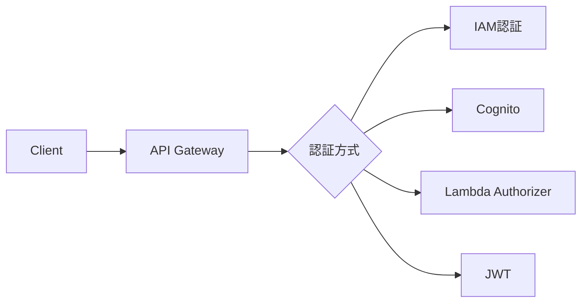

# Phase 3-2: 認証とセキュリティ

## 学習目標

この単元を終えると、以下ができるようになります：

- Cognito を使った認証を実装できる
- Lambda Authorizer を実装できる
- IAM ベースの認可を設計できる

## 認証パターン



## ハンズオン

### 演習1: Cognito 認証

```python
# cognito_auth.py
"""
Cognito認証の実装
"""

import boto3
import hmac
import hashlib
import base64

cognito = boto3.client('cognito-idp')

USER_POOL_ID = 'ap-northeast-1_xxxxx'
CLIENT_ID = 'xxxxx'
CLIENT_SECRET = 'xxxxx'  # オプション

def sign_up(email: str, password: str) -> dict:
    """ユーザー登録"""
    try:
        response = cognito.sign_up(
            ClientId=CLIENT_ID,
            SecretHash=get_secret_hash(email),
            Username=email,
            Password=password,
            UserAttributes=[
                {'Name': 'email', 'Value': email}
            ]
        )
        return {
            'success': True,
            'user_sub': response['UserSub']
        }
    except cognito.exceptions.UsernameExistsException:
        raise AuthError('User already exists')
    except cognito.exceptions.InvalidPasswordException as e:
        raise AuthError(str(e))

def confirm_sign_up(email: str, code: str) -> dict:
    """メール確認"""
    cognito.confirm_sign_up(
        ClientId=CLIENT_ID,
        SecretHash=get_secret_hash(email),
        Username=email,
        ConfirmationCode=code
    )
    return {'success': True}

def sign_in(email: str, password: str) -> dict:
    """ログイン"""
    try:
        response = cognito.initiate_auth(
            ClientId=CLIENT_ID,
            AuthFlow='USER_PASSWORD_AUTH',
            AuthParameters={
                'USERNAME': email,
                'PASSWORD': password,
                'SECRET_HASH': get_secret_hash(email)
            }
        )
        
        result = response['AuthenticationResult']
        return {
            'access_token': result['AccessToken'],
            'id_token': result['IdToken'],
            'refresh_token': result['RefreshToken'],
            'expires_in': result['ExpiresIn']
        }
    except cognito.exceptions.NotAuthorizedException:
        raise AuthError('Invalid credentials')
    except cognito.exceptions.UserNotConfirmedException:
        raise AuthError('User not confirmed')

def refresh_token(refresh_token: str, email: str) -> dict:
    """トークン更新"""
    response = cognito.initiate_auth(
        ClientId=CLIENT_ID,
        AuthFlow='REFRESH_TOKEN_AUTH',
        AuthParameters={
            'REFRESH_TOKEN': refresh_token,
            'SECRET_HASH': get_secret_hash(email)
        }
    )
    
    result = response['AuthenticationResult']
    return {
        'access_token': result['AccessToken'],
        'id_token': result['IdToken']
    }

def get_secret_hash(username: str) -> str:
    """シークレットハッシュ計算"""
    message = username + CLIENT_ID
    dig = hmac.new(
        CLIENT_SECRET.encode('utf-8'),
        message.encode('utf-8'),
        hashlib.sha256
    ).digest()
    return base64.b64encode(dig).decode()

class AuthError(Exception):
    pass
```

### 演習2: Lambda Authorizer

```python
# lambda_authorizer.py
"""
Lambda Authorizer（カスタム認証）
"""

import jwt
import json
from typing import Optional

# 公開鍵（Cognito JWKから取得）
PUBLIC_KEYS = {}

def lambda_handler(event, context):
    """
    Lambda Authorizer ハンドラー
    
    event 構造:
    {
        'type': 'TOKEN' or 'REQUEST',
        'authorizationToken': 'Bearer xxx',
        'methodArn': 'arn:aws:execute-api:...'
    }
    """
    token = event.get('authorizationToken', '')
    method_arn = event['methodArn']
    
    try:
        # Bearer トークン抽出
        if token.startswith('Bearer '):
            token = token[7:]
        
        # JWT 検証
        claims = verify_token(token)
        
        # ポリシー生成
        principal_id = claims['sub']
        return generate_policy(
            principal_id,
            'Allow',
            method_arn,
            context={
                'userId': claims['sub'],
                'email': claims.get('email', ''),
                'groups': json.dumps(claims.get('cognito:groups', []))
            }
        )
        
    except Exception as e:
        print(f'Auth error: {e}')
        return generate_policy('user', 'Deny', method_arn)

def verify_token(token: str) -> dict:
    """JWT検証"""
    # ヘッダーからkidを取得
    unverified_header = jwt.get_unverified_header(token)
    kid = unverified_header['kid']
    
    # 公開鍵を取得
    public_key = get_public_key(kid)
    
    # 検証
    claims = jwt.decode(
        token,
        public_key,
        algorithms=['RS256'],
        audience=CLIENT_ID,
        issuer=f'https://cognito-idp.ap-northeast-1.amazonaws.com/{USER_POOL_ID}'
    )
    
    return claims

def get_public_key(kid: str):
    """JWKから公開鍵取得"""
    # キャッシュまたはCognitoから取得
    if kid not in PUBLIC_KEYS:
        # 実際はCognito JWKSエンドポイントから取得
        pass
    return PUBLIC_KEYS.get(kid)

def generate_policy(
    principal_id: str,
    effect: str,
    resource: str,
    context: dict = None
) -> dict:
    """IAMポリシー生成"""
    policy = {
        'principalId': principal_id,
        'policyDocument': {
            'Version': '2012-10-17',
            'Statement': [{
                'Action': 'execute-api:Invoke',
                'Effect': effect,
                'Resource': resource
            }]
        }
    }
    
    if context:
        policy['context'] = context
    
    return policy
```

### 演習3: API Gateway での認証設定

```yaml
# serverless.yml
functions:
  # 認証不要
  publicApi:
    handler: public.handler
    events:
      - httpApi:
          path: /public
          method: GET

  # Cognito 認証
  protectedApi:
    handler: protected.handler
    events:
      - httpApi:
          path: /protected
          method: GET
          authorizer:
            name: cognitoAuthorizer

  # Lambda Authorizer
  customAuthApi:
    handler: custom.handler
    events:
      - httpApi:
          path: /custom
          method: GET
          authorizer:
            name: customAuthorizer

  # Authorizer Lambda
  authorizer:
    handler: authorizer.lambda_handler

provider:
  httpApi:
    authorizers:
      cognitoAuthorizer:
        type: jwt
        identitySource: $request.header.Authorization
        issuerUrl: https://cognito-idp.ap-northeast-1.amazonaws.com/xxx
        audience:
          - your-client-id
      
      customAuthorizer:
        type: request
        functionName: authorizer
        resultTtlInSeconds: 300
```

### 演習4: Lambda からのコンテキスト利用

```python
# protected_handler.py
"""
認証済みリクエストの処理
"""

import json

def lambda_handler(event, context):
    """
    Authorizer から渡されたコンテキストを使用
    """
    # API Gateway からのコンテキスト
    request_context = event.get('requestContext', {})
    authorizer = request_context.get('authorizer', {})
    
    # Cognito JWT の場合
    if 'jwt' in authorizer:
        claims = authorizer['jwt']['claims']
        user_id = claims.get('sub')
        email = claims.get('email')
        groups = claims.get('cognito:groups', [])
    
    # Lambda Authorizer の場合
    else:
        user_id = authorizer.get('userId')
        email = authorizer.get('email')
        groups = json.loads(authorizer.get('groups', '[]'))
    
    # 権限チェック
    if 'admin' not in groups:
        return {
            'statusCode': 403,
            'body': json.dumps({'error': 'Forbidden'})
        }
    
    return {
        'statusCode': 200,
        'body': json.dumps({
            'message': f'Hello {email}',
            'userId': user_id
        })
    }
```

## セキュリティベストプラクティス

| 項目 | 実装 |
|------|------|
| 最小権限 | Lambda に必要最小限の IAM |
| シークレット | Secrets Manager / SSM |
| 暗号化 | KMS でデータ暗号化 |
| WAF | REST API に WAF 適用 |
| ログ | CloudTrail で監査 |

## 理解度確認

### 問題

API Gateway で JWT トークンを検証する最も効率的な方法は何か。

**A.** 毎回 Lambda Authorizer で検証

**B.** API Gateway の JWT Authorizer（組み込み）

**C.** Lambda 内で毎回検証

**D.** クライアント側で検証

---

### 解答・解説

**正解: B**

HTTP API の JWT Authorizer は組み込みで JWT を検証します。Lambda を呼び出さないため、レイテンシとコストを削減できます。Cognito と組み合わせる場合は最適な選択です。

---

## 次のステップ

認証とセキュリティを学びました。次は総仕上げです。

**次の単元**: [Phase 4-1: 総仕上げ](../phase4/01_総仕上げ.md)
