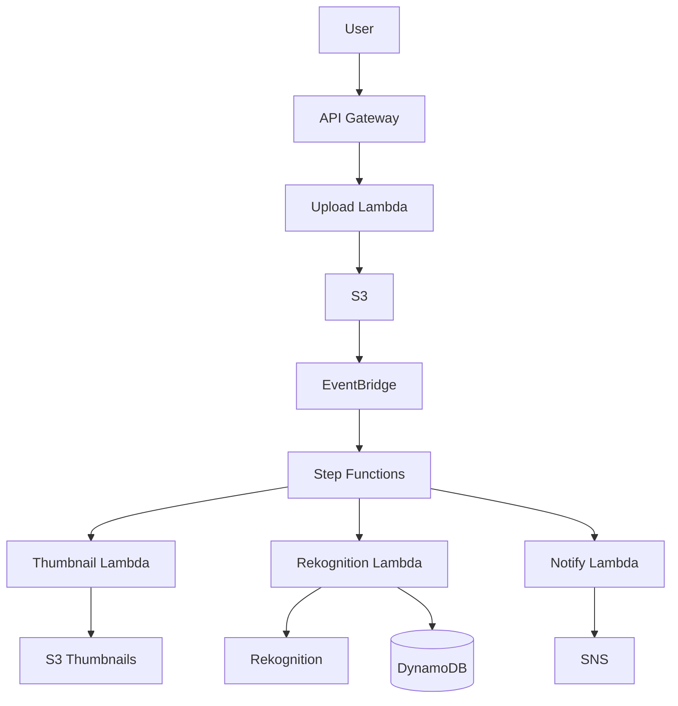

# Phase 4-1: 総仕上げ ～ サーバーレス実践プロジェクト ～

## 学習目標

この単元を終えると、以下ができるようになります：

- 本番グレードのサーバーレスアプリを設計できる
- 運用・監視を考慮した実装ができる
- コスト最適化ができる

## 総合演習: 画像処理パイプライン

### 要件

```
機能要件:
- 画像アップロード
- サムネイル生成
- AI による画像分析（Rekognition）
- 結果の保存と通知

非機能要件:
- スケーラブル（1000画像/分）
- コスト効率
- 耐障害性
```

### アーキテクチャ



### 実装

```python
# upload_handler.py
"""
画像アップロードハンドラー
"""

import boto3
import uuid
import json
from datetime import datetime

s3 = boto3.client('s3')
BUCKET = 'image-processing-bucket'

def lambda_handler(event, context):
    """
    画像アップロード用の署名付きURLを生成
    """
    body = json.loads(event.get('body', '{}'))
    file_name = body.get('fileName')
    content_type = body.get('contentType', 'image/jpeg')
    
    if not file_name:
        return response(400, {'error': 'fileName is required'})
    
    # 一意なキー生成
    image_id = str(uuid.uuid4())
    key = f'uploads/{image_id}/{file_name}'
    
    # 署名付きURL生成（5分有効）
    presigned_url = s3.generate_presigned_url(
        'put_object',
        Params={
            'Bucket': BUCKET,
            'Key': key,
            'ContentType': content_type
        },
        ExpiresIn=300
    )
    
    return response(200, {
        'imageId': image_id,
        'uploadUrl': presigned_url,
        'key': key
    })

def response(status_code, body):
    return {
        'statusCode': status_code,
        'headers': {'Content-Type': 'application/json'},
        'body': json.dumps(body)
    }
```

```python
# thumbnail_handler.py
"""
サムネイル生成
"""

import boto3
from PIL import Image
import io

s3 = boto3.client('s3')

SIZES = {
    'small': (150, 150),
    'medium': (300, 300),
    'large': (600, 600)
}

def lambda_handler(event, context):
    """
    Step Functions から呼び出される
    """
    bucket = event['bucket']
    key = event['key']
    image_id = event['imageId']
    
    # 元画像を取得
    response = s3.get_object(Bucket=bucket, Key=key)
    image_data = response['Body'].read()
    
    thumbnails = {}
    
    # 各サイズでサムネイル生成
    for size_name, dimensions in SIZES.items():
        thumbnail_key = f'thumbnails/{image_id}/{size_name}.jpg'
        thumbnail_data = create_thumbnail(image_data, dimensions)
        
        s3.put_object(
            Bucket=bucket,
            Key=thumbnail_key,
            Body=thumbnail_data,
            ContentType='image/jpeg'
        )
        
        thumbnails[size_name] = thumbnail_key
    
    return {
        'imageId': image_id,
        'thumbnails': thumbnails
    }

def create_thumbnail(image_data: bytes, size: tuple) -> bytes:
    image = Image.open(io.BytesIO(image_data))
    image.thumbnail(size)
    
    # RGB に変換（PNG対応）
    if image.mode != 'RGB':
        image = image.convert('RGB')
    
    buffer = io.BytesIO()
    image.save(buffer, format='JPEG', quality=85)
    return buffer.getvalue()
```

```python
# rekognition_handler.py
"""
画像分析（Rekognition）
"""

import boto3

rekognition = boto3.client('rekognition')
dynamodb = boto3.resource('dynamodb')
table = dynamodb.Table('image-analysis')

def lambda_handler(event, context):
    """
    Rekognitionで画像を分析
    """
    bucket = event['bucket']
    key = event['key']
    image_id = event['imageId']
    
    # ラベル検出
    labels_response = rekognition.detect_labels(
        Image={
            'S3Object': {
                'Bucket': bucket,
                'Name': key
            }
        },
        MaxLabels=10,
        MinConfidence=70
    )
    
    # 顔検出
    faces_response = rekognition.detect_faces(
        Image={
            'S3Object': {
                'Bucket': bucket,
                'Name': key
            }
        },
        Attributes=['ALL']
    )
    
    # モデレーション（不適切コンテンツ検出）
    moderation_response = rekognition.detect_moderation_labels(
        Image={
            'S3Object': {
                'Bucket': bucket,
                'Name': key
            }
        },
        MinConfidence=60
    )
    
    analysis = {
        'labels': [
            {'name': l['Name'], 'confidence': l['Confidence']}
            for l in labels_response['Labels']
        ],
        'faceCount': len(faces_response['FaceDetails']),
        'moderationLabels': [
            {'name': m['Name'], 'confidence': m['Confidence']}
            for m in moderation_response['ModerationLabels']
        ],
        'isSafe': len(moderation_response['ModerationLabels']) == 0
    }
    
    # DynamoDB に保存
    table.put_item(Item={
        'imageId': image_id,
        's3Key': key,
        'analysis': analysis,
        'status': 'completed'
    })
    
    return {
        'imageId': image_id,
        'analysis': analysis
    }
```

```json
// step_functions.asl.json
{
  "Comment": "画像処理パイプライン",
  "StartAt": "ParallelProcessing",
  "States": {
    "ParallelProcessing": {
      "Type": "Parallel",
      "Branches": [
        {
          "StartAt": "GenerateThumbnails",
          "States": {
            "GenerateThumbnails": {
              "Type": "Task",
              "Resource": "arn:aws:lambda:...:thumbnail-handler",
              "Retry": [
                {
                  "ErrorEquals": ["States.TaskFailed"],
                  "IntervalSeconds": 2,
                  "MaxAttempts": 3
                }
              ],
              "End": true
            }
          }
        },
        {
          "StartAt": "AnalyzeImage",
          "States": {
            "AnalyzeImage": {
              "Type": "Task",
              "Resource": "arn:aws:lambda:...:rekognition-handler",
              "Retry": [
                {
                  "ErrorEquals": ["States.TaskFailed"],
                  "IntervalSeconds": 2,
                  "MaxAttempts": 3
                }
              ],
              "End": true
            }
          }
        }
      ],
      "ResultPath": "$.results",
      "Next": "CheckModeration"
    },
    
    "CheckModeration": {
      "Type": "Choice",
      "Choices": [
        {
          "Variable": "$.results[1].analysis.isSafe",
          "BooleanEquals": false,
          "Next": "FlagContent"
        }
      ],
      "Default": "SendNotification"
    },
    
    "FlagContent": {
      "Type": "Task",
      "Resource": "arn:aws:lambda:...:flag-content",
      "Next": "SendNotification"
    },
    
    "SendNotification": {
      "Type": "Task",
      "Resource": "arn:aws:states:::sns:publish",
      "Parameters": {
        "TopicArn": "arn:aws:sns:...:image-processed",
        "Message.$": "States.Format('Image {} processed', $.imageId)"
      },
      "End": true
    }
  }
}
```

## コスト最適化

| 項目 | 対策 |
|------|------|
| Lambda | メモリ最適化、Arm64 |
| API Gateway | HTTP API 使用 |
| DynamoDB | オンデマンド課金 |
| S3 | Intelligent-Tiering |
| Step Functions | Express ワークフロー |

## 運用・監視

```python
# monitoring.py
"""
監視設定
"""

import boto3

cloudwatch = boto3.client('cloudwatch')

def create_dashboard():
    """CloudWatch ダッシュボード作成"""
    dashboard_body = {
        'widgets': [
            {
                'type': 'metric',
                'properties': {
                    'title': 'Lambda Invocations',
                    'metrics': [
                        ['AWS/Lambda', 'Invocations', 'FunctionName', 'upload-handler'],
                        ['AWS/Lambda', 'Invocations', 'FunctionName', 'thumbnail-handler'],
                        ['AWS/Lambda', 'Invocations', 'FunctionName', 'rekognition-handler']
                    ]
                }
            },
            {
                'type': 'metric',
                'properties': {
                    'title': 'Lambda Errors',
                    'metrics': [
                        ['AWS/Lambda', 'Errors', 'FunctionName', 'upload-handler'],
                        ['AWS/Lambda', 'Errors', 'FunctionName', 'thumbnail-handler']
                    ]
                }
            },
            {
                'type': 'metric',
                'properties': {
                    'title': 'Step Functions Executions',
                    'metrics': [
                        ['AWS/States', 'ExecutionsSucceeded', 'StateMachineArn', '...'],
                        ['AWS/States', 'ExecutionsFailed', 'StateMachineArn', '...']
                    ]
                }
            }
        ]
    }
    
    cloudwatch.put_dashboard(
        DashboardName='ImageProcessingPipeline',
        DashboardBody=json.dumps(dashboard_body)
    )

def create_alarms():
    """アラーム作成"""
    cloudwatch.put_metric_alarm(
        AlarmName='HighErrorRate',
        MetricName='Errors',
        Namespace='AWS/Lambda',
        Dimensions=[
            {'Name': 'FunctionName', 'Value': 'upload-handler'}
        ],
        Statistic='Sum',
        Period=60,
        EvaluationPeriods=3,
        Threshold=5,
        ComparisonOperator='GreaterThanThreshold',
        AlarmActions=['arn:aws:sns:...:alerts']
    )
```

## カリキュラム完了！

おめでとうございます！サーバーレスアーキテクチャのカリキュラムを完了しました。

### 学んだこと

1. **Lambda 最適化** - コールドスタート対策、メモリ設定
2. **イベント駆動** - EventBridge, SNS, SQS
3. **ワークフロー** - Step Functions
4. **API 設計** - REST API, HTTP API, GraphQL
5. **認証** - Cognito, Lambda Authorizer

### あなたの強みを活かして

AWS（Lambda, S3, Rekognition, SageMaker）の経験を持つあなたは、このカリキュラムの内容を即座に現場で活用できます。特に AI アプリ開発での Lambda + Rekognition/SageMaker の組み合わせは強力な武器です。
