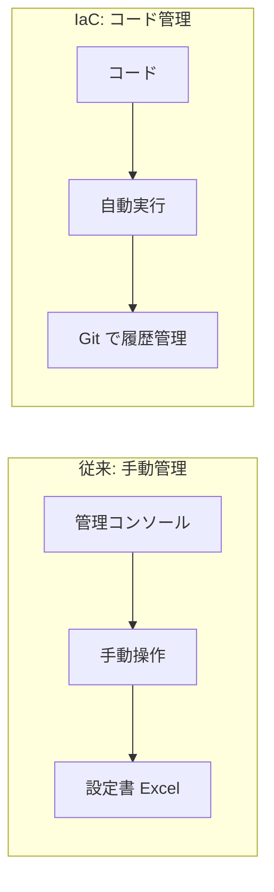
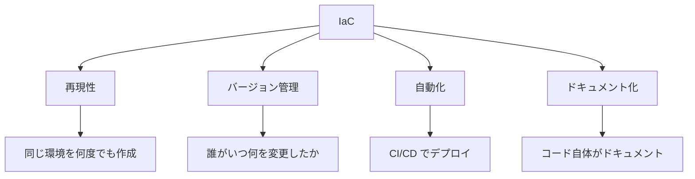
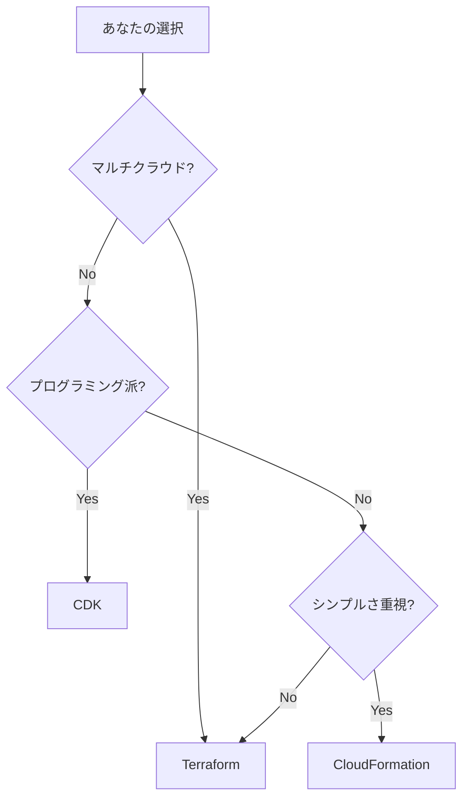
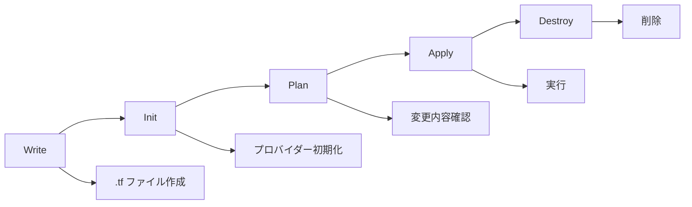

# Phase 1-1: IaC（Infrastructure as Code）とは

## 学習目標

この単元を終えると、以下ができるようになります：

- IaC の概念を説明できる
- 従来の手動管理との違いを理解できる
- 代表的な IaC ツールを説明できる

## 概念解説

### IaC とは



**Infrastructure as Code（IaC）** = インフラの構成をコードで定義・管理する手法

### 手動管理 vs IaC

| 項目 | 手動管理 | IaC |
|------|---------|-----|
| 再現性 | 低い（手順書依存） | 高い（コード通り） |
| 一貫性 | ばらつきあり | 常に同じ |
| 変更履歴 | 管理困難 | Git で完全追跡 |
| レビュー | 口頭/ドキュメント | PR でコードレビュー |
| 環境差分 | 発生しやすい | 発生しにくい |
| スケール | 大変 | 簡単 |

### IaC の利点



## IaC ツールの比較

### 主要ツール

| ツール | 開発元 | 特徴 |
|-------|-------|------|
| Terraform | HashiCorp | マルチクラウド、宣言的 |
| AWS CloudFormation | AWS | AWS 専用、YAML/JSON |
| Pulumi | Pulumi | プログラミング言語で記述 |
| AWS CDK | AWS | TypeScript/Python で CFn 生成 |
| Ansible | Red Hat | 構成管理、手続き的 |

### Terraform vs CloudFormation

| 項目 | Terraform | CloudFormation |
|------|-----------|----------------|
| 対象クラウド | マルチクラウド | AWS のみ |
| 言語 | HCL | YAML/JSON |
| 状態管理 | tfstate ファイル | AWS 管理 |
| 変更検出 | plan コマンド | Change Sets |
| 学習コスト | 中 | 低（AWS 知識あれば） |
| エコシステム | 豊富なプロバイダー | AWS 完結 |

### AWS ユーザーの視点



## Terraform の特徴

### 宣言的 vs 手続き的

```hcl
# 宣言的（Terraform）- 「あるべき状態」を記述
resource "aws_instance" "web" {
  ami           = "ami-12345678"
  instance_type = "t3.micro"
  count         = 3  # 3台欲しい
}

# Terraform が自動で判断：
# - 0台 → 3台作成
# - 3台 → 何もしない
# - 5台 → 2台削除
```

```yaml
# 手続き的（Ansible 例）- 「やること」を記述
- name: Create EC2 instances
  ec2:
    count: 3
    state: present
  # 何度実行しても3台追加される可能性
```

### Terraform のワークフロー



## 理解度確認

### 問題

IaC の最大のメリットとして最も適切なものはどれか。

**A.** サーバーのパフォーマンス向上

**B.** インフラの再現性と一貫性の確保

**C.** クラウド料金の削減

**D.** セキュリティの自動強化

---

### 解答・解説

**正解: B**

IaC の最大のメリットは：
- **再現性**: 同じコードから同じ環境を作成
- **一貫性**: 環境間の差分がなくなる
- **追跡可能性**: Git で変更履歴を管理

これにより「本番と開発環境が違う」問題を解消できます。

---

## 次のステップ

IaC の概念を学びました。次は Terraform の基礎を学びましょう。

**次の単元**: [Phase 1-2: Terraform 基礎](./02_Terraform基礎.md)
