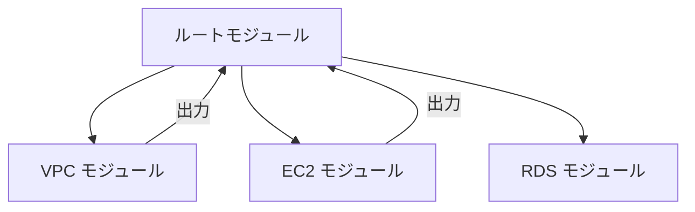

# Phase 3-1: 変数とモジュール

## 学習目標

この単元を終えると、以下ができるようになります：

- 変数を効果的に使える
- モジュールを作成・利用できる
- 再利用可能なコードを書ける

## 変数の詳細

### 変数の型

```hcl
# 基本型
variable "name" {
  type = string
}

variable "count" {
  type = number
}

variable "enabled" {
  type = bool
}

# 複合型
variable "tags" {
  type = map(string)
}

variable "ports" {
  type = list(number)
}

variable "config" {
  type = object({
    name    = string
    version = string
    enabled = bool
  })
}

# オプショナル属性
variable "settings" {
  type = object({
    name     = string
    optional = optional(string, "default")
  })
}
```

### バリデーション

```hcl
variable "instance_type" {
  type        = string
  description = "EC2 インスタンスタイプ"
  
  validation {
    condition     = can(regex("^t3\\.", var.instance_type))
    error_message = "t3 ファミリーのみ許可されています"
  }
}

variable "environment" {
  type = string
  
  validation {
    condition     = contains(["dev", "staging", "prod"], var.environment)
    error_message = "environment は dev, staging, prod のいずれかである必要があります"
  }
}

variable "port" {
  type = number
  
  validation {
    condition     = var.port >= 1 && var.port <= 65535
    error_message = "port は 1-65535 の範囲である必要があります"
  }
}
```

### 変数の値の設定方法

```hcl
# 1. デフォルト値
variable "region" {
  default = "ap-northeast-1"
}

# 2. terraform.tfvars
# terraform.tfvars
instance_type = "t3.small"
environment   = "prod"

# 3. 環境変数
# export TF_VAR_instance_type="t3.small"

# 4. コマンドライン
# terraform apply -var="instance_type=t3.small"

# 5. 変数ファイル指定
# terraform apply -var-file="prod.tfvars"
```

## モジュール

### モジュールとは



### ローカルモジュールの作成

```
project/
├── main.tf
├── variables.tf
├── outputs.tf
└── modules/
    └── vpc/
        ├── main.tf
        ├── variables.tf
        └── outputs.tf
```

```hcl
# modules/vpc/variables.tf
variable "name" {
  type        = string
  description = "VPC の名前"
}

variable "cidr_block" {
  type        = string
  description = "VPC の CIDR ブロック"
  default     = "10.0.0.0/16"
}

variable "public_subnet_cidrs" {
  type        = list(string)
  description = "パブリックサブネットの CIDR"
  default     = ["10.0.1.0/24", "10.0.2.0/24"]
}

variable "private_subnet_cidrs" {
  type        = list(string)
  description = "プライベートサブネットの CIDR"
  default     = ["10.0.11.0/24", "10.0.12.0/24"]
}
```

```hcl
# modules/vpc/main.tf
data "aws_availability_zones" "available" {
  state = "available"
}

resource "aws_vpc" "main" {
  cidr_block           = var.cidr_block
  enable_dns_hostnames = true
  enable_dns_support   = true
  
  tags = {
    Name = var.name
  }
}

resource "aws_subnet" "public" {
  count = length(var.public_subnet_cidrs)
  
  vpc_id                  = aws_vpc.main.id
  cidr_block              = var.public_subnet_cidrs[count.index]
  availability_zone       = data.aws_availability_zones.available.names[count.index]
  map_public_ip_on_launch = true
  
  tags = {
    Name = "${var.name}-public-${count.index + 1}"
  }
}

resource "aws_subnet" "private" {
  count = length(var.private_subnet_cidrs)
  
  vpc_id            = aws_vpc.main.id
  cidr_block        = var.private_subnet_cidrs[count.index]
  availability_zone = data.aws_availability_zones.available.names[count.index]
  
  tags = {
    Name = "${var.name}-private-${count.index + 1}"
  }
}

resource "aws_internet_gateway" "main" {
  vpc_id = aws_vpc.main.id
  
  tags = {
    Name = "${var.name}-igw"
  }
}

resource "aws_route_table" "public" {
  vpc_id = aws_vpc.main.id
  
  route {
    cidr_block = "0.0.0.0/0"
    gateway_id = aws_internet_gateway.main.id
  }
  
  tags = {
    Name = "${var.name}-public-rt"
  }
}

resource "aws_route_table_association" "public" {
  count = length(aws_subnet.public)
  
  subnet_id      = aws_subnet.public[count.index].id
  route_table_id = aws_route_table.public.id
}
```

```hcl
# modules/vpc/outputs.tf
output "vpc_id" {
  value       = aws_vpc.main.id
  description = "VPC ID"
}

output "public_subnet_ids" {
  value       = aws_subnet.public[*].id
  description = "パブリックサブネット ID のリスト"
}

output "private_subnet_ids" {
  value       = aws_subnet.private[*].id
  description = "プライベートサブネット ID のリスト"
}
```

### モジュールの呼び出し

```hcl
# main.tf
module "vpc" {
  source = "./modules/vpc"
  
  name                 = "my-app"
  cidr_block           = "10.0.0.0/16"
  public_subnet_cidrs  = ["10.0.1.0/24", "10.0.2.0/24"]
  private_subnet_cidrs = ["10.0.11.0/24", "10.0.12.0/24"]
}

# モジュールの出力を参照
resource "aws_security_group" "web" {
  vpc_id = module.vpc.vpc_id
  # ...
}

output "vpc_id" {
  value = module.vpc.vpc_id
}
```

### 外部モジュールの利用

```hcl
# Terraform Registry のモジュール
module "vpc" {
  source  = "terraform-aws-modules/vpc/aws"
  version = "5.0.0"
  
  name = "my-vpc"
  cidr = "10.0.0.0/16"
  
  azs             = ["ap-northeast-1a", "ap-northeast-1c"]
  public_subnets  = ["10.0.1.0/24", "10.0.2.0/24"]
  private_subnets = ["10.0.11.0/24", "10.0.12.0/24"]
  
  enable_nat_gateway = true
  single_nat_gateway = true
}

# GitHub からのモジュール
module "custom" {
  source = "github.com/myorg/terraform-modules//vpc?ref=v1.0.0"
}
```

## ハンズオン

### 演習: 完全な構成

```hcl
# variables.tf
variable "project_name" {
  type    = string
  default = "myapp"
}

variable "environment" {
  type = string
  validation {
    condition     = contains(["dev", "staging", "prod"], var.environment)
    error_message = "Invalid environment"
  }
}

variable "instance_type" {
  type = map(string)
  default = {
    dev     = "t3.micro"
    staging = "t3.small"
    prod    = "t3.medium"
  }
}
```

```hcl
# main.tf
locals {
  name_prefix = "${var.project_name}-${var.environment}"
  common_tags = {
    Project     = var.project_name
    Environment = var.environment
    ManagedBy   = "Terraform"
  }
}

module "vpc" {
  source = "./modules/vpc"
  
  name       = local.name_prefix
  cidr_block = var.environment == "prod" ? "10.0.0.0/16" : "10.1.0.0/16"
}

resource "aws_instance" "web" {
  ami           = data.aws_ami.amazon_linux_2.id
  instance_type = var.instance_type[var.environment]
  subnet_id     = module.vpc.public_subnet_ids[0]
  
  tags = merge(local.common_tags, {
    Name = "${local.name_prefix}-web"
  })
}
```

## 理解度確認

### 問題

Terraform モジュールで出力を定義するファイルとして慣例的に使用されるのはどれか。

**A.** returns.tf

**B.** exports.tf

**C.** outputs.tf

**D.** values.tf

---

### 解答・解説

**正解: C**

Terraform の慣例的なファイル構成：
- `main.tf` - メインのリソース定義
- `variables.tf` - 入力変数
- `outputs.tf` - 出力値
- `providers.tf` - プロバイダー設定
- `versions.tf` - バージョン制約

---

## 次のステップ

変数とモジュールを学びました。次は状態管理を学びましょう。

**次の単元**: [Phase 3-2: 状態管理](./02_状態管理.md)
