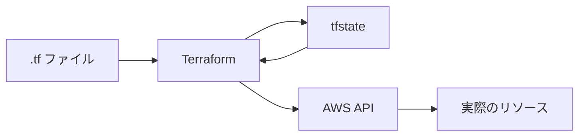
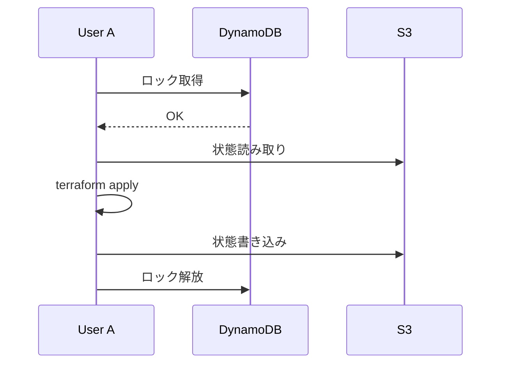

# Phase 3-2: 状態管理

## 学習目標

この単元を終えると、以下ができるようになります：

- tfstate の役割を理解できる
- リモートバックエンドを設定できる
- 状態のロックを理解できる

## tfstate とは

### 役割



| 役割 | 説明 |
|------|------|
| 現状の記録 | 作成したリソースの情報を保存 |
| 差分計算 | 設定と現状の差を検出 |
| リソース追跡 | ID と設定の紐付け |
| メタデータ | 依存関係の情報 |

### ローカル状態の問題点

```
# デフォルトではローカルに保存
terraform.tfstate
terraform.tfstate.backup
```

| 問題 | 影響 |
|------|------|
| チーム共有困難 | Git に入れるべきではない（Secrets 含む） |
| 同時実行 | 競合が発生する |
| バックアップ | ローカルだと消える可能性 |

## リモートバックエンド

### S3 + DynamoDB

```hcl
# backend.tf
terraform {
  backend "s3" {
    bucket         = "my-terraform-state-bucket"
    key            = "prod/terraform.tfstate"
    region         = "ap-northeast-1"
    encrypt        = true
    dynamodb_table = "terraform-lock"
  }
}
```

### バックエンド用リソースの作成

```hcl
# backend-resources/main.tf
# ※ バックエンド設定前に別途作成

provider "aws" {
  region = "ap-northeast-1"
}

resource "aws_s3_bucket" "terraform_state" {
  bucket = "my-terraform-state-bucket"
  
  lifecycle {
    prevent_destroy = true
  }
}

resource "aws_s3_bucket_versioning" "terraform_state" {
  bucket = aws_s3_bucket.terraform_state.id
  versioning_configuration {
    status = "Enabled"
  }
}

resource "aws_s3_bucket_server_side_encryption_configuration" "terraform_state" {
  bucket = aws_s3_bucket.terraform_state.id
  
  rule {
    apply_server_side_encryption_by_default {
      sse_algorithm = "AES256"
    }
  }
}

resource "aws_s3_bucket_public_access_block" "terraform_state" {
  bucket = aws_s3_bucket.terraform_state.id
  
  block_public_acls       = true
  block_public_policy     = true
  ignore_public_acls      = true
  restrict_public_buckets = true
}

resource "aws_dynamodb_table" "terraform_lock" {
  name         = "terraform-lock"
  billing_mode = "PAY_PER_REQUEST"
  hash_key     = "LockID"
  
  attribute {
    name = "LockID"
    type = "S"
  }
}

output "bucket_name" {
  value = aws_s3_bucket.terraform_state.id
}
```

### 状態のロック



## ハンズオン

### 演習1: ローカルからリモートへ移行

```bash
# 1. 既存のプロジェクト
cd my-project
cat terraform.tfstate  # ローカル状態

# 2. バックエンド設定追加
cat >> backend.tf << 'EOF'
terraform {
  backend "s3" {
    bucket         = "my-terraform-state-bucket"
    key            = "projects/my-project/terraform.tfstate"
    region         = "ap-northeast-1"
    encrypt        = true
    dynamodb_table = "terraform-lock"
  }
}
EOF

# 3. 再初期化（マイグレーション）
terraform init -migrate-state
# "yes" と入力

# 4. ローカル状態は削除されている
ls terraform.tfstate  # 存在しない
```

### 演習2: ワークスペース

```bash
# ワークスペース一覧
terraform workspace list

# 新規作成
terraform workspace new dev
terraform workspace new staging
terraform workspace new prod

# 切り替え
terraform workspace select prod

# 現在のワークスペース
terraform workspace show
```

```hcl
# main.tf
locals {
  environment = terraform.workspace
  
  instance_type = {
    dev     = "t3.micro"
    staging = "t3.small"
    prod    = "t3.medium"
  }
}

resource "aws_instance" "web" {
  ami           = data.aws_ami.amazon_linux_2.id
  instance_type = local.instance_type[local.environment]
  
  tags = {
    Name        = "web-${local.environment}"
    Environment = local.environment
  }
}
```

### 演習3: 状態操作コマンド

```bash
# 状態の表示
terraform show
terraform show -json | jq

# リソース一覧
terraform state list

# 特定リソースの詳細
terraform state show aws_instance.web

# リソースの状態から削除（リソース自体は削除しない）
terraform state rm aws_instance.web

# リソースのリネーム
terraform state mv aws_instance.web aws_instance.web_server

# 既存リソースのインポート
terraform import aws_instance.existing i-1234567890abcdef0
```

### 演習4: データソースで既存リソース参照

```hcl
# 既存の VPC を参照
data "aws_vpc" "existing" {
  tags = {
    Name = "existing-vpc"
  }
}

# その VPC にリソースを作成
resource "aws_subnet" "new" {
  vpc_id     = data.aws_vpc.existing.id
  cidr_block = "10.0.100.0/24"
}
```

### 演習5: 環境別ディレクトリ構成

```
infrastructure/
├── modules/
│   └── vpc/
├── environments/
│   ├── dev/
│   │   ├── main.tf
│   │   ├── backend.tf
│   │   └── terraform.tfvars
│   ├── staging/
│   │   ├── main.tf
│   │   ├── backend.tf
│   │   └── terraform.tfvars
│   └── prod/
│       ├── main.tf
│       ├── backend.tf
│       └── terraform.tfvars
```

```hcl
# environments/dev/backend.tf
terraform {
  backend "s3" {
    bucket = "my-terraform-state"
    key    = "dev/terraform.tfstate"
    region = "ap-northeast-1"
  }
}

# environments/prod/backend.tf
terraform {
  backend "s3" {
    bucket = "my-terraform-state"
    key    = "prod/terraform.tfstate"
    region = "ap-northeast-1"
  }
}
```

## 状態管理のベストプラクティス

| プラクティス | 理由 |
|-------------|------|
| リモートバックエンド必須 | チーム共有、バックアップ |
| 状態のロック | 同時実行防止 |
| 暗号化 | Secrets 保護 |
| バージョニング | 復旧可能性 |
| 環境分離 | prod と dev を分ける |

## 理解度確認

### 問題

Terraform の状態ファイルをリモートに保存する主な理由として最も適切なものはどれか。

**A.** 実行速度の向上

**B.** チーム間での状態共有と同時実行の制御

**C.** コードの自動フォーマット

**D.** リソースのコスト削減

---

### 解答・解説

**正解: B**

リモートバックエンドの主な目的：
- チームで状態を共有
- ロック機能で同時実行を防止
- バックアップと暗号化

```hcl
terraform {
  backend "s3" {
    bucket         = "my-state"
    dynamodb_table = "terraform-lock"  # ロック用
  }
}
```

---

## 次のステップ

状態管理を学びました。次は実践的な構築を学びましょう。

**次の単元**: [Phase 4-1: 実践構築](../phase4/01_実践構築.md)
