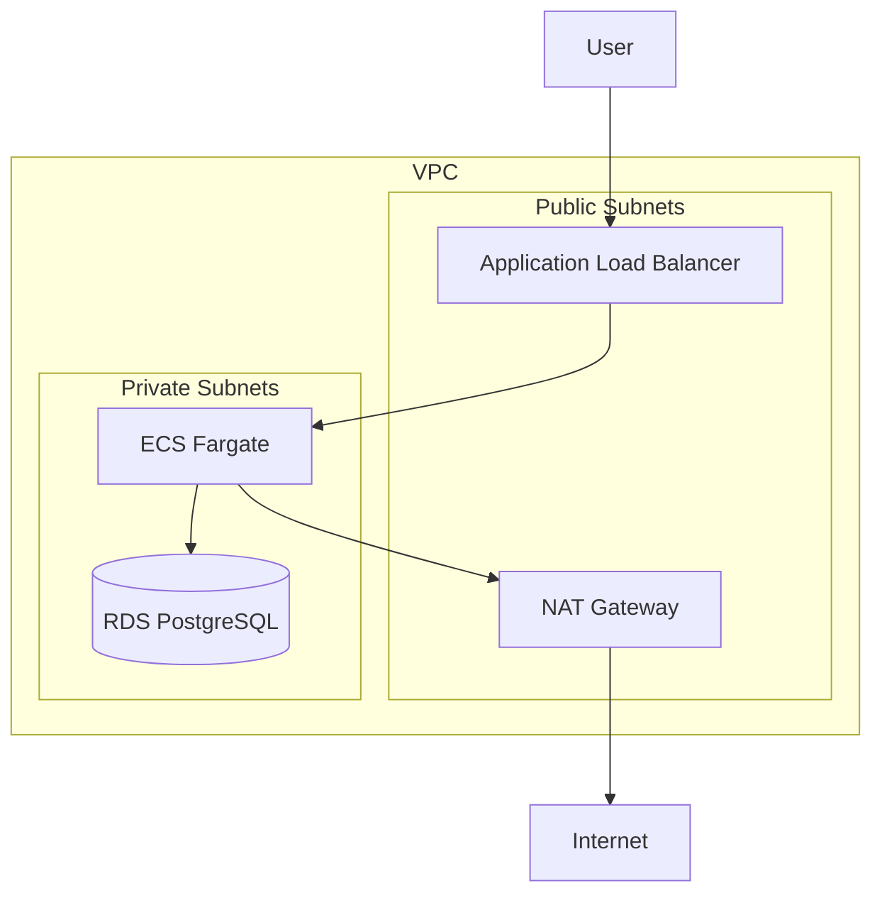

# Phase 4-1: 実践構築

## 学習目標

この単元を終えると、以下ができるようになります：

- 本番レベルのインフラを構築できる
- ECS / ALB を Terraform で構築できる
- RDS を Terraform で構築できる

## 実践プロジェクト: Web アプリケーション基盤

### アーキテクチャ



### ディレクトリ構成

```
webapp-infrastructure/
├── main.tf
├── variables.tf
├── outputs.tf
├── providers.tf
├── versions.tf
├── terraform.tfvars
└── modules/
    ├── vpc/
    ├── alb/
    ├── ecs/
    └── rds/
```

## ハンズオン

### 演習1: VPC モジュール（改良版）

```hcl
# modules/vpc/main.tf
data "aws_availability_zones" "available" {
  state = "available"
}

locals {
  azs = slice(data.aws_availability_zones.available.names, 0, 2)
}

resource "aws_vpc" "main" {
  cidr_block           = var.vpc_cidr
  enable_dns_hostnames = true
  enable_dns_support   = true
  
  tags = {
    Name = "${var.name}-vpc"
  }
}

# パブリックサブネット
resource "aws_subnet" "public" {
  count = length(local.azs)
  
  vpc_id                  = aws_vpc.main.id
  cidr_block              = cidrsubnet(var.vpc_cidr, 8, count.index)
  availability_zone       = local.azs[count.index]
  map_public_ip_on_launch = true
  
  tags = {
    Name = "${var.name}-public-${local.azs[count.index]}"
    Type = "Public"
  }
}

# プライベートサブネット
resource "aws_subnet" "private" {
  count = length(local.azs)
  
  vpc_id            = aws_vpc.main.id
  cidr_block        = cidrsubnet(var.vpc_cidr, 8, count.index + 10)
  availability_zone = local.azs[count.index]
  
  tags = {
    Name = "${var.name}-private-${local.azs[count.index]}"
    Type = "Private"
  }
}

# インターネットゲートウェイ
resource "aws_internet_gateway" "main" {
  vpc_id = aws_vpc.main.id
  
  tags = {
    Name = "${var.name}-igw"
  }
}

# NAT ゲートウェイ用 EIP
resource "aws_eip" "nat" {
  count  = var.enable_nat_gateway ? 1 : 0
  domain = "vpc"
  
  tags = {
    Name = "${var.name}-nat-eip"
  }
}

# NAT ゲートウェイ
resource "aws_nat_gateway" "main" {
  count = var.enable_nat_gateway ? 1 : 0
  
  allocation_id = aws_eip.nat[0].id
  subnet_id     = aws_subnet.public[0].id
  
  tags = {
    Name = "${var.name}-nat"
  }
}

# パブリックルートテーブル
resource "aws_route_table" "public" {
  vpc_id = aws_vpc.main.id
  
  route {
    cidr_block = "0.0.0.0/0"
    gateway_id = aws_internet_gateway.main.id
  }
  
  tags = {
    Name = "${var.name}-public-rt"
  }
}

# プライベートルートテーブル
resource "aws_route_table" "private" {
  vpc_id = aws_vpc.main.id
  
  dynamic "route" {
    for_each = var.enable_nat_gateway ? [1] : []
    content {
      cidr_block     = "0.0.0.0/0"
      nat_gateway_id = aws_nat_gateway.main[0].id
    }
  }
  
  tags = {
    Name = "${var.name}-private-rt"
  }
}

# 関連付け
resource "aws_route_table_association" "public" {
  count          = length(aws_subnet.public)
  subnet_id      = aws_subnet.public[count.index].id
  route_table_id = aws_route_table.public.id
}

resource "aws_route_table_association" "private" {
  count          = length(aws_subnet.private)
  subnet_id      = aws_subnet.private[count.index].id
  route_table_id = aws_route_table.private.id
}
```

### 演習2: ALB モジュール

```hcl
# modules/alb/main.tf
resource "aws_lb" "main" {
  name               = "${var.name}-alb"
  internal           = false
  load_balancer_type = "application"
  security_groups    = [aws_security_group.alb.id]
  subnets            = var.public_subnet_ids
  
  tags = {
    Name = "${var.name}-alb"
  }
}

resource "aws_security_group" "alb" {
  name        = "${var.name}-alb-sg"
  description = "ALB security group"
  vpc_id      = var.vpc_id
  
  ingress {
    from_port   = 80
    to_port     = 80
    protocol    = "tcp"
    cidr_blocks = ["0.0.0.0/0"]
  }
  
  ingress {
    from_port   = 443
    to_port     = 443
    protocol    = "tcp"
    cidr_blocks = ["0.0.0.0/0"]
  }
  
  egress {
    from_port   = 0
    to_port     = 0
    protocol    = "-1"
    cidr_blocks = ["0.0.0.0/0"]
  }
}

resource "aws_lb_target_group" "main" {
  name        = "${var.name}-tg"
  port        = var.container_port
  protocol    = "HTTP"
  vpc_id      = var.vpc_id
  target_type = "ip"
  
  health_check {
    enabled             = true
    healthy_threshold   = 2
    unhealthy_threshold = 2
    timeout             = 5
    interval            = 30
    path                = var.health_check_path
    matcher             = "200"
  }
}

resource "aws_lb_listener" "http" {
  load_balancer_arn = aws_lb.main.arn
  port              = 80
  protocol          = "HTTP"
  
  default_action {
    type             = "forward"
    target_group_arn = aws_lb_target_group.main.arn
  }
}
```

### 演習3: ECS モジュール

```hcl
# modules/ecs/main.tf
resource "aws_ecs_cluster" "main" {
  name = "${var.name}-cluster"
  
  setting {
    name  = "containerInsights"
    value = "enabled"
  }
}

resource "aws_ecs_task_definition" "main" {
  family                   = "${var.name}-task"
  network_mode             = "awsvpc"
  requires_compatibilities = ["FARGATE"]
  cpu                      = var.cpu
  memory                   = var.memory
  execution_role_arn       = aws_iam_role.ecs_execution.arn
  task_role_arn            = aws_iam_role.ecs_task.arn
  
  container_definitions = jsonencode([
    {
      name  = var.container_name
      image = var.container_image
      
      portMappings = [
        {
          containerPort = var.container_port
          hostPort      = var.container_port
          protocol      = "tcp"
        }
      ]
      
      environment = [
        for k, v in var.environment_variables : {
          name  = k
          value = v
        }
      ]
      
      secrets = [
        for k, v in var.secrets : {
          name      = k
          valueFrom = v
        }
      ]
      
      logConfiguration = {
        logDriver = "awslogs"
        options = {
          "awslogs-group"         = aws_cloudwatch_log_group.main.name
          "awslogs-region"        = var.region
          "awslogs-stream-prefix" = "ecs"
        }
      }
    }
  ])
}

resource "aws_ecs_service" "main" {
  name            = "${var.name}-service"
  cluster         = aws_ecs_cluster.main.id
  task_definition = aws_ecs_task_definition.main.arn
  desired_count   = var.desired_count
  launch_type     = "FARGATE"
  
  network_configuration {
    subnets          = var.private_subnet_ids
    security_groups  = [aws_security_group.ecs.id]
    assign_public_ip = false
  }
  
  load_balancer {
    target_group_arn = var.target_group_arn
    container_name   = var.container_name
    container_port   = var.container_port
  }
}

resource "aws_security_group" "ecs" {
  name        = "${var.name}-ecs-sg"
  description = "ECS security group"
  vpc_id      = var.vpc_id
  
  ingress {
    from_port       = var.container_port
    to_port         = var.container_port
    protocol        = "tcp"
    security_groups = [var.alb_security_group_id]
  }
  
  egress {
    from_port   = 0
    to_port     = 0
    protocol    = "-1"
    cidr_blocks = ["0.0.0.0/0"]
  }
}

resource "aws_cloudwatch_log_group" "main" {
  name              = "/ecs/${var.name}"
  retention_in_days = 30
}
```

### 演習4: RDS モジュール

```hcl
# modules/rds/main.tf
resource "aws_db_subnet_group" "main" {
  name       = "${var.name}-db-subnet"
  subnet_ids = var.private_subnet_ids
  
  tags = {
    Name = "${var.name}-db-subnet"
  }
}

resource "aws_security_group" "rds" {
  name        = "${var.name}-rds-sg"
  description = "RDS security group"
  vpc_id      = var.vpc_id
  
  ingress {
    from_port       = 5432
    to_port         = 5432
    protocol        = "tcp"
    security_groups = [var.ecs_security_group_id]
  }
}

resource "aws_db_instance" "main" {
  identifier = "${var.name}-db"
  
  engine         = "postgres"
  engine_version = "15"
  instance_class = var.instance_class
  
  allocated_storage     = var.allocated_storage
  max_allocated_storage = var.max_allocated_storage
  storage_type          = "gp3"
  storage_encrypted     = true
  
  db_name  = var.database_name
  username = var.database_username
  password = var.database_password
  
  db_subnet_group_name   = aws_db_subnet_group.main.name
  vpc_security_group_ids = [aws_security_group.rds.id]
  
  backup_retention_period = 7
  backup_window           = "03:00-04:00"
  maintenance_window      = "Mon:04:00-Mon:05:00"
  
  skip_final_snapshot = var.environment != "prod"
  deletion_protection = var.environment == "prod"
  
  tags = {
    Name = "${var.name}-db"
  }
}
```

### 演習5: メイン構成

```hcl
# main.tf
module "vpc" {
  source = "./modules/vpc"
  
  name               = local.name
  vpc_cidr           = var.vpc_cidr
  enable_nat_gateway = true
}

module "alb" {
  source = "./modules/alb"
  
  name              = local.name
  vpc_id            = module.vpc.vpc_id
  public_subnet_ids = module.vpc.public_subnet_ids
  container_port    = var.container_port
  health_check_path = "/health"
}

module "ecs" {
  source = "./modules/ecs"
  
  name               = local.name
  region             = var.region
  vpc_id             = module.vpc.vpc_id
  private_subnet_ids = module.vpc.private_subnet_ids
  
  container_name  = "app"
  container_image = var.container_image
  container_port  = var.container_port
  cpu             = var.cpu
  memory          = var.memory
  desired_count   = var.desired_count
  
  target_group_arn      = module.alb.target_group_arn
  alb_security_group_id = module.alb.security_group_id
  
  environment_variables = {
    DATABASE_URL = "postgresql://${module.rds.endpoint}/${var.database_name}"
  }
}

module "rds" {
  source = "./modules/rds"
  
  name               = local.name
  environment        = var.environment
  vpc_id             = module.vpc.vpc_id
  private_subnet_ids = module.vpc.private_subnet_ids
  
  instance_class        = var.db_instance_class
  allocated_storage     = 20
  max_allocated_storage = 100
  database_name         = var.database_name
  database_username     = var.database_username
  database_password     = var.database_password
  
  ecs_security_group_id = module.ecs.security_group_id
}
```

## 理解度確認

### 問題

ECS Fargate タスクがプライベートサブネットから外部 API にアクセスするために必要なリソースはどれか。

**A.** Internet Gateway

**B.** NAT Gateway

**C.** VPC Endpoint

**D.** Transit Gateway

---

### 解答・解説

**正解: B**

プライベートサブネットから外部へのアクセス：
- NAT Gateway をパブリックサブネットに配置
- プライベートサブネットのルートテーブルで NAT を経由

VPC Endpoint は AWS サービスへのプライベートアクセス用。

---

## 次のステップ

実践構築を学びました。次は CI/CD との連携を学びましょう。

**次の単元**: [Phase 4-2: CI/CD 連携](./02_CI_CD連携.md)
