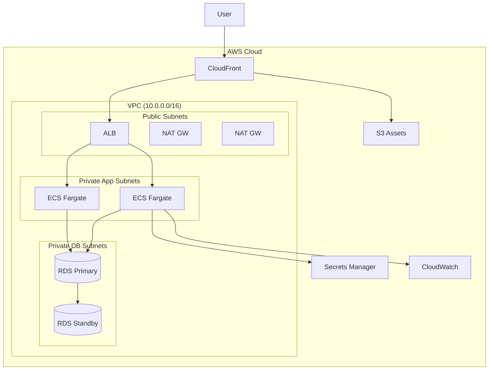

# Phase 5-1: 総仕上げ ～ 完全なインフラ構築 ～

## 学習目標

この単元を終えると、以下ができるようになります：

- 本番レベルのインフラを設計・構築できる
- セキュリティ・可用性を考慮した構成を作れる
- チームでの運用を想定したコードを書ける

## 総合演習: 本番対応インフラ構築

### アーキテクチャ



### プロジェクト構成

```
infrastructure/
├── .github/
│   └── workflows/
│       └── terraform.yml
├── modules/
│   ├── vpc/
│   ├── alb/
│   ├── ecs/
│   ├── rds/
│   ├── s3/
│   ├── cloudfront/
│   └── monitoring/
├── environments/
│   ├── dev/
│   │   ├── main.tf
│   │   ├── backend.tf
│   │   ├── variables.tf
│   │   └── terraform.tfvars
│   ├── staging/
│   └── prod/
├── scripts/
│   └── init-backend.sh
└── README.md
```

### 完全な構成例

```hcl
# environments/prod/main.tf
terraform {
  required_version = ">= 1.7.0"
  
  required_providers {
    aws = {
      source  = "hashicorp/aws"
      version = "~> 5.0"
    }
  }
  
  backend "s3" {
    bucket         = "myapp-terraform-state"
    key            = "prod/terraform.tfstate"
    region         = "ap-northeast-1"
    encrypt        = true
    dynamodb_table = "terraform-lock"
  }
}

provider "aws" {
  region = var.region
  
  default_tags {
    tags = {
      Project     = var.project
      Environment = var.environment
      ManagedBy   = "Terraform"
    }
  }
}

locals {
  name = "${var.project}-${var.environment}"
}

# VPC
module "vpc" {
  source = "../../modules/vpc"
  
  name               = local.name
  vpc_cidr           = var.vpc_cidr
  enable_nat_gateway = true
  single_nat_gateway = var.environment != "prod"  # prod は AZ ごと
}

# ALB
module "alb" {
  source = "../../modules/alb"
  
  name               = local.name
  vpc_id             = module.vpc.vpc_id
  public_subnet_ids  = module.vpc.public_subnet_ids
  certificate_arn    = var.certificate_arn
  health_check_path  = "/health"
}

# ECS
module "ecs" {
  source = "../../modules/ecs"
  
  name               = local.name
  region             = var.region
  vpc_id             = module.vpc.vpc_id
  private_subnet_ids = module.vpc.private_subnet_ids
  
  container_image = var.container_image
  container_port  = 8000
  cpu             = var.environment == "prod" ? 1024 : 256
  memory          = var.environment == "prod" ? 2048 : 512
  desired_count   = var.environment == "prod" ? 3 : 1
  
  target_group_arn      = module.alb.target_group_arn
  alb_security_group_id = module.alb.security_group_id
  
  environment_variables = {
    APP_ENV      = var.environment
    DATABASE_URL = "postgresql://${module.rds.endpoint}/${var.db_name}"
  }
  
  secrets = {
    DB_PASSWORD = module.secrets.db_password_arn
    API_KEY     = module.secrets.api_key_arn
  }
}

# RDS
module "rds" {
  source = "../../modules/rds"
  
  name                = local.name
  environment         = var.environment
  vpc_id              = module.vpc.vpc_id
  private_subnet_ids  = module.vpc.private_subnet_ids
  
  instance_class    = var.environment == "prod" ? "db.r6g.large" : "db.t3.micro"
  multi_az          = var.environment == "prod"
  database_name     = var.db_name
  database_username = var.db_username
  database_password = module.secrets.db_password
  
  ecs_security_group_id = module.ecs.security_group_id
}

# Secrets Manager
module "secrets" {
  source = "../../modules/secrets"
  
  name = local.name
}

# S3 + CloudFront
module "cdn" {
  source = "../../modules/cdn"
  
  name            = local.name
  domain_name     = var.domain_name
  certificate_arn = var.cloudfront_certificate_arn
}

# Monitoring
module "monitoring" {
  source = "../../modules/monitoring"
  
  name              = local.name
  ecs_cluster_name  = module.ecs.cluster_name
  ecs_service_name  = module.ecs.service_name
  alb_arn_suffix    = module.alb.arn_suffix
  rds_identifier    = module.rds.identifier
  
  alarm_email = var.alarm_email
}

# Outputs
output "alb_dns_name" {
  value = module.alb.dns_name
}

output "cloudfront_domain" {
  value = module.cdn.domain_name
}

output "rds_endpoint" {
  value     = module.rds.endpoint
  sensitive = true
}
```

### 監視モジュール

```hcl
# modules/monitoring/main.tf
resource "aws_cloudwatch_metric_alarm" "ecs_cpu" {
  alarm_name          = "${var.name}-ecs-cpu-high"
  comparison_operator = "GreaterThanThreshold"
  evaluation_periods  = 2
  metric_name         = "CPUUtilization"
  namespace           = "AWS/ECS"
  period              = 300
  statistic           = "Average"
  threshold           = 80
  alarm_description   = "ECS CPU utilization is too high"
  
  dimensions = {
    ClusterName = var.ecs_cluster_name
    ServiceName = var.ecs_service_name
  }
  
  alarm_actions = [aws_sns_topic.alerts.arn]
}

resource "aws_cloudwatch_metric_alarm" "rds_cpu" {
  alarm_name          = "${var.name}-rds-cpu-high"
  comparison_operator = "GreaterThanThreshold"
  evaluation_periods  = 2
  metric_name         = "CPUUtilization"
  namespace           = "AWS/RDS"
  period              = 300
  statistic           = "Average"
  threshold           = 80
  
  dimensions = {
    DBInstanceIdentifier = var.rds_identifier
  }
  
  alarm_actions = [aws_sns_topic.alerts.arn]
}

resource "aws_cloudwatch_metric_alarm" "alb_5xx" {
  alarm_name          = "${var.name}-alb-5xx-errors"
  comparison_operator = "GreaterThanThreshold"
  evaluation_periods  = 1
  metric_name         = "HTTPCode_Target_5XX_Count"
  namespace           = "AWS/ApplicationELB"
  period              = 60
  statistic           = "Sum"
  threshold           = 10
  
  dimensions = {
    LoadBalancer = var.alb_arn_suffix
  }
  
  alarm_actions = [aws_sns_topic.alerts.arn]
}

resource "aws_sns_topic" "alerts" {
  name = "${var.name}-alerts"
}

resource "aws_sns_topic_subscription" "email" {
  topic_arn = aws_sns_topic.alerts.arn
  protocol  = "email"
  endpoint  = var.alarm_email
}

# ダッシュボード
resource "aws_cloudwatch_dashboard" "main" {
  dashboard_name = "${var.name}-dashboard"
  
  dashboard_body = jsonencode({
    widgets = [
      {
        type   = "metric"
        x      = 0
        y      = 0
        width  = 12
        height = 6
        properties = {
          title  = "ECS CPU/Memory"
          region = "ap-northeast-1"
          metrics = [
            ["AWS/ECS", "CPUUtilization", "ClusterName", var.ecs_cluster_name, "ServiceName", var.ecs_service_name],
            [".", "MemoryUtilization", ".", ".", ".", "."]
          ]
        }
      },
      {
        type   = "metric"
        x      = 12
        y      = 0
        width  = 12
        height = 6
        properties = {
          title  = "ALB Request Count"
          region = "ap-northeast-1"
          metrics = [
            ["AWS/ApplicationELB", "RequestCount", "LoadBalancer", var.alb_arn_suffix]
          ]
        }
      }
    ]
  })
}
```

## 運用チェックリスト

```markdown
## セキュリティ
- [ ] Secrets Manager で機密情報管理
- [ ] 最小権限の IAM ロール
- [ ] セキュリティグループの適切な設定
- [ ] S3 パブリックアクセスブロック
- [ ] RDS 暗号化

## 可用性
- [ ] マルチ AZ 構成
- [ ] Auto Scaling 設定
- [ ] ヘルスチェック設定
- [ ] バックアップ設定

## 監視
- [ ] CloudWatch アラーム
- [ ] ダッシュボード
- [ ] ログ収集
- [ ] SNS 通知

## コスト
- [ ] 適切なインスタンスサイズ
- [ ] リザーブドインスタンス検討
- [ ] 不要リソースの削除
```

## カリキュラム完了！

おめでとうございます！Terraform/IaC のカリキュラムを完了しました。

### 学んだこと

1. **IaC の概念** - インフラのコード化
2. **Terraform 基礎** - HCL、コマンド
3. **AWS プロバイダー** - 認証、リソース
4. **モジュール** - 再利用可能なコード
5. **状態管理** - リモートバックエンド
6. **CI/CD 連携** - GitHub Actions

### 次のステップ

- **Terragrunt** - DRY な Terraform 管理
- **Terraform Cloud** - チーム向け機能
- **Policy as Code** - Sentinel, OPA
- **他クラウド** - Azure, GCP プロバイダー
