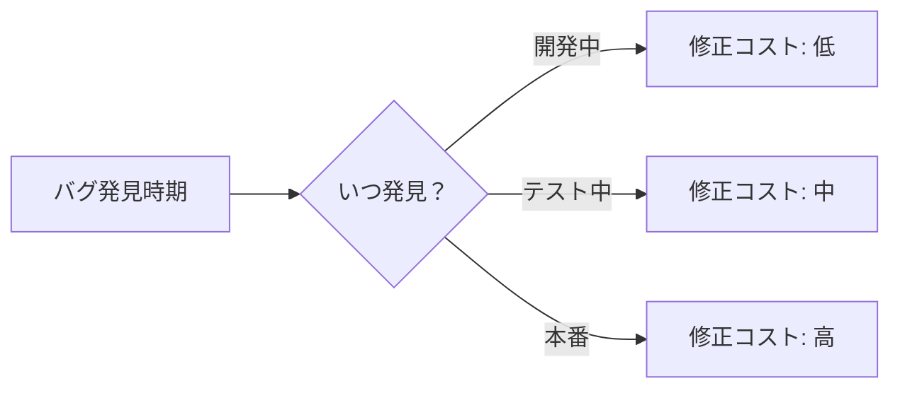
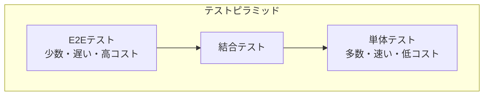

# Phase 1-1: テストの基礎

## 学習目標

この単元を終えると、以下ができるようになります：

- テストの目的を説明できる
- テストの種類を区別できる
- テストピラミッドを理解できる

## 概念解説

### なぜテストが必要か

| 目的 | 説明 |
|------|------|
| バグ検出 | 早期発見でコスト削減 |
| リグレッション防止 | 変更による既存機能の破壊を防ぐ |
| 設計改善 | テストしやすい = 良い設計 |
| ドキュメント | テストが仕様書になる |
| 自信 | リファクタリングへの自信 |



### テストの種類



| 種類 | 対象 | 特徴 | 例 |
|------|------|------|-----|
| 単体テスト | 関数・クラス | 速い、独立 | 計算ロジック |
| 結合テスト | 複数コンポーネント | DB・API連携 | Repository + DB |
| E2Eテスト | システム全体 | ユーザー視点 | ブラウザ操作 |

### その他のテスト

| テスト | 目的 |
|--------|------|
| パフォーマンステスト | 速度・負荷 |
| セキュリティテスト | 脆弱性検出 |
| 回帰テスト | 既存機能の確認 |
| スモークテスト | 基本動作確認 |

## テストピラミッド

### 理想的な比率

```
       /\
      /E2E\       10%
     /------\
    /  結合  \     20%
   /----------\
  /   単体テスト  \   70%
 /_________________\
```

### アンチパターン：アイスクリームコーン

```
    ___________
   |   E2E    |   ← 多すぎる
   |__________|
    |  結合  |     ← 少ない
    |________|
     | 単体 |      ← ほぼない
     |_____|
```

### なぜピラミッド型が良いか

| 層 | 速度 | 安定性 | メンテナンス |
|----|------|--------|-------------|
| 単体 | 速い | 高い | 容易 |
| 結合 | 中程度 | 中程度 | 中程度 |
| E2E | 遅い | 低い | 困難 |

## テストの基本原則

### FIRST 原則

| 原則 | 意味 |
|------|------|
| **F**ast | 速く実行できる |
| **I**ndependent | 独立している |
| **R**epeatable | 何度実行しても同じ結果 |
| **S**elf-validating | 自動で成功/失敗を判定 |
| **T**imely | 適切なタイミングで書く |

### AAA パターン

```python
def test_add():
    # Arrange（準備）
    a = 1
    b = 2
    
    # Act（実行）
    result = add(a, b)
    
    # Assert（検証）
    assert result == 3
```

### Given-When-Then

```python
def test_user_login():
    # Given: ユーザーが存在する
    user = create_user(email="test@example.com", password="password")
    
    # When: ログインする
    result = login(email="test@example.com", password="password")
    
    # Then: トークンが返される
    assert result.token is not None
```

## テスト設計

### 境界値分析

```python
# 0〜100 の範囲を受け付ける関数
def validate_score(score):
    if 0 <= score <= 100:
        return True
    return False

# テストケース
def test_boundary_values():
    # 境界値
    assert validate_score(0) == True      # 下限
    assert validate_score(100) == True    # 上限
    assert validate_score(-1) == False    # 下限外
    assert validate_score(101) == False   # 上限外
    
    # 典型値
    assert validate_score(50) == True     # 中央値
```

### 同値分割

```python
# 年齢を3グループに分ける
def get_age_group(age):
    if age < 13:
        return "child"
    elif age < 20:
        return "teen"
    else:
        return "adult"

# 各グループから代表値をテスト
def test_age_groups():
    assert get_age_group(5) == "child"    # 0-12 の代表
    assert get_age_group(15) == "teen"    # 13-19 の代表
    assert get_age_group(30) == "adult"   # 20+ の代表
```

## 理解度確認

### 問題

テストピラミッドにおいて、最も多くのテストを書くべきなのはどれか。

**A.** E2E テスト

**B.** 結合テスト

**C.** 単体テスト

**D.** パフォーマンステスト

---

### 解答・解説

**正解: C**

テストピラミッドの理想的な比率：
- 単体テスト: 70%（最も多い）
- 結合テスト: 20%
- E2E テスト: 10%

単体テストは速く、安定しており、メンテナンスしやすいため、多く書くべきです。

---

## 次のステップ

テストの基礎を学びました。次は pytest を学びましょう。

**次の単元**: [Phase 1-2: pytest 入門](./02_pytest入門.md)
