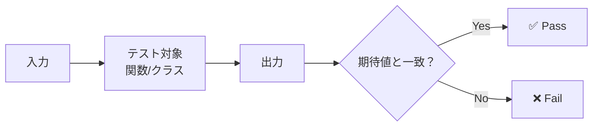

# Phase 2-1: 単体テスト

## 学習目標

この単元を終えると、以下ができるようになります：

- 良い単体テストを書ける
- テストしやすいコードを設計できる
- 境界値・エッジケースをテストできる

## 概念解説

### 単体テストとは



**特徴**:
- 1つの関数/メソッドをテスト
- 外部依存なし（モック化）
- 高速（ミリ秒単位）
- 独立（順序無関係）

## ハンズオン

### 演習1: シンプルな関数のテスト

```python
# user_service.py
from dataclasses import dataclass
from typing import Optional
import re

@dataclass
class User:
    id: int
    name: str
    email: str
    age: int

def validate_email(email: str) -> bool:
    """メールアドレスの形式を検証"""
    pattern = r'^[a-zA-Z0-9_.+-]+@[a-zA-Z0-9-]+\.[a-zA-Z0-9-.]+$'
    return bool(re.match(pattern, email))

def validate_age(age: int) -> bool:
    """年齢が有効範囲か検証"""
    return 0 <= age <= 150

def calculate_discount(age: int, is_member: bool) -> float:
    """年齢と会員状態に基づく割引率を計算"""
    discount = 0.0
    
    if age < 12:
        discount += 0.2  # 子供割引
    elif age >= 65:
        discount += 0.15  # シニア割引
    
    if is_member:
        discount += 0.1  # 会員割引
    
    return min(discount, 0.3)  # 最大30%
```

```python
# test_user_service.py
import pytest
from user_service import validate_email, validate_age, calculate_discount

class TestValidateEmail:
    """メールアドレス検証のテスト"""
    
    def test_valid_email(self):
        assert validate_email("user@example.com") == True
    
    def test_valid_email_with_subdomain(self):
        assert validate_email("user@mail.example.com") == True
    
    def test_valid_email_with_plus(self):
        assert validate_email("user+tag@example.com") == True
    
    def test_invalid_email_no_at(self):
        assert validate_email("userexample.com") == False
    
    def test_invalid_email_no_domain(self):
        assert validate_email("user@") == False
    
    def test_invalid_email_empty(self):
        assert validate_email("") == False

class TestValidateAge:
    """年齢検証のテスト"""
    
    @pytest.mark.parametrize("age,expected", [
        (0, True),      # 下限
        (150, True),    # 上限
        (25, True),     # 中央
        (-1, False),    # 下限外
        (151, False),   # 上限外
    ])
    def test_age_boundary(self, age, expected):
        assert validate_age(age) == expected

class TestCalculateDiscount:
    """割引計算のテスト"""
    
    def test_child_discount(self):
        # 11歳、非会員 → 子供割引のみ
        assert calculate_discount(11, False) == 0.2
    
    def test_senior_discount(self):
        # 65歳、非会員 → シニア割引のみ
        assert calculate_discount(65, False) == 0.15
    
    def test_member_discount(self):
        # 30歳、会員 → 会員割引のみ
        assert calculate_discount(30, True) == 0.1
    
    def test_child_member_discount(self):
        # 10歳、会員 → 子供 + 会員 = 30%
        assert calculate_discount(10, True) == 0.3
    
    def test_senior_member_discount_capped(self):
        # 70歳、会員 → シニア + 会員 = 25%（上限なし）
        assert calculate_discount(70, True) == 0.25
    
    def test_no_discount(self):
        # 30歳、非会員 → 割引なし
        assert calculate_discount(30, False) == 0.0
```

### 演習2: クラスのテスト

```python
# shopping_cart.py
from dataclasses import dataclass
from typing import List

@dataclass
class Product:
    id: str
    name: str
    price: float

class ShoppingCart:
    def __init__(self):
        self._items: List[tuple[Product, int]] = []
    
    def add(self, product: Product, quantity: int = 1) -> None:
        if quantity <= 0:
            raise ValueError("Quantity must be positive")
        
        for i, (p, q) in enumerate(self._items):
            if p.id == product.id:
                self._items[i] = (p, q + quantity)
                return
        
        self._items.append((product, quantity))
    
    def remove(self, product_id: str) -> None:
        for i, (p, _) in enumerate(self._items):
            if p.id == product_id:
                self._items.pop(i)
                return
        raise ValueError(f"Product {product_id} not in cart")
    
    def get_total(self) -> float:
        return sum(p.price * q for p, q in self._items)
    
    def get_item_count(self) -> int:
        return sum(q for _, q in self._items)
    
    def clear(self) -> None:
        self._items.clear()
    
    def is_empty(self) -> bool:
        return len(self._items) == 0
```

```python
# test_shopping_cart.py
import pytest
from shopping_cart import ShoppingCart, Product

@pytest.fixture
def cart():
    return ShoppingCart()

@pytest.fixture
def apple():
    return Product(id="apple", name="Apple", price=100)

@pytest.fixture
def banana():
    return Product(id="banana", name="Banana", price=80)

class TestShoppingCart:
    
    def test_new_cart_is_empty(self, cart):
        assert cart.is_empty() == True
        assert cart.get_total() == 0
        assert cart.get_item_count() == 0
    
    def test_add_single_product(self, cart, apple):
        cart.add(apple)
        
        assert cart.is_empty() == False
        assert cart.get_item_count() == 1
        assert cart.get_total() == 100
    
    def test_add_product_with_quantity(self, cart, apple):
        cart.add(apple, quantity=3)
        
        assert cart.get_item_count() == 3
        assert cart.get_total() == 300
    
    def test_add_same_product_twice(self, cart, apple):
        cart.add(apple, quantity=2)
        cart.add(apple, quantity=3)
        
        assert cart.get_item_count() == 5
        assert cart.get_total() == 500
    
    def test_add_multiple_products(self, cart, apple, banana):
        cart.add(apple, quantity=2)
        cart.add(banana, quantity=3)
        
        assert cart.get_item_count() == 5
        assert cart.get_total() == 200 + 240
    
    def test_add_zero_quantity_raises_error(self, cart, apple):
        with pytest.raises(ValueError, match="positive"):
            cart.add(apple, quantity=0)
    
    def test_add_negative_quantity_raises_error(self, cart, apple):
        with pytest.raises(ValueError, match="positive"):
            cart.add(apple, quantity=-1)
    
    def test_remove_product(self, cart, apple, banana):
        cart.add(apple)
        cart.add(banana)
        
        cart.remove("apple")
        
        assert cart.get_item_count() == 1
        assert cart.get_total() == 80
    
    def test_remove_nonexistent_product_raises_error(self, cart):
        with pytest.raises(ValueError, match="not in cart"):
            cart.remove("nonexistent")
    
    def test_clear_cart(self, cart, apple, banana):
        cart.add(apple)
        cart.add(banana)
        
        cart.clear()
        
        assert cart.is_empty() == True
```

### 演習3: 例外のテスト

```python
# bank_account.py
class InsufficientFundsError(Exception):
    pass

class BankAccount:
    def __init__(self, initial_balance: float = 0):
        if initial_balance < 0:
            raise ValueError("Initial balance cannot be negative")
        self._balance = initial_balance
    
    @property
    def balance(self) -> float:
        return self._balance
    
    def deposit(self, amount: float) -> None:
        if amount <= 0:
            raise ValueError("Deposit amount must be positive")
        self._balance += amount
    
    def withdraw(self, amount: float) -> None:
        if amount <= 0:
            raise ValueError("Withdrawal amount must be positive")
        if amount > self._balance:
            raise InsufficientFundsError(
                f"Cannot withdraw {amount}, balance is {self._balance}"
            )
        self._balance -= amount
    
    def transfer(self, to_account: "BankAccount", amount: float) -> None:
        self.withdraw(amount)
        to_account.deposit(amount)
```

```python
# test_bank_account.py
import pytest
from bank_account import BankAccount, InsufficientFundsError

class TestBankAccount:
    
    def test_create_with_initial_balance(self):
        account = BankAccount(100)
        assert account.balance == 100
    
    def test_create_with_zero_balance(self):
        account = BankAccount()
        assert account.balance == 0
    
    def test_create_with_negative_balance_raises(self):
        with pytest.raises(ValueError, match="negative"):
            BankAccount(-100)
    
    def test_deposit_increases_balance(self):
        account = BankAccount(100)
        account.deposit(50)
        assert account.balance == 150
    
    def test_deposit_zero_raises(self):
        account = BankAccount(100)
        with pytest.raises(ValueError, match="positive"):
            account.deposit(0)
    
    def test_withdraw_decreases_balance(self):
        account = BankAccount(100)
        account.withdraw(30)
        assert account.balance == 70
    
    def test_withdraw_all_balance(self):
        account = BankAccount(100)
        account.withdraw(100)
        assert account.balance == 0
    
    def test_withdraw_more_than_balance_raises(self):
        account = BankAccount(100)
        with pytest.raises(InsufficientFundsError):
            account.withdraw(150)
    
    def test_transfer_between_accounts(self):
        sender = BankAccount(100)
        receiver = BankAccount(50)
        
        sender.transfer(receiver, 30)
        
        assert sender.balance == 70
        assert receiver.balance == 80
    
    def test_transfer_insufficient_funds_raises(self):
        sender = BankAccount(100)
        receiver = BankAccount(50)
        
        with pytest.raises(InsufficientFundsError):
            sender.transfer(receiver, 150)
        
        # 失敗時は両方の残高が変わらない
        assert sender.balance == 100
        assert receiver.balance == 50
```

## テストしやすいコードの原則

| 原則 | 説明 |
|------|------|
| 単一責任 | 1つの関数は1つのことだけ |
| 依存性注入 | 外部依存を引数で渡す |
| 純粋関数 | 同じ入力→同じ出力 |
| 小さな関数 | テストしやすいサイズ |

## 理解度確認

### 問題

単体テストの特徴として正しいものはどれか。

**A.** データベースに接続してテストする

**B.** 複数のコンポーネントを組み合わせてテストする

**C.** 1つの関数やメソッドを独立してテストする

**D.** ブラウザを操作してテストする

---

### 解答・解説

**正解: C**

単体テストの特徴：
- 1つの関数/メソッドをテスト
- 外部依存なし（DBはモック化）
- 高速で独立

A/Bは結合テスト、Dは E2E テストです。

---

## 次のステップ

単体テストを学びました。次はモックを学びましょう。

**次の単元**: [Phase 2-2: モック](./02_モック.md)
