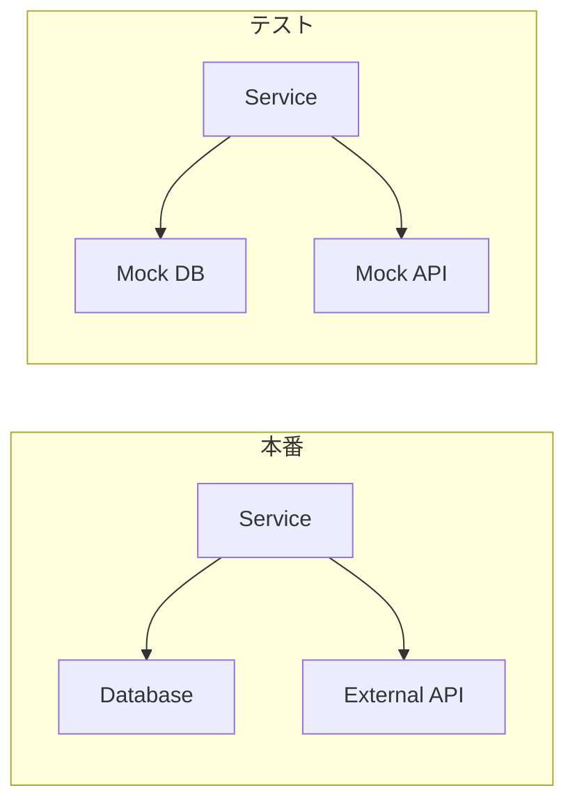

# Phase 2-2: モック

## 学習目標

この単元を終えると、以下ができるようになります：

- モックの目的を説明できる
- unittest.mock を使いこなせる
- 適切にモックを使い分けられる

## 概念解説

### モックとは



**モック** = 外部依存をシミュレートするオブジェクト

### なぜモックを使うか

| 理由 | 説明 |
|------|------|
| 高速化 | DB・API 呼び出しを省略 |
| 安定性 | 外部サービスの状態に依存しない |
| 制御 | 任意の戻り値やエラーを返せる |
| 分離 | テスト対象のみに集中 |

### モックの種類

| 用語 | 説明 |
|------|------|
| Mock | 呼び出しを記録し、設定した値を返す |
| Stub | 固定値を返すだけ |
| Spy | 実際の処理を行いつつ呼び出しを記録 |
| Fake | 簡易版の実装（インメモリDBなど） |

## ハンズオン

### 演習1: 基本的なモック

```python
from unittest.mock import Mock, MagicMock

# 基本的なMock
mock = Mock()

# 戻り値を設定
mock.some_method.return_value = 42
result = mock.some_method()
print(result)  # 42

# 呼び出しを確認
mock.some_method.assert_called()
mock.some_method.assert_called_once()
mock.some_method.assert_called_with()

# 複数回呼び出し
mock.another_method.return_value = "hello"
mock.another_method()
mock.another_method()
print(mock.another_method.call_count)  # 2

# 引数付き呼び出しの確認
mock.greet("John", greeting="Hello")
mock.greet.assert_called_with("John", greeting="Hello")
```

### 演習2: patch デコレータ

```python
# user_service.py
import requests

def get_user_from_api(user_id: int) -> dict:
    response = requests.get(f"https://api.example.com/users/{user_id}")
    response.raise_for_status()
    return response.json()

def get_user_name(user_id: int) -> str:
    user = get_user_from_api(user_id)
    return user["name"]
```

```python
# test_user_service.py
from unittest.mock import patch, Mock
import pytest
from user_service import get_user_name, get_user_from_api

# 方法1: デコレータ
@patch('user_service.requests.get')
def test_get_user_name(mock_get):
    # モックの設定
    mock_response = Mock()
    mock_response.json.return_value = {"id": 1, "name": "John"}
    mock_get.return_value = mock_response
    
    # テスト
    result = get_user_name(1)
    
    assert result == "John"
    mock_get.assert_called_once_with("https://api.example.com/users/1")

# 方法2: コンテキストマネージャ
def test_get_user_name_context():
    with patch('user_service.requests.get') as mock_get:
        mock_response = Mock()
        mock_response.json.return_value = {"id": 1, "name": "Jane"}
        mock_get.return_value = mock_response
        
        result = get_user_name(1)
        
        assert result == "Jane"

# 方法3: 関数をモック
@patch('user_service.get_user_from_api')
def test_get_user_name_mock_function(mock_get_user):
    mock_get_user.return_value = {"id": 1, "name": "Bob"}
    
    result = get_user_name(1)
    
    assert result == "Bob"
```

### 演習3: 例外のモック

```python
# test_exceptions.py
from unittest.mock import patch, Mock
import pytest
import requests
from user_service import get_user_name

@patch('user_service.requests.get')
def test_api_error(mock_get):
    # HTTPエラーをシミュレート
    mock_get.side_effect = requests.HTTPError("404 Not Found")
    
    with pytest.raises(requests.HTTPError):
        get_user_name(999)

@patch('user_service.requests.get')
def test_connection_error(mock_get):
    # 接続エラーをシミュレート
    mock_get.side_effect = requests.ConnectionError("Connection refused")
    
    with pytest.raises(requests.ConnectionError):
        get_user_name(1)

@patch('user_service.requests.get')
def test_multiple_calls_different_results(mock_get):
    # 連続呼び出しで異なる結果を返す
    mock_response1 = Mock()
    mock_response1.json.return_value = {"name": "First"}
    
    mock_response2 = Mock()
    mock_response2.json.return_value = {"name": "Second"}
    
    mock_get.side_effect = [mock_response1, mock_response2]
    
    assert get_user_name(1) == "First"
    assert get_user_name(2) == "Second"
```

### 演習4: クラスのモック

```python
# email_service.py
class EmailClient:
    def send(self, to: str, subject: str, body: str) -> bool:
        # 実際のメール送信ロジック
        pass

class UserService:
    def __init__(self, email_client: EmailClient):
        self.email_client = email_client
    
    def register(self, email: str, name: str) -> dict:
        user = {"email": email, "name": name}
        # ウェルカムメールを送信
        self.email_client.send(
            to=email,
            subject="Welcome!",
            body=f"Hello, {name}!"
        )
        return user
```

```python
# test_email_service.py
from unittest.mock import Mock, patch, create_autospec
import pytest
from email_service import UserService, EmailClient

# 方法1: Mock インスタンスを注入
def test_register_sends_welcome_email():
    mock_email = Mock(spec=EmailClient)
    service = UserService(mock_email)
    
    result = service.register("john@example.com", "John")
    
    assert result["email"] == "john@example.com"
    mock_email.send.assert_called_once_with(
        to="john@example.com",
        subject="Welcome!",
        body="Hello, John!"
    )

# 方法2: create_autospec で型チェック
def test_register_with_autospec():
    mock_email = create_autospec(EmailClient)
    service = UserService(mock_email)
    
    service.register("jane@example.com", "Jane")
    
    mock_email.send.assert_called_once()

# 方法3: patch.object
def test_register_with_patch_object():
    email_client = EmailClient()
    service = UserService(email_client)
    
    with patch.object(email_client, 'send', return_value=True) as mock_send:
        service.register("bob@example.com", "Bob")
        
        mock_send.assert_called_once()
```

### 演習5: プロパティとマジックメソッドのモック

```python
from unittest.mock import Mock, MagicMock, PropertyMock

# プロパティのモック
class Config:
    @property
    def api_key(self):
        return "real-api-key"

def test_property_mock():
    config = Config()
    with patch.object(type(config), 'api_key', new_callable=PropertyMock) as mock_key:
        mock_key.return_value = "test-api-key"
        assert config.api_key == "test-api-key"

# MagicMock でマジックメソッド
def test_magic_methods():
    mock = MagicMock()
    
    # __len__
    mock.__len__.return_value = 5
    assert len(mock) == 5
    
    # __iter__
    mock.__iter__.return_value = iter([1, 2, 3])
    assert list(mock) == [1, 2, 3]
    
    # コンテキストマネージャ
    mock.__enter__.return_value = "entered"
    with mock as m:
        assert m == "entered"
```

### 演習6: 日時のモック

```python
# scheduler.py
from datetime import datetime

def is_business_hours() -> bool:
    now = datetime.now()
    return 9 <= now.hour < 18 and now.weekday() < 5

def get_greeting() -> str:
    hour = datetime.now().hour
    if hour < 12:
        return "Good morning"
    elif hour < 18:
        return "Good afternoon"
    else:
        return "Good evening"
```

```python
# test_scheduler.py
from unittest.mock import patch
from datetime import datetime
from scheduler import is_business_hours, get_greeting

@patch('scheduler.datetime')
def test_business_hours_monday_10am(mock_datetime):
    # 月曜日の10時
    mock_datetime.now.return_value = datetime(2024, 1, 15, 10, 0)  # 月曜
    assert is_business_hours() == True

@patch('scheduler.datetime')
def test_business_hours_sunday(mock_datetime):
    # 日曜日
    mock_datetime.now.return_value = datetime(2024, 1, 14, 10, 0)  # 日曜
    assert is_business_hours() == False

@patch('scheduler.datetime')
def test_greeting_morning(mock_datetime):
    mock_datetime.now.return_value = datetime(2024, 1, 15, 9, 0)
    assert get_greeting() == "Good morning"

@patch('scheduler.datetime')
def test_greeting_afternoon(mock_datetime):
    mock_datetime.now.return_value = datetime(2024, 1, 15, 14, 0)
    assert get_greeting() == "Good afternoon"

# freezegun ライブラリを使う方法（より簡単）
# pip install freezegun
from freezegun import freeze_time

@freeze_time("2024-01-15 10:00:00")
def test_business_hours_with_freezegun():
    assert is_business_hours() == True
```

## モックのベストプラクティス

| ✅ 良い使い方 | ❌ 悪い使い方 |
|-------------|-------------|
| 外部API・DB | テスト対象自体 |
| 時間・乱数 | 単純な計算ロジック |
| ファイルI/O | 全てをモック |

## 理解度確認

### 問題

モジュール内の関数をモックする際、patch のパスとして正しいのはどれか。

例: `my_module.py` が `import requests` している場合

**A.** `@patch('requests.get')`

**B.** `@patch('my_module.requests.get')`

**C.** `@patch('my_module.get')`

**D.** `@patch('unittest.mock.requests.get')`

---

### 解答・解説

**正解: B**

モックは「使われる場所」でパッチします：
- `my_module.py` が `requests.get` を使う
- → `my_module.requests.get` をパッチ

これを「patch where it's used」原則と呼びます。

---

## 次のステップ

モックを学びました。次は結合テストを学びましょう。

**次の単元**: [Phase 3-1: 結合テスト](../phase3/01_結合テスト.md)
