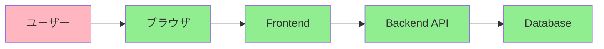

# Phase 3-2: E2E テスト

## 学習目標

この単元を終えると、以下ができるようになります：

- E2E テストの目的を説明できる
- Playwright でブラウザテストができる
- API の E2E テストができる

## 概念解説

### E2E テストとは



**E2E（End-to-End）テスト** = システム全体をユーザー視点でテスト

### 特徴

| メリット | デメリット |
|---------|----------|
| 実際のユーザー体験をテスト | 遅い |
| 全コンポーネントの連携確認 | 不安定になりやすい |
| 重要なフローの保証 | メンテナンスコスト高い |

## ハンズオン

### 演習1: Playwright のセットアップ

```bash
# インストール
pip install pytest-playwright
playwright install
```

```python
# test_web.py
from playwright.sync_api import Page, expect

def test_google_search(page: Page):
    # ページにアクセス
    page.goto("https://www.google.com")
    
    # 検索ボックスに入力
    page.get_by_role("combobox", name="検索").fill("Python")
    
    # 検索実行
    page.get_by_role("combobox", name="検索").press("Enter")
    
    # 結果が表示されることを確認
    expect(page.locator("#search")).to_be_visible()
```

```bash
# 実行
pytest test_web.py --headed  # ブラウザ表示
pytest test_web.py           # ヘッドレス
```

### 演習2: 基本的なブラウザ操作

```python
from playwright.sync_api import Page, expect

class TestLoginFlow:
    
    def test_successful_login(self, page: Page):
        # ログインページへ
        page.goto("http://localhost:3000/login")
        
        # フォーム入力
        page.get_by_label("Email").fill("test@example.com")
        page.get_by_label("Password").fill("password123")
        
        # ログインボタンをクリック
        page.get_by_role("button", name="Login").click()
        
        # ダッシュボードにリダイレクトされることを確認
        expect(page).to_have_url("http://localhost:3000/dashboard")
        expect(page.get_by_text("Welcome")).to_be_visible()
    
    def test_failed_login(self, page: Page):
        page.goto("http://localhost:3000/login")
        
        page.get_by_label("Email").fill("wrong@example.com")
        page.get_by_label("Password").fill("wrongpassword")
        page.get_by_role("button", name="Login").click()
        
        # エラーメッセージが表示されることを確認
        expect(page.get_by_text("Invalid credentials")).to_be_visible()
    
    def test_form_validation(self, page: Page):
        page.goto("http://localhost:3000/login")
        
        # 空のまま送信
        page.get_by_role("button", name="Login").click()
        
        # バリデーションエラーが表示
        expect(page.get_by_text("Email is required")).to_be_visible()
```

### 演習3: 要素の操作

```python
from playwright.sync_api import Page, expect

def test_element_interactions(page: Page):
    page.goto("http://localhost:3000")
    
    # クリック
    page.get_by_role("button", name="Submit").click()
    
    # ダブルクリック
    page.locator("#item").dblclick()
    
    # 右クリック
    page.locator("#item").click(button="right")
    
    # ホバー
    page.locator("#menu").hover()
    
    # テキスト入力
    page.get_by_label("Name").fill("John Doe")
    
    # クリア & 入力
    page.get_by_label("Name").clear()
    page.get_by_label("Name").type("Jane Doe")
    
    # セレクトボックス
    page.get_by_label("Country").select_option("Japan")
    
    # チェックボックス
    page.get_by_label("I agree").check()
    expect(page.get_by_label("I agree")).to_be_checked()
    
    # ラジオボタン
    page.get_by_label("Option A").click()
    
    # ファイルアップロード
    page.get_by_label("Upload").set_input_files("test.pdf")

def test_assertions(page: Page):
    page.goto("http://localhost:3000")
    
    # 可視性
    expect(page.locator("#header")).to_be_visible()
    expect(page.locator("#hidden")).to_be_hidden()
    
    # テキスト
    expect(page.locator("h1")).to_have_text("Welcome")
    expect(page.locator("p")).to_contain_text("Hello")
    
    # 属性
    expect(page.locator("input")).to_have_attribute("type", "text")
    
    # URL
    expect(page).to_have_url("http://localhost:3000/")
    
    # タイトル
    expect(page).to_have_title("My App")
    
    # カウント
    expect(page.locator("li")).to_have_count(5)
```

### 演習4: 待機処理

```python
from playwright.sync_api import Page, expect

def test_async_content(page: Page):
    page.goto("http://localhost:3000")
    
    # ボタンをクリック（非同期でデータ取得）
    page.get_by_role("button", name="Load Data").click()
    
    # 自動待機（推奨）
    expect(page.locator("#data")).to_be_visible()
    
    # 明示的な待機
    page.wait_for_selector("#data")
    
    # ネットワーク待機
    with page.expect_response("**/api/data") as response_info:
        page.get_by_role("button", name="Fetch").click()
    response = response_info.value
    assert response.status == 200
    
    # ナビゲーション待機
    with page.expect_navigation():
        page.get_by_role("link", name="Next").click()
```

### 演習5: Page Object パターン

```python
# pages/login_page.py
from playwright.sync_api import Page, expect

class LoginPage:
    def __init__(self, page: Page):
        self.page = page
        self.email_input = page.get_by_label("Email")
        self.password_input = page.get_by_label("Password")
        self.login_button = page.get_by_role("button", name="Login")
        self.error_message = page.get_by_role("alert")
    
    def goto(self):
        self.page.goto("http://localhost:3000/login")
        return self
    
    def login(self, email: str, password: str):
        self.email_input.fill(email)
        self.password_input.fill(password)
        self.login_button.click()
        return self
    
    def expect_error(self, message: str):
        expect(self.error_message).to_contain_text(message)
        return self
```

```python
# pages/dashboard_page.py
from playwright.sync_api import Page, expect

class DashboardPage:
    def __init__(self, page: Page):
        self.page = page
        self.welcome_message = page.get_by_text("Welcome")
        self.logout_button = page.get_by_role("button", name="Logout")
    
    def expect_welcome(self, name: str):
        expect(self.welcome_message).to_contain_text(name)
        return self
    
    def logout(self):
        self.logout_button.click()
        return LoginPage(self.page)
```

```python
# test_login_flow.py
from pages.login_page import LoginPage
from pages.dashboard_page import DashboardPage

def test_login_success(page):
    login_page = LoginPage(page)
    
    login_page.goto().login("test@example.com", "password")
    
    dashboard = DashboardPage(page)
    dashboard.expect_welcome("Test User")

def test_login_failure(page):
    login_page = LoginPage(page)
    
    login_page.goto().login("wrong@example.com", "wrong")
    login_page.expect_error("Invalid credentials")
```

### 演習6: API の E2E テスト

```python
# test_api_e2e.py
import pytest
import requests

BASE_URL = "http://localhost:8000"

@pytest.fixture(scope="module")
def auth_token():
    """ログインしてトークンを取得"""
    response = requests.post(
        f"{BASE_URL}/token",
        data={"username": "test@example.com", "password": "password"}
    )
    return response.json()["access_token"]

class TestUserFlow:
    
    def test_complete_user_flow(self, auth_token):
        headers = {"Authorization": f"Bearer {auth_token}"}
        
        # 1. ユーザー作成
        create_response = requests.post(
            f"{BASE_URL}/users",
            json={"name": "E2E User", "email": "e2e@example.com"},
            headers=headers
        )
        assert create_response.status_code == 201
        user_id = create_response.json()["id"]
        
        # 2. ユーザー取得
        get_response = requests.get(
            f"{BASE_URL}/users/{user_id}",
            headers=headers
        )
        assert get_response.status_code == 200
        assert get_response.json()["name"] == "E2E User"
        
        # 3. ユーザー更新
        update_response = requests.put(
            f"{BASE_URL}/users/{user_id}",
            json={"name": "Updated E2E User"},
            headers=headers
        )
        assert update_response.status_code == 200
        
        # 4. ユーザー削除
        delete_response = requests.delete(
            f"{BASE_URL}/users/{user_id}",
            headers=headers
        )
        assert delete_response.status_code == 204
        
        # 5. 削除確認
        verify_response = requests.get(
            f"{BASE_URL}/users/{user_id}",
            headers=headers
        )
        assert verify_response.status_code == 404
```

## E2E テストのベストプラクティス

| 項目 | 推奨 |
|------|------|
| テスト数 | 少数（重要フローのみ） |
| データ | テストごとにリセット |
| 待機 | 自動待機を活用 |
| セレクタ | ロールベース優先 |

## 理解度確認

### 問題

E2E テストの特徴として正しいものはどれか。

**A.** 単体テストより高速に実行できる

**B.** ユーザー視点でシステム全体をテストする

**C.** 外部依存は全てモック化する

**D.** 最も多くのテストを書くべき層である

---

### 解答・解説

**正解: B**

E2E テストの特徴：
- ユーザー視点で全体をテスト
- 遅く、不安定になりやすい
- 重要なフローのみに限定

テストピラミッドでは最上位（最小数）です。

---

## 次のステップ

E2E テストを学びました。次は TDD を学びましょう。

**次の単元**: [Phase 4-1: TDD](../phase4/01_TDD.md)
