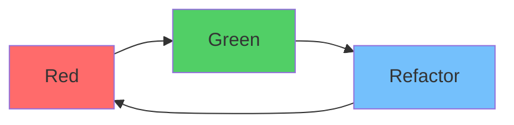

# Phase 4-1: TDD（テスト駆動開発）

## 学習目標

この単元を終えると、以下ができるようになります：

- TDD のサイクルを説明できる
- Red-Green-Refactor を実践できる
- TDD のメリットを説明できる

## 概念解説

### TDD とは



**TDD（Test-Driven Development）** = テストを先に書いてから実装する開発手法

### Red-Green-Refactor

| フェーズ | 内容 |
|---------|------|
| **Red** | 失敗するテストを書く |
| **Green** | テストを通す最小限のコードを書く |
| **Refactor** | コードを改善する（テストは通したまま） |

### TDD のルール

1. 失敗するテストがなければプロダクションコードを書かない
2. 失敗するテストは1つだけ書く
3. テストを通す最小限のコードを書く

## ハンズオン

### 演習1: FizzBuzz を TDD で実装

```python
# Step 1: Red - 最初のテスト
# test_fizzbuzz.py
def test_returns_1_for_1():
    assert fizzbuzz(1) == "1"

# 実行: pytest → NameError（関数がない）
```

```python
# Step 2: Green - 最小限の実装
# fizzbuzz.py
def fizzbuzz(n):
    return "1"
```

```python
# Step 3: Red - 次のテスト追加
def test_returns_2_for_2():
    assert fizzbuzz(2) == "2"

# 実行: pytest → AssertionError
```

```python
# Step 4: Green - 実装を拡張
def fizzbuzz(n):
    return str(n)
```

```python
# Step 5: Red - Fizz のテスト
def test_returns_fizz_for_3():
    assert fizzbuzz(3) == "Fizz"
```

```python
# Step 6: Green
def fizzbuzz(n):
    if n % 3 == 0:
        return "Fizz"
    return str(n)
```

```python
# Step 7: Red - Buzz のテスト
def test_returns_buzz_for_5():
    assert fizzbuzz(5) == "Buzz"
```

```python
# Step 8: Green
def fizzbuzz(n):
    if n % 3 == 0:
        return "Fizz"
    if n % 5 == 0:
        return "Buzz"
    return str(n)
```

```python
# Step 9: Red - FizzBuzz のテスト
def test_returns_fizzbuzz_for_15():
    assert fizzbuzz(15) == "FizzBuzz"
```

```python
# Step 10: Green - 完成版
def fizzbuzz(n):
    if n % 15 == 0:
        return "FizzBuzz"
    if n % 3 == 0:
        return "Fizz"
    if n % 5 == 0:
        return "Buzz"
    return str(n)
```

```python
# Step 11: Refactor
def fizzbuzz(n):
    result = ""
    if n % 3 == 0:
        result += "Fizz"
    if n % 5 == 0:
        result += "Buzz"
    return result or str(n)
```

### 演習2: スタックを TDD で実装

```python
# test_stack.py
import pytest

def test_new_stack_is_empty():
    stack = Stack()
    assert stack.is_empty() == True

def test_push_makes_stack_non_empty():
    stack = Stack()
    stack.push(1)
    assert stack.is_empty() == False

def test_pop_returns_pushed_value():
    stack = Stack()
    stack.push(42)
    assert stack.pop() == 42

def test_pop_empty_stack_raises():
    stack = Stack()
    with pytest.raises(IndexError):
        stack.pop()

def test_lifo_order():
    stack = Stack()
    stack.push(1)
    stack.push(2)
    stack.push(3)
    assert stack.pop() == 3
    assert stack.pop() == 2
    assert stack.pop() == 1

def test_peek_returns_top_without_removing():
    stack = Stack()
    stack.push(1)
    assert stack.peek() == 1
    assert stack.is_empty() == False

def test_size():
    stack = Stack()
    assert stack.size() == 0
    stack.push(1)
    assert stack.size() == 1
    stack.push(2)
    assert stack.size() == 2
```

```python
# stack.py - 完成版（TDD で段階的に実装）
class Stack:
    def __init__(self):
        self._items = []
    
    def is_empty(self):
        return len(self._items) == 0
    
    def push(self, item):
        self._items.append(item)
    
    def pop(self):
        if self.is_empty():
            raise IndexError("pop from empty stack")
        return self._items.pop()
    
    def peek(self):
        if self.is_empty():
            raise IndexError("peek from empty stack")
        return self._items[-1]
    
    def size(self):
        return len(self._items)
```

### 演習3: パスワードバリデーターを TDD で実装

```python
# test_password_validator.py
import pytest

class TestPasswordValidator:
    
    def test_valid_password(self):
        assert validate_password("Password1!") == True
    
    def test_too_short(self):
        result = validate_password("Pass1!")
        assert result == False
    
    def test_no_uppercase(self):
        assert validate_password("password1!") == False
    
    def test_no_lowercase(self):
        assert validate_password("PASSWORD1!") == False
    
    def test_no_digit(self):
        assert validate_password("Password!") == False
    
    def test_no_special_char(self):
        assert validate_password("Password1") == False
    
    def test_returns_error_messages(self):
        errors = get_password_errors("short")
        
        assert "at least 8 characters" in errors
        assert "uppercase letter" in errors
        assert "digit" in errors
        assert "special character" in errors
```

```python
# password_validator.py
def validate_password(password: str) -> bool:
    return len(get_password_errors(password)) == 0

def get_password_errors(password: str) -> list[str]:
    errors = []
    
    if len(password) < 8:
        errors.append("Password must be at least 8 characters")
    
    if not any(c.isupper() for c in password):
        errors.append("Password must contain an uppercase letter")
    
    if not any(c.islower() for c in password):
        errors.append("Password must contain a lowercase letter")
    
    if not any(c.isdigit() for c in password):
        errors.append("Password must contain a digit")
    
    special_chars = "!@#$%^&*()_+-=[]{}|;:,.<>?"
    if not any(c in special_chars for c in password):
        errors.append("Password must contain a special character")
    
    return errors
```

## TDD のメリット・デメリット

| メリット | デメリット |
|---------|----------|
| 設計が改善される | 学習コスト |
| バグが早期発見される | 時間がかかる（初期） |
| リファクタリングの安心感 | UI テストには不向き |
| ドキュメント代わり | 経験が必要 |

## TDD が向いているケース

| 向いている | 向いていない |
|-----------|-------------|
| ロジックが複雑 | プロトタイプ |
| 仕様が明確 | UI 開発 |
| 長期メンテナンス | 探索的開発 |

## 理解度確認

### 問題

TDD の Red-Green-Refactor サイクルにおいて、「Green」フェーズで行うことはどれか。

**A.** 失敗するテストを書く

**B.** テストを通す最小限のコードを書く

**C.** コードをきれいにリファクタリングする

**D.** 新しい機能を追加する

---

### 解答・解説

**正解: B**

TDD サイクル：
- **Red**: 失敗するテストを書く
- **Green**: テストを通す最小限のコードを書く
- **Refactor**: コードを改善（テストは通したまま）

---

## 次のステップ

TDD を学びました。次はカバレッジを学びましょう。

**次の単元**: [Phase 4-2: カバレッジ](./02_カバレッジ.md)
