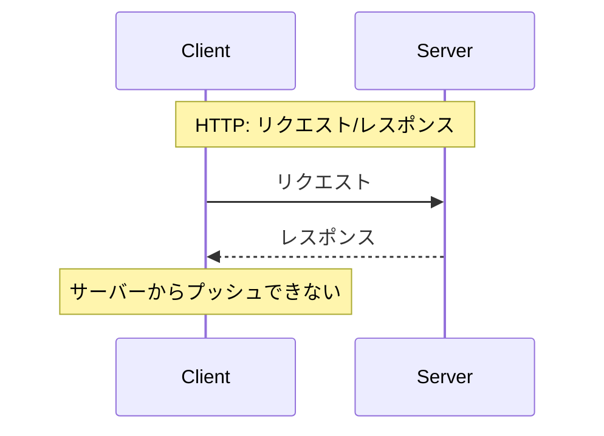
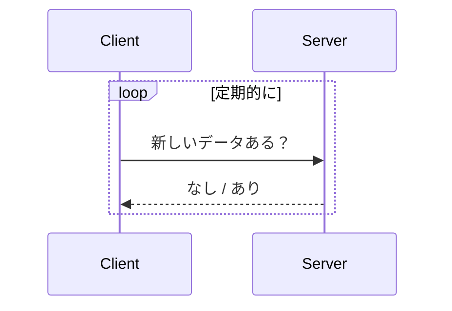
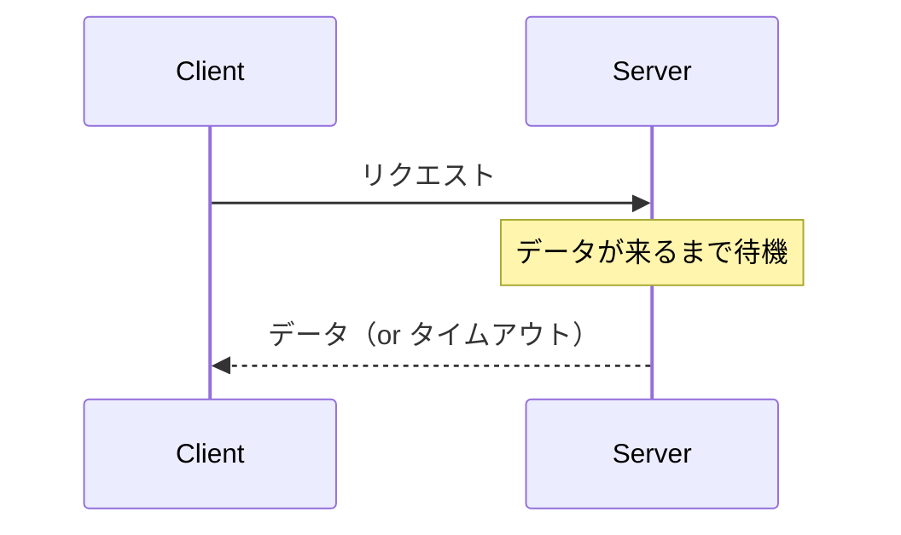
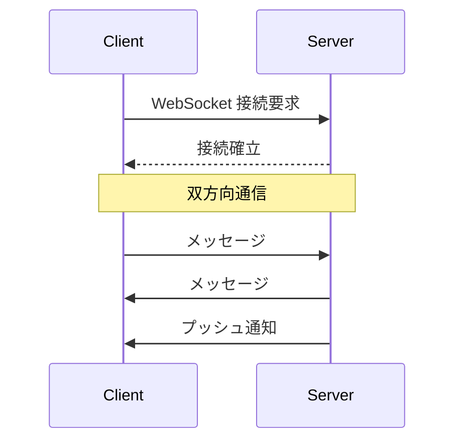

# Phase 1-1: リアルタイム通信とは

## 学習目標

この単元を終えると、以下ができるようになります：

- HTTP とリアルタイム通信の違いを説明できる
- ポーリングと WebSocket を比較できる
- 適切な通信方式を選択できる

## HTTP の限界



## リアルタイム通信の方式

### 1. ポーリング



### 2. ロングポーリング



### 3. WebSocket



## 方式の比較

| 方式 | リアルタイム性 | サーバー負荷 | 複雑さ |
|------|--------------|------------|--------|
| ポーリング | 低 | 高 | 低 |
| ロングポーリング | 中 | 中 | 中 |
| Server-Sent Events | 高（単方向） | 低 | 低 |
| **WebSocket** | 高（双方向） | 低 | 中 |

## ユースケース

| 用途 | 推奨方式 |
|------|---------|
| チャット | WebSocket |
| 通知 | WebSocket / SSE |
| ライブフィード | WebSocket / SSE |
| ダッシュボード更新 | SSE / ポーリング |
| ゲーム | WebSocket |

## AWS との比較

| AWS サービス | 用途 |
|-------------|------|
| API Gateway WebSocket | サーバーレス WebSocket |
| AppSync | GraphQL サブスクリプション |
| IoT Core | IoT デバイス通信 |

あなたが使う可能性がある **API Gateway WebSocket API** は、Lambda と組み合わせてサーバーレスでリアルタイム通信を実現できます。

## ハンズオン

### 演習1: ポーリングの問題

```python
# polling_problem.py
"""
ポーリングの問題点：
- 無駄なリクエスト
- リアルタイム性が低い
- サーバー負荷が高い
"""

import time
import random

class NotificationService:
    def __init__(self):
        self.notifications = []
    
    def check_notifications(self) -> list:
        """クライアントからのポーリング"""
        # 実際には DB を毎回クエリ
        return self.notifications.copy()
    
    def add_notification(self, message: str):
        self.notifications.append({
            'message': message,
            'timestamp': time.time()
        })

# シミュレーション
service = NotificationService()

def client_polling():
    """クライアント: 1秒ごとにポーリング"""
    poll_count = 0
    
    for _ in range(10):
        # 毎秒リクエスト（無駄が多い）
        notifications = service.check_notifications()
        poll_count += 1
        
        if notifications:
            print(f'New notifications: {notifications}')
        else:
            print(f'No new notifications (poll #{poll_count})')
        
        time.sleep(1)
    
    print(f'Total polls: {poll_count}')

# 3秒後に通知追加
def server_task():
    time.sleep(3)
    service.add_notification('Hello!')

import threading
threading.Thread(target=server_task).start()
client_polling()
```

### 演習2: WebSocket の利点を理解

```python
# websocket_advantage.py
"""
WebSocket の利点：
- 常時接続（コネクション確立は1回）
- 双方向通信
- 低レイテンシ
- サーバーからプッシュ可能
"""

# 接続の比較
http_connections = 100  # 100リクエスト = 100接続
websocket_connections = 1  # 1接続で何度もやり取り

# オーバーヘッドの比較
http_overhead = 'ヘッダー + 本文（毎回）'
websocket_overhead = '2バイト + 本文（接続後）'
```

## 理解度確認

### 問題

チャットアプリケーションを実装する場合、最も適した通信方式はどれか。

**A.** 通常のポーリング

**B.** ロングポーリング

**C.** Server-Sent Events

**D.** WebSocket

---

### 解答・解説

**正解: D**

チャットは双方向のリアルタイム通信が必要です。WebSocket は双方向かつ低レイテンシで、チャットに最適です。SSE は単方向のみなので不適切です。

---

## 次のステップ

リアルタイム通信の基礎を学びました。次は WebSocket の詳細を学びましょう。

**次の単元**: [Phase 1-2: WebSocket 基礎](./02_WebSocket基礎.md)
