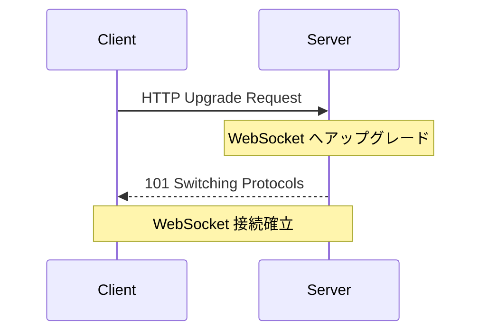
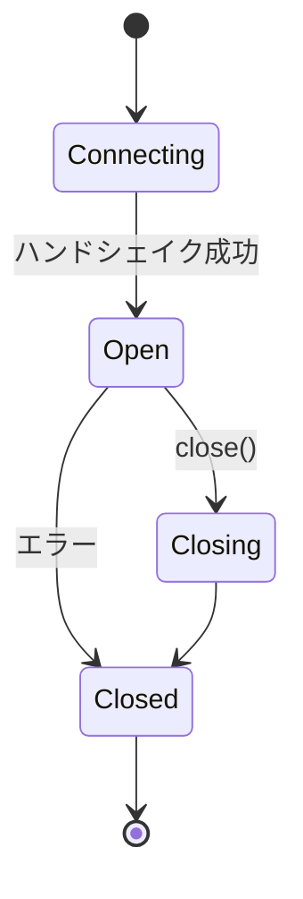

# Phase 1-2: WebSocket 基礎

## 学習目標

この単元を終えると、以下ができるようになります：

- WebSocket プロトコルを理解できる
- ハンドシェイクを説明できる
- 接続ライフサイクルを理解できる

## WebSocket プロトコル

### ハンドシェイク



### リクエスト

```http
GET /ws HTTP/1.1
Host: example.com
Upgrade: websocket
Connection: Upgrade
Sec-WebSocket-Key: dGhlIHNhbXBsZSBub25jZQ==
Sec-WebSocket-Version: 13
```

### レスポンス

```http
HTTP/1.1 101 Switching Protocols
Upgrade: websocket
Connection: Upgrade
Sec-WebSocket-Accept: s3pPLMBiTxaQ9kYGzzhZRbK+xOo=
```

## 接続のライフサイクル



## フレーム構造

| フィールド | サイズ | 説明 |
|-----------|--------|------|
| FIN | 1 bit | 最終フレーム |
| Opcode | 4 bits | 種類（テキスト、バイナリ等） |
| Mask | 1 bit | マスク有無 |
| Payload Length | 7+ bits | データ長 |
| Payload Data | 可変 | データ本体 |

## ハンズオン

### 演習1: 最小限の WebSocket サーバー

```bash
pip install websockets
```

```python
# simple_server.py
import asyncio
import websockets

async def handler(websocket, path):
    """接続ごとに呼ばれるハンドラ"""
    print(f'Client connected: {websocket.remote_address}')
    
    try:
        async for message in websocket:
            print(f'Received: {message}')
            
            # エコーバック
            await websocket.send(f'Echo: {message}')
    
    except websockets.ConnectionClosed:
        print('Client disconnected')

async def main():
    server = await websockets.serve(handler, 'localhost', 8765)
    print('WebSocket server started on ws://localhost:8765')
    await server.wait_closed()

asyncio.run(main())
```

### 演習2: WebSocket クライアント

```python
# simple_client.py
import asyncio
import websockets

async def client():
    uri = 'ws://localhost:8765'
    
    async with websockets.connect(uri) as websocket:
        # メッセージ送信
        await websocket.send('Hello, WebSocket!')
        
        # レスポンス受信
        response = await websocket.recv()
        print(f'Received: {response}')
        
        # 複数メッセージ
        for i in range(3):
            await websocket.send(f'Message {i}')
            response = await websocket.recv()
            print(f'Received: {response}')

asyncio.run(client())
```

### 演習3: 接続イベント

```python
# connection_events.py
import asyncio
import websockets
from datetime import datetime

class WebSocketServer:
    def __init__(self):
        self.clients = set()
    
    async def handler(self, websocket, path):
        # 接続時
        self.clients.add(websocket)
        print(f'[{datetime.now()}] Connected: {len(self.clients)} clients')
        
        try:
            async for message in websocket:
                print(f'[{datetime.now()}] Message: {message}')
                await websocket.send(f'Received: {message}')
        
        except websockets.ConnectionClosed as e:
            print(f'[{datetime.now()}] Closed: code={e.code}, reason={e.reason}')
        
        finally:
            # 切断時
            self.clients.discard(websocket)
            print(f'[{datetime.now()}] Disconnected: {len(self.clients)} clients')
    
    async def run(self, host='localhost', port=8765):
        server = await websockets.serve(self.handler, host, port)
        print(f'Server running on ws://{host}:{port}')
        await server.wait_closed()

if __name__ == '__main__':
    server = WebSocketServer()
    asyncio.run(server.run())
```

### 演習4: Ping/Pong

```python
# ping_pong.py
import asyncio
import websockets

async def handler(websocket, path):
    """Ping/Pong で接続を維持"""
    try:
        # websockets ライブラリは自動で Ping/Pong を処理
        async for message in websocket:
            await websocket.send(f'Echo: {message}')
    
    except websockets.ConnectionClosed:
        pass

async def main():
    server = await websockets.serve(
        handler,
        'localhost',
        8765,
        ping_interval=20,    # 20秒ごとに Ping
        ping_timeout=20      # 20秒で Pong がなければ切断
    )
    await server.wait_closed()

asyncio.run(main())
```

## 理解度確認

### 問題

WebSocket 接続の確立時に使用される HTTP ステータスコードはどれか。

**A.** 200 OK

**B.** 101 Switching Protocols

**C.** 301 Redirect

**D.** 404 Not Found

---

### 解答・解説

**正解: B**

WebSocket のハンドシェイクでは、サーバーが `101 Switching Protocols` を返すことで、HTTP から WebSocket へプロトコルが切り替わります。

---

## 次のステップ

WebSocket 基礎を学びました。次は FastAPI での実装を学びましょう。

**次の単元**: [Phase 2-1: FastAPI 実装](../phase2/01_FastAPI実装.md)
