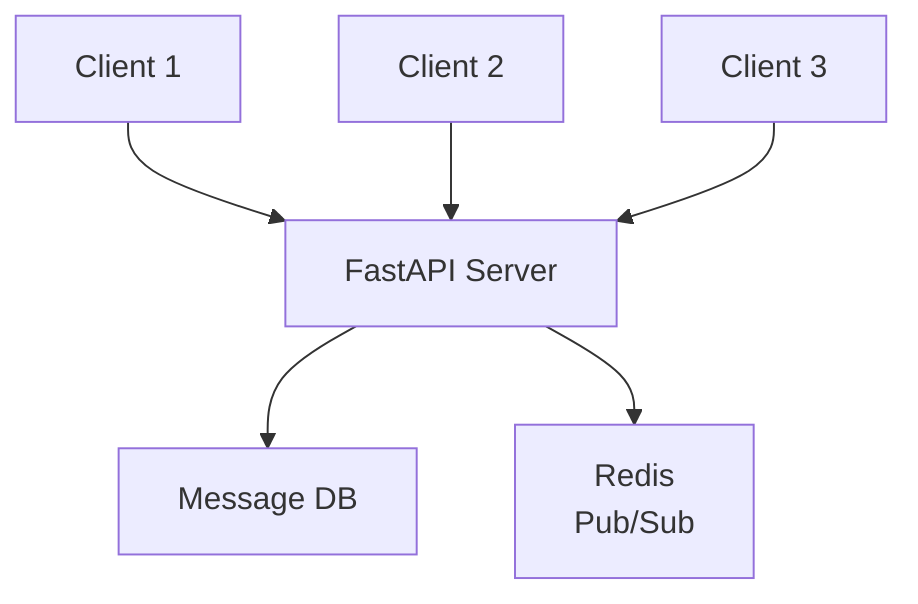

# Phase 3-1: チャット実装

## 学習目標

この単元を終えると、以下ができるようになります：

- 本格的なチャットアプリを実装できる
- メッセージ履歴を管理できる
- オンラインユーザーを表示できる

## チャットアプリの構成



## ハンズオン

### 演習1: 完全なチャットサーバー

```python
# chat_server.py
from fastapi import FastAPI, WebSocket, WebSocketDisconnect
from fastapi.staticfiles import StaticFiles
from fastapi.responses import HTMLResponse
from pydantic import BaseModel
from typing import Dict, List, Optional
from datetime import datetime
import json

app = FastAPI()

# メッセージモデル
class Message(BaseModel):
    id: Optional[int] = None
    type: str  # message, join, leave, system
    content: str
    sender: Optional[str] = None
    room: str = 'general'
    timestamp: str = None
    
    def __init__(self, **data):
        super().__init__(**data)
        if not self.timestamp:
            self.timestamp = datetime.now().isoformat()

# チャットマネージャー
class ChatManager:
    def __init__(self):
        self.rooms: Dict[str, Dict[str, WebSocket]] = {}
        self.message_history: Dict[str, List[Message]] = {}
        self.message_id = 0
    
    async def connect(self, room: str, user_id: str, websocket: WebSocket):
        await websocket.accept()
        
        if room not in self.rooms:
            self.rooms[room] = {}
            self.message_history[room] = []
        
        self.rooms[room][user_id] = websocket
        
        # 履歴を送信
        for msg in self.message_history[room][-50:]:  # 最新50件
            await websocket.send_json(msg.dict())
        
        # 参加通知
        await self.broadcast(room, Message(
            type='join',
            content=f'{user_id} joined the room',
            sender='system',
            room=room
        ))
        
        # オンラインユーザーを通知
        await self.broadcast_users(room)
    
    async def disconnect(self, room: str, user_id: str):
        if room in self.rooms and user_id in self.rooms[room]:
            del self.rooms[room][user_id]
            
            await self.broadcast(room, Message(
                type='leave',
                content=f'{user_id} left the room',
                sender='system',
                room=room
            ))
            
            await self.broadcast_users(room)
    
    async def broadcast(self, room: str, message: Message):
        self.message_id += 1
        message.id = self.message_id
        
        # 履歴に保存
        if room in self.message_history:
            self.message_history[room].append(message)
        
        # 全員に送信
        if room in self.rooms:
            for websocket in self.rooms[room].values():
                await websocket.send_json(message.dict())
    
    async def broadcast_users(self, room: str):
        """オンラインユーザー一覧を送信"""
        if room in self.rooms:
            users = list(self.rooms[room].keys())
            message = Message(
                type='users',
                content=json.dumps(users),
                sender='system',
                room=room
            )
            for websocket in self.rooms[room].values():
                await websocket.send_json(message.dict())
    
    def get_users(self, room: str) -> List[str]:
        return list(self.rooms.get(room, {}).keys())

manager = ChatManager()

@app.websocket('/ws/{room}/{user_id}')
async def websocket_endpoint(websocket: WebSocket, room: str, user_id: str):
    await manager.connect(room, user_id, websocket)
    
    try:
        while True:
            data = await websocket.receive_json()
            
            message = Message(
                type='message',
                content=data.get('content', ''),
                sender=user_id,
                room=room
            )
            
            await manager.broadcast(room, message)
    
    except WebSocketDisconnect:
        await manager.disconnect(room, user_id)

@app.get('/rooms/{room}/users')
async def get_room_users(room: str):
    return {'users': manager.get_users(room)}
```

### 演習2: チャットクライアント

```html
<!-- chat_client.html -->
<!DOCTYPE html>
<html>
<head>
    <title>Chat Room</title>
    <style>
        body { font-family: Arial, sans-serif; max-width: 800px; margin: 0 auto; padding: 20px; }
        .chat-container { display: flex; gap: 20px; }
        .messages { flex: 1; height: 400px; overflow-y: auto; border: 1px solid #ccc; padding: 10px; }
        .users { width: 150px; border: 1px solid #ccc; padding: 10px; }
        .message { padding: 5px 0; border-bottom: 1px solid #eee; }
        .message.join, .message.leave { color: gray; font-style: italic; }
        .message .sender { font-weight: bold; color: #333; }
        .message .time { color: #999; font-size: 0.8em; }
        .input-area { display: flex; margin-top: 10px; }
        .input-area input { flex: 1; padding: 10px; }
        .input-area button { padding: 10px 20px; }
        .status { padding: 10px; margin-bottom: 10px; }
        .status.connected { background: #d4edda; }
        .status.disconnected { background: #f8d7da; }
    </style>
</head>
<body>
    <h1>Chat Room: <span id="room-name"></span></h1>
    <div id="status" class="status disconnected">Connecting...</div>
    
    <div class="chat-container">
        <div class="messages" id="messages"></div>
        <div class="users">
            <h3>Online Users</h3>
            <ul id="users"></ul>
        </div>
    </div>
    
    <div class="input-area">
        <input type="text" id="message" placeholder="Type a message...">
        <button id="send">Send</button>
    </div>

    <script>
        // URL からパラメータ取得
        const params = new URLSearchParams(window.location.search);
        const room = params.get('room') || 'general';
        const userId = params.get('user') || 'user_' + Math.random().toString(36).substr(2, 9);
        
        document.getElementById('room-name').textContent = room;
        
        const messagesEl = document.getElementById('messages');
        const usersEl = document.getElementById('users');
        const statusEl = document.getElementById('status');
        const messageInput = document.getElementById('message');
        
        let ws;
        
        function connect() {
            ws = new WebSocket(`ws://localhost:8000/ws/${room}/${userId}`);
            
            ws.onopen = () => {
                statusEl.textContent = `Connected as ${userId}`;
                statusEl.className = 'status connected';
            };
            
            ws.onmessage = (event) => {
                const data = JSON.parse(event.data);
                
                if (data.type === 'users') {
                    // ユーザー一覧更新
                    const users = JSON.parse(data.content);
                    usersEl.innerHTML = users.map(u => `<li>${u}</li>`).join('');
                } else {
                    // メッセージ表示
                    const div = document.createElement('div');
                    div.className = `message ${data.type}`;
                    
                    if (data.type === 'message') {
                        const time = new Date(data.timestamp).toLocaleTimeString();
                        div.innerHTML = `
                            <span class="sender">${data.sender}</span>
                            <span class="time">${time}</span>
                            <div>${data.content}</div>
                        `;
                    } else {
                        div.textContent = data.content;
                    }
                    
                    messagesEl.appendChild(div);
                    messagesEl.scrollTop = messagesEl.scrollHeight;
                }
            };
            
            ws.onclose = () => {
                statusEl.textContent = 'Disconnected. Reconnecting...';
                statusEl.className = 'status disconnected';
                setTimeout(connect, 3000);
            };
        }
        
        document.getElementById('send').onclick = () => {
            if (messageInput.value && ws.readyState === WebSocket.OPEN) {
                ws.send(JSON.stringify({ content: messageInput.value }));
                messageInput.value = '';
            }
        };
        
        messageInput.onkeypress = (e) => {
            if (e.key === 'Enter') document.getElementById('send').click();
        };
        
        connect();
    </script>
</body>
</html>
```

### 演習3: タイピングインジケーター

```python
# typing_indicator.py
from fastapi import FastAPI, WebSocket
import asyncio

# メッセージタイプ追加
# type: 'typing' - ユーザーが入力中

class ChatManagerWithTyping(ChatManager):
    def __init__(self):
        super().__init__()
        self.typing_users: Dict[str, Dict[str, float]] = {}
    
    async def set_typing(self, room: str, user_id: str, is_typing: bool):
        if room not in self.typing_users:
            self.typing_users[room] = {}
        
        if is_typing:
            self.typing_users[room][user_id] = datetime.now().timestamp()
        else:
            self.typing_users[room].pop(user_id, None)
        
        # タイピング中ユーザーを通知
        typing = list(self.typing_users[room].keys())
        await self.broadcast(room, Message(
            type='typing',
            content=json.dumps(typing),
            sender='system',
            room=room
        ))
```

## 理解度確認

### 問題

チャットアプリで新しいユーザーが参加したときに過去のメッセージを表示するには、どのようなアプローチが適切か。

**A.** クライアント側でローカルストレージから復元

**B.** サーバー側でメッセージ履歴を保存し、接続時に送信

**C.** 他のクライアントからメッセージを取得

**D.** ブラウザのキャッシュを使用

---

### 解答・解説

**正解: B**

サーバー側でメッセージ履歴を保存（メモリ、DB、Redis等）し、新しいクライアントが接続したときに履歴を送信するのが一般的です。

---

## 次のステップ

チャット実装を学びました。次はスケーリングを学びましょう。

**次の単元**: [Phase 3-2: スケーリング](./02_スケーリング.md)
