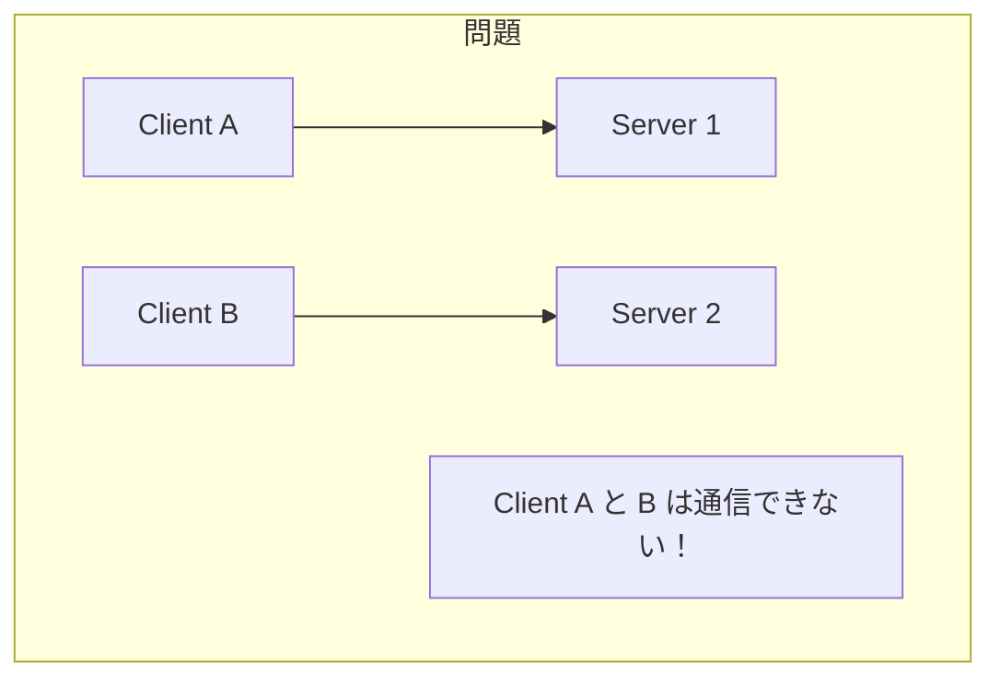
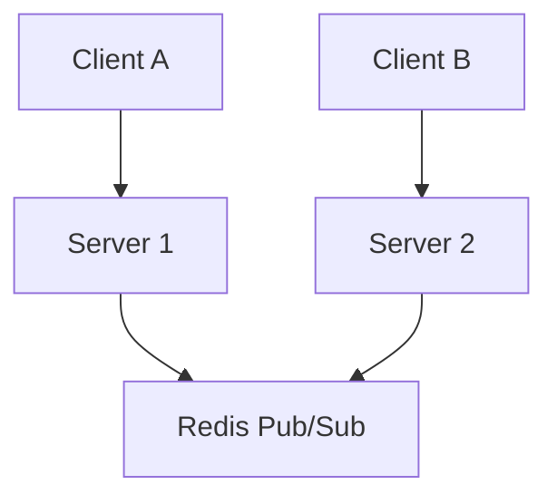
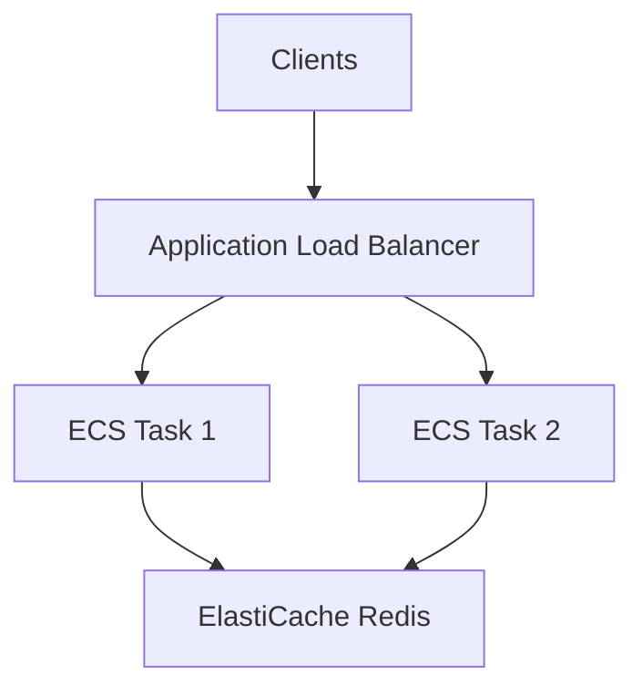

# Phase 3-2: スケーリング

## 学習目標

この単元を終えると、以下ができるようになります：

- 複数サーバーでの WebSocket を設計できる
- Redis Pub/Sub を使ったスケーリングを実装できる
- AWS でのスケーリングを理解できる

## スケーリングの課題



## 解決策: Redis Pub/Sub



## ハンズオン

### 演習1: Redis Pub/Sub 基礎

```python
# redis_pubsub.py
import redis
import asyncio
import json

# 同期版
def sync_example():
    r = redis.Redis(host='localhost', port=6379)
    
    # Publisher
    r.publish('chat:general', json.dumps({
        'type': 'message',
        'content': 'Hello!',
        'sender': 'user1'
    }))
    
    # Subscriber
    pubsub = r.pubsub()
    pubsub.subscribe('chat:general')
    
    for message in pubsub.listen():
        if message['type'] == 'message':
            data = json.loads(message['data'])
            print(f"Received: {data}")

# 非同期版
import redis.asyncio as aioredis

async def async_subscriber():
    r = aioredis.from_url('redis://localhost:6379')
    pubsub = r.pubsub()
    await pubsub.subscribe('chat:general')
    
    async for message in pubsub.listen():
        if message['type'] == 'message':
            data = json.loads(message['data'])
            print(f"Received: {data}")

async def async_publisher():
    r = aioredis.from_url('redis://localhost:6379')
    await r.publish('chat:general', json.dumps({
        'type': 'message',
        'content': 'Hello async!'
    }))
```

### 演習2: スケーラブルなチャットサーバー

```python
# scalable_chat.py
from fastapi import FastAPI, WebSocket, WebSocketDisconnect
import redis.asyncio as aioredis
import json
import asyncio
from typing import Dict, Set
from contextlib import asynccontextmanager

class ScalableChatManager:
    def __init__(self, redis_url: str = 'redis://localhost:6379'):
        self.redis_url = redis_url
        self.redis = None
        self.pubsub = None
        self.local_connections: Dict[str, Dict[str, WebSocket]] = {}
    
    async def connect_redis(self):
        self.redis = aioredis.from_url(self.redis_url)
        self.pubsub = self.redis.pubsub()
    
    async def subscribe_room(self, room: str):
        """ルームを購読"""
        await self.pubsub.subscribe(f'chat:{room}')
    
    async def listen(self):
        """Redis からのメッセージを受信してローカルクライアントに配信"""
        async for message in self.pubsub.listen():
            if message['type'] == 'message':
                data = json.loads(message['data'])
                room = data['room']
                
                # ローカルのクライアントに配信
                if room in self.local_connections:
                    for websocket in self.local_connections[room].values():
                        try:
                            await websocket.send_json(data)
                        except:
                            pass
    
    async def connect(self, room: str, user_id: str, websocket: WebSocket):
        await websocket.accept()
        
        if room not in self.local_connections:
            self.local_connections[room] = {}
            await self.subscribe_room(room)
        
        self.local_connections[room][user_id] = websocket
        
        # 参加を通知
        await self.publish(room, {
            'type': 'join',
            'content': f'{user_id} joined',
            'sender': 'system',
            'room': room
        })
    
    async def disconnect(self, room: str, user_id: str):
        if room in self.local_connections:
            self.local_connections[room].pop(user_id, None)
        
        await self.publish(room, {
            'type': 'leave',
            'content': f'{user_id} left',
            'sender': 'system',
            'room': room
        })
    
    async def publish(self, room: str, message: dict):
        """Redis に発行（全サーバーに配信される）"""
        message['room'] = room
        await self.redis.publish(f'chat:{room}', json.dumps(message))

manager = ScalableChatManager()

@asynccontextmanager
async def lifespan(app: FastAPI):
    await manager.connect_redis()
    asyncio.create_task(manager.listen())
    yield

app = FastAPI(lifespan=lifespan)

@app.websocket('/ws/{room}/{user_id}')
async def websocket_endpoint(websocket: WebSocket, room: str, user_id: str):
    await manager.connect(room, user_id, websocket)
    
    try:
        while True:
            data = await websocket.receive_json()
            
            await manager.publish(room, {
                'type': 'message',
                'content': data['content'],
                'sender': user_id,
                'room': room
            })
    
    except WebSocketDisconnect:
        await manager.disconnect(room, user_id)
```

### 演習3: Docker Compose でスケーリングテスト

```yaml
# docker-compose.yml
services:
  redis:
    image: redis:7
    ports:
      - "6379:6379"

  chat1:
    build: .
    ports:
      - "8001:8000"
    environment:
      - REDIS_URL=redis://redis:6379

  chat2:
    build: .
    ports:
      - "8002:8000"
    environment:
      - REDIS_URL=redis://redis:6379

  nginx:
    image: nginx
    ports:
      - "80:80"
    volumes:
      - ./nginx.conf:/etc/nginx/nginx.conf
```

```nginx
# nginx.conf
events {}

http {
    upstream chat_servers {
        ip_hash;  # 同じクライアントを同じサーバーへ
        server chat1:8000;
        server chat2:8000;
    }

    server {
        listen 80;

        location /ws/ {
            proxy_pass http://chat_servers;
            proxy_http_version 1.1;
            proxy_set_header Upgrade $http_upgrade;
            proxy_set_header Connection "upgrade";
            proxy_set_header Host $host;
        }
    }
}
```

## AWS でのスケーリング



| AWS サービス | 役割 |
|-------------|------|
| ALB | WebSocket 対応ロードバランサー |
| ECS/EKS | コンテナオーケストレーション |
| ElastiCache | Redis Pub/Sub |
| API Gateway | サーバーレス WebSocket |

## 理解度確認

### 問題

複数の WebSocket サーバーで状態を共有するのに適した方法はどれか。

**A.** ファイル共有

**B.** Redis Pub/Sub

**C.** セッションストレージ

**D.** ローカルメモリ

---

### 解答・解説

**正解: B**

Redis Pub/Sub を使うと、複数のサーバー間でリアルタイムにメッセージを共有できます。1つのサーバーで受信したメッセージを Redis に発行し、他の全サーバーが受信してローカルのクライアントに配信します。

---

## 次のステップ

スケーリングを学びました。次は総仕上げです。

**次の単元**: [Phase 4-1: 総仕上げ](../phase4/01_総仕上げ.md)
