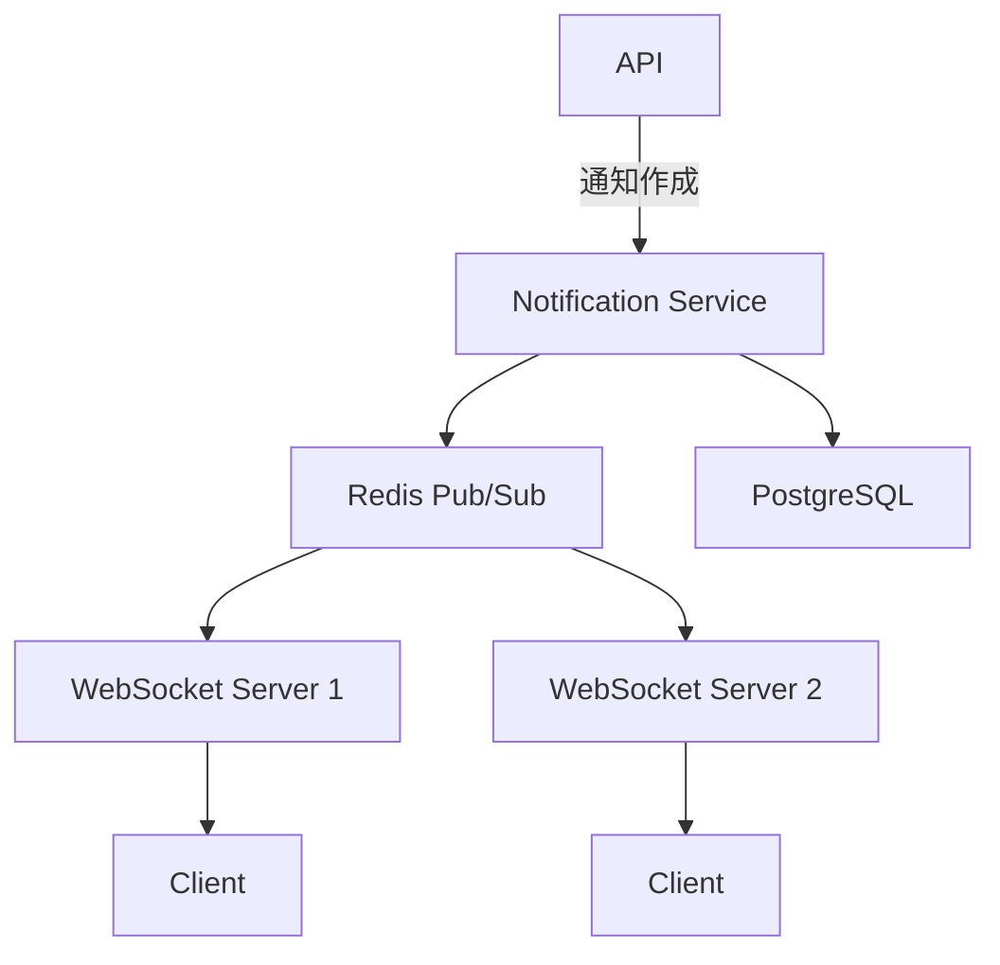

# Phase 4-1: 総仕上げ ～ リアルタイムダッシュボード ～

## 学習目標

この単元を終えると、以下ができるようになります：

- 本格的なリアルタイムアプリを設計できる
- 通知システムを実装できる
- プロダクション品質のコードを書ける

## 総合演習: リアルタイム通知システム

### 要件

```
- ユーザーごとの通知配信
- 未読管理
- 複数デバイス対応
- スケーラブル
```

### アーキテクチャ



### 統合実装

```python
# notification_system.py
from fastapi import FastAPI, WebSocket, WebSocketDisconnect, Depends, HTTPException
from fastapi.security import HTTPBearer
from pydantic import BaseModel
from typing import Dict, List, Optional
import redis.asyncio as aioredis
import json
import asyncio
from datetime import datetime
from contextlib import asynccontextmanager
import uuid

# モデル
class Notification(BaseModel):
    id: str = None
    user_id: str
    type: str  # info, warning, error, success
    title: str
    message: str
    read: bool = False
    created_at: str = None
    
    def __init__(self, **data):
        super().__init__(**data)
        if not self.id:
            self.id = str(uuid.uuid4())
        if not self.created_at:
            self.created_at = datetime.now().isoformat()

class NotificationCreate(BaseModel):
    user_id: str
    type: str = 'info'
    title: str
    message: str

# 通知マネージャー
class NotificationManager:
    def __init__(self, redis_url: str = 'redis://localhost:6379'):
        self.redis_url = redis_url
        self.redis = None
        self.pubsub = None
        self.connections: Dict[str, List[WebSocket]] = {}
    
    async def connect_redis(self):
        self.redis = aioredis.from_url(self.redis_url)
        self.pubsub = self.redis.pubsub()
        await self.pubsub.psubscribe('notification:*')
    
    async def listen(self):
        """Redis からの通知を受信"""
        async for message in self.pubsub.listen():
            if message['type'] == 'pmessage':
                channel = message['channel'].decode()
                user_id = channel.split(':')[1]
                data = json.loads(message['data'])
                
                # ローカルの接続に配信
                if user_id in self.connections:
                    for ws in self.connections[user_id][:]:
                        try:
                            await ws.send_json(data)
                        except:
                            self.connections[user_id].remove(ws)
    
    async def connect(self, user_id: str, websocket: WebSocket):
        await websocket.accept()
        
        if user_id not in self.connections:
            self.connections[user_id] = []
        
        self.connections[user_id].append(websocket)
        
        # 未読通知を送信
        unread = await self.get_unread_notifications(user_id)
        for notification in unread:
            await websocket.send_json(notification)
    
    def disconnect(self, user_id: str, websocket: WebSocket):
        if user_id in self.connections:
            self.connections[user_id].remove(websocket)
    
    async def create_notification(self, notification: Notification):
        """通知を作成してユーザーに配信"""
        # DB に保存
        await self.redis.lpush(
            f'notifications:{notification.user_id}',
            json.dumps(notification.dict())
        )
        
        # Pub/Sub で配信
        await self.redis.publish(
            f'notification:{notification.user_id}',
            json.dumps(notification.dict())
        )
        
        return notification
    
    async def get_unread_notifications(self, user_id: str) -> List[dict]:
        """未読通知を取得"""
        notifications = await self.redis.lrange(
            f'notifications:{user_id}', 0, -1
        )
        
        result = []
        for n in notifications:
            data = json.loads(n)
            if not data.get('read'):
                result.append(data)
        
        return result
    
    async def mark_as_read(self, user_id: str, notification_id: str):
        """通知を既読にする"""
        notifications = await self.redis.lrange(
            f'notifications:{user_id}', 0, -1
        )
        
        for i, n in enumerate(notifications):
            data = json.loads(n)
            if data['id'] == notification_id:
                data['read'] = True
                await self.redis.lset(
                    f'notifications:{user_id}',
                    i,
                    json.dumps(data)
                )
                break

manager = NotificationManager()

@asynccontextmanager
async def lifespan(app: FastAPI):
    await manager.connect_redis()
    asyncio.create_task(manager.listen())
    yield

app = FastAPI(lifespan=lifespan)

# WebSocket エンドポイント
@app.websocket('/ws/notifications/{user_id}')
async def notification_websocket(websocket: WebSocket, user_id: str):
    await manager.connect(user_id, websocket)
    
    try:
        while True:
            data = await websocket.receive_json()
            
            # 既読マーク
            if data.get('action') == 'mark_read':
                await manager.mark_as_read(user_id, data['notification_id'])
    
    except WebSocketDisconnect:
        manager.disconnect(user_id, websocket)

# REST API
@app.post('/notifications')
async def create_notification(data: NotificationCreate):
    notification = Notification(
        user_id=data.user_id,
        type=data.type,
        title=data.title,
        message=data.message
    )
    
    await manager.create_notification(notification)
    return notification

@app.get('/notifications/{user_id}')
async def get_notifications(user_id: str):
    return await manager.get_unread_notifications(user_id)
```

### クライアント実装

```typescript
// NotificationService.ts
class NotificationService {
    private ws: WebSocket | null = null;
    private userId: string;
    private listeners: ((notification: any) => void)[] = [];

    constructor(userId: string) {
        this.userId = userId;
    }

    connect() {
        this.ws = new WebSocket(`ws://localhost:8000/ws/notifications/${this.userId}`);

        this.ws.onmessage = (event) => {
            const notification = JSON.parse(event.data);
            this.notify(notification);
        };

        this.ws.onclose = () => {
            setTimeout(() => this.connect(), 3000);
        };
    }

    onNotification(callback: (notification: any) => void) {
        this.listeners.push(callback);
    }

    private notify(notification: any) {
        this.listeners.forEach(cb => cb(notification));
    }

    markAsRead(notificationId: string) {
        this.ws?.send(JSON.stringify({
            action: 'mark_read',
            notification_id: notificationId
        }));
    }
}
```

## カリキュラム完了！

おめでとうございます！WebSocket・リアルタイム通信のカリキュラムを完了しました。

### 学んだこと

1. **リアルタイム通信基礎** - ポーリング、WebSocket
2. **WebSocket プロトコル** - ハンドシェイク、フレーム
3. **FastAPI 実装** - エンドポイント、接続管理
4. **クライアント実装** - JavaScript、React Hook
5. **チャット実装** - ルーム、メッセージ履歴
6. **スケーリング** - Redis Pub/Sub、ロードバランサー

### 次のステップ

- **Socket.IO** - 高レベルライブラリ
- **GraphQL Subscriptions** - GraphQL でのリアルタイム
- **AWS API Gateway WebSocket** - サーバーレス
